# Analysis and Management of Production System
# Lesson 2: Introduction to Factory Models

Prof. Giulia Bruno
Department of Management and Production Engineering
giulia.bruno@polito.it

---

## Slide n.01 → Title: Analysis and Management of Production System – Lesson 2: Introduction to Factory Models

Analysis and Management of Production System
Lesson 2: Introduction to Factory Models

Prof. Giulia Bruno
Department of Management and Production Engineering
giulia.bruno@polito.it

> No image/graph present in this slide.

---

## Slide n.02 → Title: Factory model

- Analytical approach for the modeling and analysis of manufacturing and production systems
  - Firstly, extremely simple models (single machine models) are developed to show the necessary mechanics and concepts needed
  - Then, more complex models are developed by connecting simple models into networks of workstations with the appropriate interconnections

- Overall approach
  1. decompose a system into small components
  2. model components
  3. reintegrate the general system by appropriate combination of submodels

> No image/graph present in this slide.

---

## Slide n.03 → Title: Factory model

- Decomposition approach is an approximation
  - Produces acceptable results in a wide variety of manufacturing applications
- Any analytical model (exact or approximate) is an approximation of the real world environment
- Question to be answered: whether or not the model yields accurate enough results to be used as an analysis tool in support of design and operational decision making

> No image/graph present in this slide.

---

## Slide n.04 → Title: Factory model

- Modelled system doesn't take into account where or why jobs arrive or how they are transported to customers
  - modeling the order creation or completed job delivery systems is not within the scope of our analysis
- Arriving job is a physical entity to be processed through the various processing steps or an order to begin the processing of raw material into a newly manufactured entity

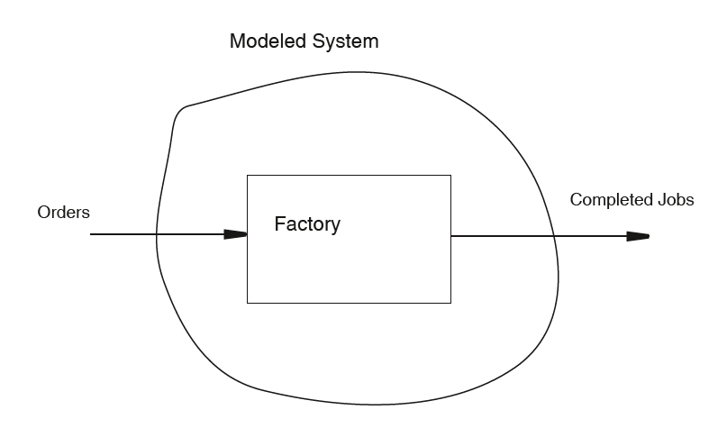

**Image description:** Schematic diagram of the modelled system. An ellipse (labelled "Modeled System") encloses a central rectangle labelled "Factory". An arrow enters the ellipse from the left labelled "Orders" and an arrow exits the ellipse to the right labelled "Completed Jobs". The diagram highlights the boundaries of the analysed system: only the internal factory process, excluding order creation and customer delivery.

---

## Slide n.05 → Title: Notations and definitions

- **Factory** composed by several machines grouped together by type (called **workstations**) and series of jobs to be produced on the machines
- **Processing steps** for a job consists of several processing operations to be performed by different machines in a specified sequence
- **Jobs move** through the factory, waiting in line at a workstation until their turn for being processed by the machine, then proceeding to the next workstation to repeat this sequence until all required operations have been completed
- **Jobs arrive** at the factory either individually or in batches based on some distribution of the time between arrivals

> No image/graph present in this slide.

---

## Slide n.06 → Title: Workstation

- Collection of one or more identical machines or resources (i.e. machines which perform the same function)

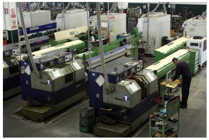

**Image description:** Photograph of a real manufacturing department with multiple CNC lathes (Tornos brand) arranged in a row. The machines are green/blue in colour and an operator is visible in the background. The photo visually illustrates the concept of a workstation as a group of identical machines performing the same function.

---

## Slide n.07 → Title: Routing

- Sequence of processing steps for a job
- Jobs with identical routings are said to be of the same job type
  - different job types are jobs with different routings

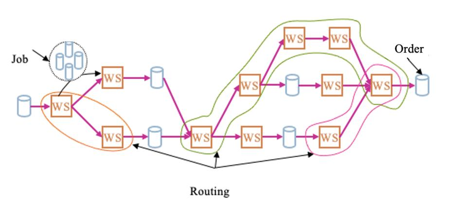

**Image description:** Coloured diagram illustrating the concept of routing in a factory. Starting from the left with "Job" (represented by a cylinder inside a dashed circle), arrows show alternative paths through a network of workstations (WS, represented by orange squares). The paths diverge and converge through the network, ending on the right with "Order" (cylinder). Three distinct paths are highlighted with coloured curves (green, orange, pink), representing different possible routing types for different job types.

---

## Slide n.08 → Title: Performance measures

- **Cycle time**: time a job spends in a system
  - Average cycle time of the line is denoted as CT
  - Sometimes called Lead Time, even if LT identifies the a priori evaluation of the cycle time (time allocated to a operation sequence to produce a certain job)
- **Work in process**: number of jobs within a system (from the beginning to the end of the operations sequence) which are either undergoing processing or waiting in a queue for processing
  - Average work-in-process is denoted as WIP
- **Throughput rate**: number of completed jobs leaving the system per unit of time
  - Throughput rate averaged over many jobs is denoted by TH

> No image/graph present in this slide.

---

## Slide n.09 → Title: Cycle time

- Notational distinction
  - average factory cycle time denoted as CTs
  - average cycle time at workstation i, denoted as CT(i)
- CTs: average time that a job spends within the factory, either being processed at a workstation or waiting in a workstation queue
- CT(i): average time jobs spend being processed by workstation i plus the average time spend in the workstation i queue (or buffer)
- CT: used for general properties related to the average cycle time will be developed

> No image/graph present in this slide.

---

## Slide n.10 → Title: Cycle time

- Processing time often known or can be determined without much effort
- Queue time not easily estimated for a given job
  - it depends on the number and processing times of the various types of jobs that are waiting in the queue ahead of the designated job
- Average cycle time at workstation i given as the sum of two components:

$$CT(i) = CT_q(i) + E[T_s(i)]$$

where T_s(i) denotes the service time (or processing time) at workstation i

> No image/graph present in this slide.

---

## Slide n.11 → Title: Factory analysis

- For most analyzed systems, long-run throughput rate is equal to the input rate of jobs
- Main issue: estimation of the total length of time for the manufacturing process (CTs)
- The higher the factory capacity, the faster jobs are completed
  - Cycle time increases as the factory becomes busier

> No image/graph present in this slide.

---

## Slide n.12 → Title: Factory analysis

- Time dependent measures such as CTs(t) and WIPs(t) are very difficult to develop
  - Focus restricted to the "steady-state" measures i.e., the limiting value of the time dependent measures
  - By a property called the ergodic property, steady-state values can also be considered to be time-averaged values as time becomes very large
- Steady-state measures are independent of the initial conditions of the system
- In the queueing theory, results are for steady-state system measures

> No image/graph present in this slide.

---

## Slide n.13 → Title: Factory analysis

- System's performance measures CT and WIP can be estimated from the arrival and departure streams of the system
- Define T_ai as the arrival time of the i_th job, and the function A(t) for t ≥ 0 as the total number of arrivals during the time interval [0, t]
- Define T_di as the departure time of the i_th job, and the function D(t) for t ≥ 0 as the total number of departures during the interval [0, t]

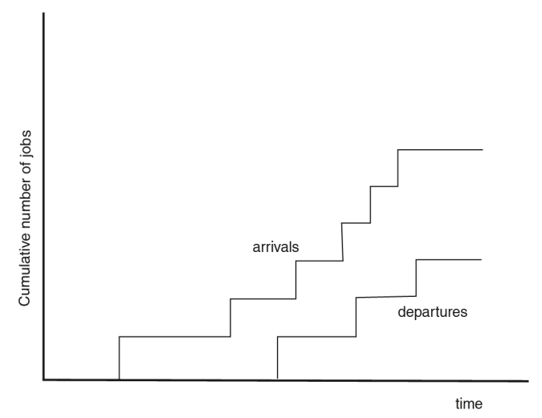

**Image description:** Step chart with Y axis "Cumulative number of jobs" and X axis "time". It shows two step curves: the upper one (labelled "arrivals") grows faster and earlier, the lower one (labelled "departures") follows with a time delay. The area between the two curves represents the instantaneous WIP in the system.

---

## Slide n.14 → Title: Factory analysis

- Consider a time interval (a, b) such that the system starts empty and returns to empty
- Let N_ab be the number of jobs that arrive to the system during the interval (a, b)
- Number these jobs from 1 to N, with index i representing specific jobs.
- Then the average waiting time, CT(a,b), for jobs during this interval is given by:

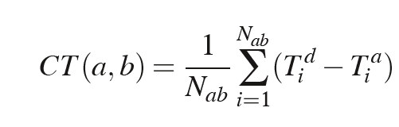

$$CT(a,b) = \frac{1}{N_{ab}} \sum_{i=1}^{N_{ab}} (T_i^d - T_i^a)$$

**Image description:** Mathematical formula expressing the average cycle time CT(a,b) as the mean of the differences between departure times (T_i^d) and arrival times (T_i^a) of each job i, summed over all N_ab jobs arriving in the interval (a,b).

---

## Slide n.15 → Title: Factory analysis

- The area, AB, between the curves A(t) and D(t) for a < t < b is merely the summation given in the above equation. This area can also be obtained by standard integration methods as:

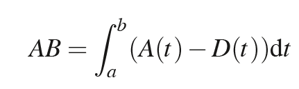

$$AB = \int_a^b (A(t) - D(t)) dt$$

- The area represents the integral of the number of jobs in the system at time t, since N(t) = A(t) − D(t) is the number of jobs in the system at t. So the time-averaged number of jobs waiting in the system during the time interval (a, b) is given by:

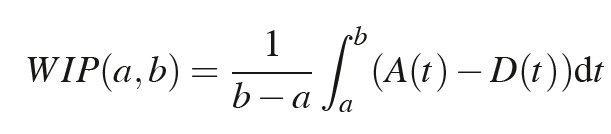

$$WIP(a,b) = \frac{1}{b-a} \int_a^b (A(t) - D(t)) dt$$

**Image description 15a:** Integral formula defining the area AB between the curves A(t) and D(t) over the interval (a,b), calculated as the integral of the difference between arrivals and departures.

**Image description 15b:** Formula expressing the average WIP over the interval (a,b) as the integral of A(t)-D(t) divided by the length of the interval (b-a).

---

## Slide n.16 → Title: Factory analysis

- There is a relationship between the average number in the system during the interval (a, b) and the average waiting time or cycle time in the system during this interval. Since the area between A(·) and D(·) (namely AB) is constant regardless of the method used to measure it, we have:

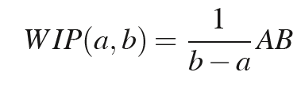
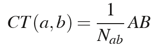

$$WIP(a,b) = \frac{1}{b-a} AB \qquad CT(a,b) = \frac{1}{N_{ab}} AB$$

- Thus, the following relationship is obtained:

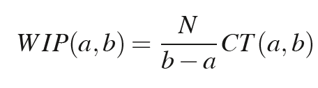

$$WIP(a,b) = \frac{N}{b-a} CT(a,b)$$

**Image descriptions:** Three mathematical formulas showing: (1) WIP(a,b) expressed as a function of area AB and the time interval; (2) CT(a,b) expressed as a function of area AB and the number of jobs; (3) the derived relationship between WIP and CT multiplied by the arrival rate N/(b-a).

---

## Slide n.17 → Title: Factory analysis

- The mean number of jobs arriving to the system per unit time, normally denoted as λ, is N_ab/(b-a), thus:

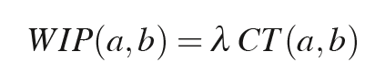

$$WIP(a,b) = \lambda \cdot CT(a,b)$$

- This result is valid for any interval that starts with an empty system and ends with an empty system
- In fact this relationship is the limiting behavior result, or long run average result, for stationary queueing systems, and is known as **Little's Law**
- The result holds for individual workstations as well as the system as a whole

**Image description:** Little's Law formula in its interval form: WIP(a,b) = λ · CT(a,b), where λ is the average job arrival rate to the system.

---

## Slide n.18 → Title: Factory analysis

- For a system that satisfies steady-state conditions, the following equation holds:

$$WIP = \lambda \times CT$$

where WIP is the long-run average number of jobs in the system, CT is the long-run average cycle time and λ is the long-run input rate of jobs to the server

- Since the average input rate is usually equal to the average throughput rate, Little's Law can also be written as:

$$WIP = TH \times CT$$

> No image/graph present in this slide.

---

## Slide n.19 → Title: Factory analysis

- The formula estimates mean values, but the actual underlying random variables of the systems can be quite variable
- In most single workstation system models, the average number in the system, WIP, can be easily obtained. However, the behavior of the random variable representing the number in the system at any one point in time can be highly variable

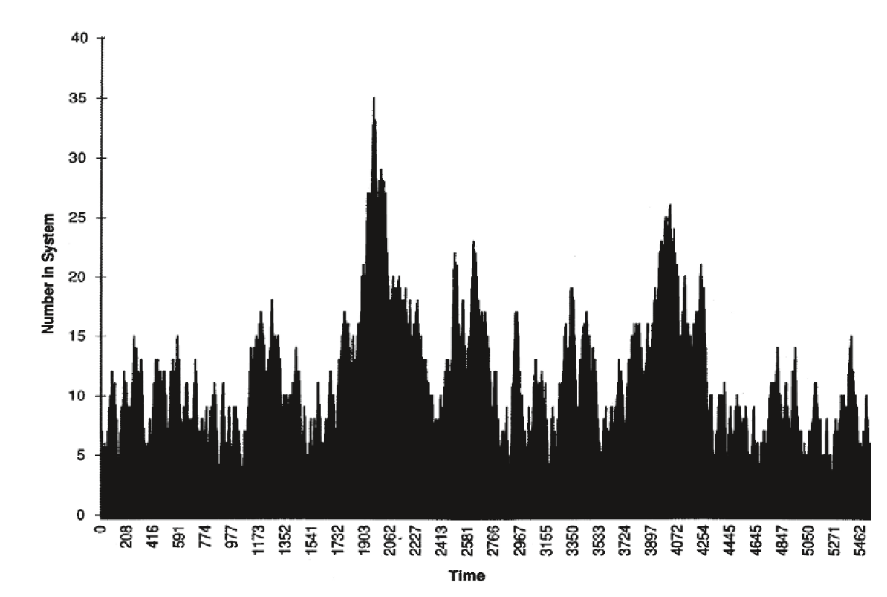

**Image description:** Dense bar chart showing the variability of the number of jobs in the system ("Number In System", Y axis from 0 to 40) over time ("Time", X axis from 0 to 5462). The chart highlights the high variability of the instantaneous WIP: the bars fluctuate irregularly with peaks reaching values of 25-35, despite the mean value being stable. This illustrates how the stationarity of the system does not imply the absence of fluctuations.

---

## Slide n.20 → Title: Factory analysis

- Term steady-state implies that the *mean* reaches a limiting value and thus ceases to change with respect to time
  - It does *not* imply that the system itself ceases to change
- Variability continues forever
  - fluctuations within the system never cease
- Steady-state does imply that the entire distribution reaches a limiting value
  - not only the mean but also the standard deviation, skewness, and other such measures will have limiting values

> No image/graph present in this slide.

---

## Slide n.21 → Title: Exercise 1

A workstation with a single machine for processing has a long-run average inventory level (WIP) of 25 jobs. The average rate at which jobs enter the workstation is 4 per hour, and the average processing time is 14.5 minutes per job. What is the average time that a job spends in the queue?

> No image/graph present in this slide.

---

## Slide n.22 → Title: Exercise 1 – Solution

DATA
- WIP = 25 pcs
- rate = λ = 4 pcs/hr
- E[T_S] = 14.5 min = 14.5/60 = 0.24 hrs
- CT_q = ?

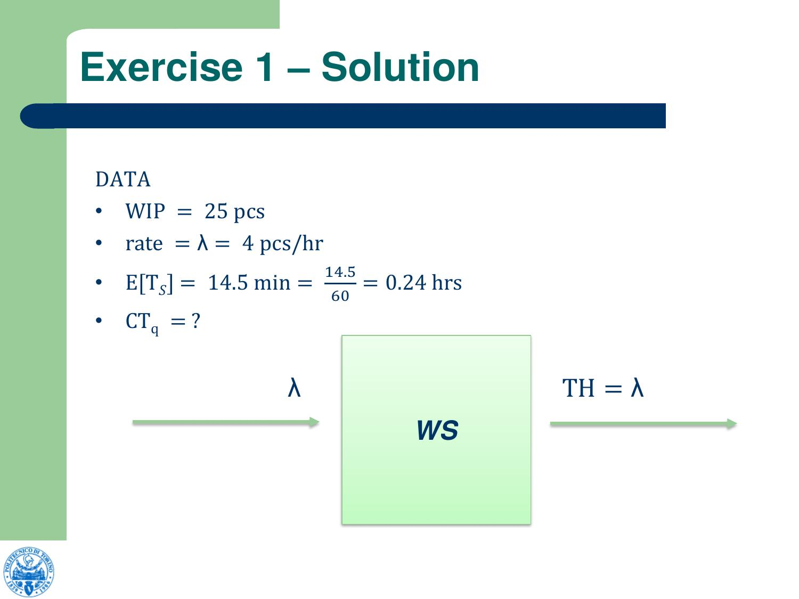

**Image description:** Workstation diagram: an incoming arrow labelled λ, a green rectangle labelled WS (workstation), and an outgoing arrow labelled TH = λ. It illustrates that in the absence of losses or reworks, the throughput equals the arrival rate.

---

## Slide n.23 → Title: Exercise 1 – Solution

According to the Little's Law: WIP = TH × CT

Supposing to have no losses or reworks, we can say that TH = λ and the equations becomes:

$$WIP = \lambda \times CT$$

Thanks to this, we can find out the Cycle Time of the station:

$$CT = \frac{WIP}{\lambda} = \frac{25}{4} = 6.25 \text{ hrs}$$

We also know that CT = CT_q + E[TS]

So,

$$CT_q = CT - E[T_S] = 6.25 - 0.24 = 6.01 \text{ hrs}$$

> No image/graph present in this slide.

---

## Slide n.24 → Title: Exercise 2

Consider a factory operating 24 hours per day consisting of two workstations. Arrivals to the first station occur at a rate of 10 per day. The long-run average time that a job spends at the first workstation is 4.2 hours. After processing at the first workstation, a job is sent directly to the second workstation where it spends an average of 5.3 hours. After processing at the second workstation, the job leaves the system. What is the average work-in-process within the factory?

> No image/graph present in this slide.

---

## Slide n.25 → Title: Exercise 2 – Solution

- Shift = 24 hrs/day
- rate (λ) = 10 pcs/day = 10/24 pcs/hr = 0.417 pcs/hr
- CT_1 = 4.2 hrs
- CT_2 = 5.3 hrs

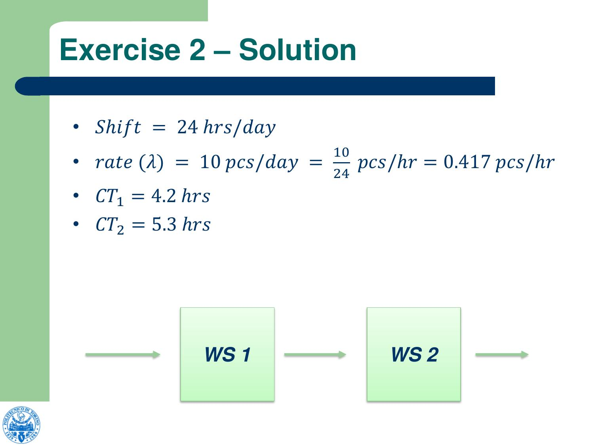

**Image description:** Two-workstation series diagram: an incoming arrow from the left, then the green block "WS 1", a central arrow, the green block "WS 2", and an outgoing arrow to the right. It illustrates the sequential flow of jobs between the two stations.

---

## Slide n.26 → Title: Exercise 2 – Solution

Computation of WIP level related to WS1 and WS2 with the Little's Law:
- WIP_1 = λ × CT_1 = 0.417 × 4.2 = 1.75 pcs
- WIP_2 = λ × CT_2 = 0.417 × 5.3 = 2.21 pcs

Total WIP given by the sum of the two WIP related to the single stations:
- WIP_tot = WIP_1 + WIP_2 = 1.75 + 2.21 = 3.96 pcs

> No image/graph present in this slide.

---

## Slide n.27 → Title: Penny Fab model

- Factory that makes only one type of product
- Four processing steps to be performed in sequence
- Each processing operation performed on a separate machine
- Machines process only one unit of the product at a time (a job)
- Constant processing times: 1, 2, 1 and 1 hour(s) respectively
- Constant WIPs
  - when a job has completed its four processing steps, it is immediately removed from the factory and a new job is started at Machine 1 to keep the total factory WIPs at the specified level

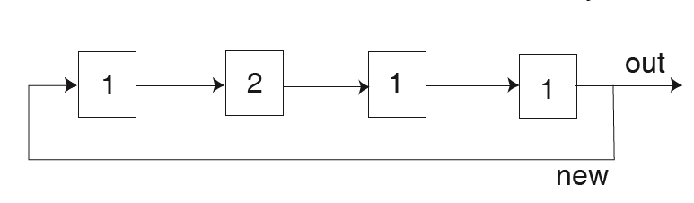

**Image description:** Diagram of the Penny Fab line: four machines in series (labelled 1, 2, 1, 1 to indicate processing times in hours), connected by arrows. The last machine has an "out" arrow exiting and a "new" arrow returning to the first machine, representing the constant WIP mechanism.

---

## Slide n.28 → Title: Penny Fab model

- Constant WIPs level fixed at 10 jobs decided by the Management
- Result a th = 0.5 job/h (one finished job every two hours on the average is produced)
- Equal to the maximum throughput rate for this factory because its slowest processing step (at Machine 2) takes two hours per job
- Jobs can be completed no faster than this single machine completes its own processing

**Image description:** Same Penny Fab line diagram (four machines with processing times 1-2-1-1 in series with "new" feedback). It reinforces the line structure in the context of the discussion on WIP=10 and the maximum throughput of 0.5 job/h determined by the bottleneck machine (Machine 2, 2h processing time).

---

## Slide n.29 → Title: Penny Fab model

- Management pleased with the throughput of the factory since it is at its maximum capacity, but concerned with the cycle time (20 hours per job)
  - very high since it only takes 5 hours of processing to complete each job
- The x-factor for a factory is the ratio of CTs to the average total processing time per job
  - X-factor = 4
- From literature analysis the x-factor for this sector is 2.6
  - management is worried about the ability to keep customers when the industry on average produces the same product with a considerably shorter lead-time from order placement to receipt

**Image description:** Same Penny Fab line diagram (four machines 1-2-1-1 with feedback). Used as a visual reference in the context of the x-factor discussion (CT/T0 ratio = 20h/5h = 4) and comparison with the industry average (x-factor = 2.6).

---

## Slide n.30 → Title: Penny Fab model

- Possible solution to address the cycle time problem: purchase a 25% faster machine (1.5 hours) for processing step two
- This purchase would be made expressly for the purpose of reducing the x-factor for the factory to be more in line with the industry average
- The company selling the machine says that this investment will bring the x-factor down to 3.33 and the additional throughput of 0.166 units per hour would pay for the cost of the new machine in three years

**Image description:** Same Penny Fab line diagram (four machines 1-2-1-1 with feedback). Context: evaluation of purchasing a faster machine for step 2 (from 2h to 1.5h) to reduce the x-factor.

---

## Slide n.31 → Title: Penny Fab model

- Management decided that investment is not worthwhile just based on increased throughput
  - funds needed to buy the machine are needed for other aspects of the company (e.g., research and development)
- Hiring of a consulting team from the manufacturing engineering department of a local university to perform a short term factory flow analysis study
  - First activity to devise a method of predicting the long-term factory performance measures of cycle time and throughput

**Image description:** Same Penny Fab line diagram (four machines 1-2-1-1 with feedback). Context: management decision not to purchase the new machine and to engage a consulting team to analyse factory performance.

---

## Slide n.32 → Title: Penny Fab model

- Hand simulation procedure of the factory flow
- Beginning: 10 jobs all placed at Machine 1, then hourly updates to each job's status
- Jobs soon distributed themselves throughout the factory and after a short period of time a two-hour cyclic pattern emerged
- Every cycle of this pattern produced one completed job and the factory returned to the identical state for each machine and associated queue
  - This set of conditions is referred to as the factory status
- All the job cycle times had identical values after the system reached the cyclic behavior pattern (20 h, agreed with the company)

**Image description:** Same Penny Fab line diagram (four machines 1-2-1-1 with feedback). Context: start of the hand simulation with WIP=10, all jobs initially placed at Machine 1.

---

## Slide n.33 → Title: Penny Fab model

- Factory simulation with WIP = 10 for one 24-hour day
- Status (X,Y):
  - X: number of jobs at the WS (queue + processing)
  - Y: number of hours already completed for the job in processing
- After hour 15 the factory status repeats every two hours (factory status at the start of hours 15, 17, 19, 21, etc. are identical)

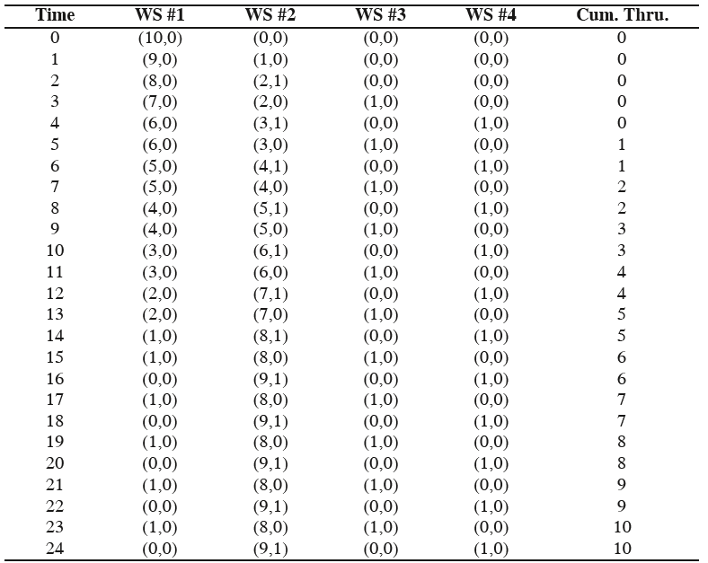

**Image description 33a:** Penny Fab line diagram (four machines 1-2-1-1 with feedback).

**Image description 33b:** Hourly simulation table with WIP=10 over 24 hours. Columns: Time (0-24), WS#1, WS#2, WS#3, WS#4 (each with state (X,Y)), Cum. Thru. (cumulative throughput). After hour 15 the factory status repeats every 2 hours, with cumulative throughput increasing by 1 every 2 hours (from 6 to 10 in the period 15-24).

---

## Slide n.34 → Title: Penny Fab model

- The consulting team decided to estimate the x-factor for various numbers of jobs in the system (WIP)
- From Little's Law: CT = WIP/TH
- In this case, TH = 0.5 j/h, then CT = 2*WIP
- Processing time = 5h, then x = CT/5 = WIP/2.5
- In order to have the desired x-factor (2.6), the WIP must be 6.5
- How the TH change by varying WIP?

**Image description:** Same Penny Fab line diagram (four machines 1-2-1-1 with feedback). Context: consulting team analysis to find the optimal WIP that achieves x-factor = 2.6.

---

## Slide n.35 → Title: Penny Fab manual simulation – WIP = 1

WIP = 1 → WS1 (t1=1h) → WS2 (t2=2h) → WS3 (t3=1h) → WS4 (t4=1h)

Step-by-step simulation:
- t = 0h: job at WS1
- t = 1h: job at WS2
- t = 2h: job at WS2 (still being processed)
- t = 3h: job at WS3
- t = 4h: job at WS4
- t = 5h: job exits → new job at WS1

**Result: WIP=1, CT=5h, TH=1/5=0.2 pcs/h**

1 item every 5 hours comes out of the line (TH = 1/5 pcs/h)
Each item stays on the line for 5 hours (CT = 5 h)

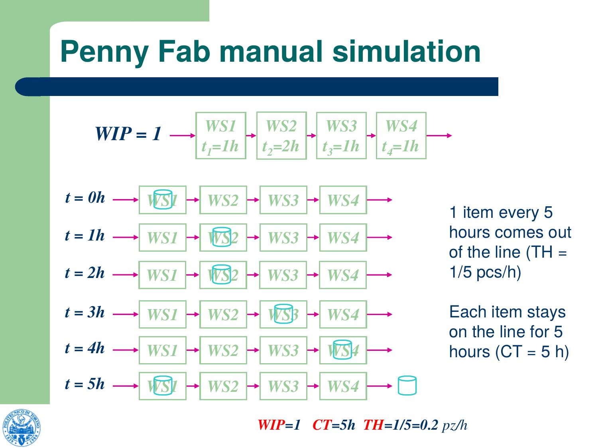

**Image description:** Step-by-step animation of the simulation with WIP=1. At the top: line diagram with the 4 WS and their respective processing times (t1=1h, t2=2h, t3=1h, t4=1h). Below: 6 rows (t=0h to t=5h) showing the position of the single job (highlighted) advancing through the 4 workstations. At the exit at t=5h a cylinder represents the completed job.

---

## Slide n.36 → Title: Penny Fab manual simulation – WIP = 2

WIP = 2 → WS1 (t1=1h) → WS2 (t2=2h) → WS3 (t3=1h) → WS4 (t4=1h)

Step-by-step simulation:
- t = 0h: job A at WS1, job B at WS2
- t = 1h: job A at WS2, job B still at WS2
- t = 2h: job A at WS2, job B at WS3
- t = 3h: job A at WS3, job B at WS4
- t = 4h: job A at WS4, job B exits → new job at WS1
- t = 5h: job A exits → new job at WS1, another new job at WS2

**Result: WIP=2, CT=5h, TH=2/5=0.4 pcs/h**

2 items every 5 hours come out of the line (TH = 2/5 pcs/h)
Each item stays on the line for 5 hours (CT = 5 h)

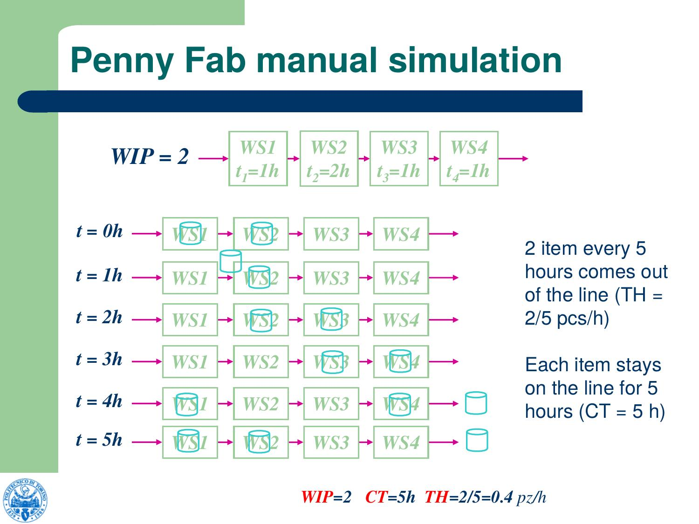

**Image description:** Step-by-step animation with WIP=2. Diagram with 6 time rows (t=0h to t=5h) showing the position of 2 jobs (in different colours) advancing through the 4 workstations. It can be observed that 2 completed jobs exit within 5 hours, with CT unchanged at 5h compared to the WIP=1 case.

---

## Slide n.37 → Title: Penny Fab manual simulation – WIP = 3

WIP = 3 → WS1 (t1=1h) → WS2 (t2=2h) → WS3 (t3=1h) → WS4 (t4=1h)

Step-by-step simulation:
- t = 0h: job A at WS1, job B at WS2, job C at WS3
- t = 1h: job A at WS2, job B still at WS2 (waiting), job C at WS4
- t = 2h: job A at WS2, job B at WS3, job C exits → new job at WS1
- t = 3h: job A at WS3, job B at WS4, new job at WS2
- t = 4h: job A at WS4, job B exits → new job at WS1, ...
- t = 5h: job A at WS3, ...
- t = 6h: job A exits

**Result: WIP=3, CT=6h, TH=3/6=0.5 pcs/h**

3 items every 6 hours come out of the line (TH = 3/6 = 0.5 pcs/h)
Each item stays on the line for 6 hours (CT = 6 h)

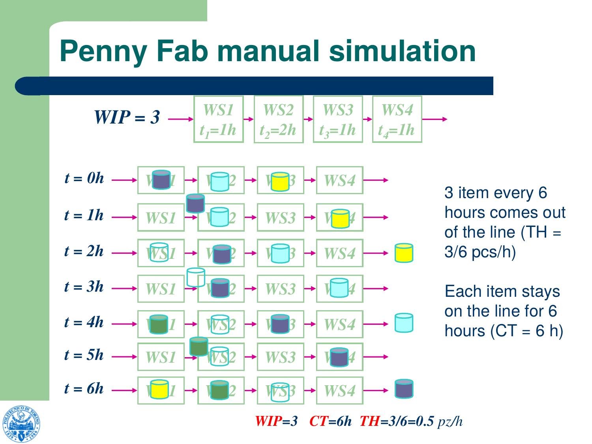

**Image description:** Step-by-step animation with WIP=3. Diagram with 7 time rows (t=0h to t=6h) showing 3 jobs (in different colours: black, light blue, yellow) advancing through the 4 workstations. WS2 becomes the bottleneck: with WIP=3 the CT rises to 6h (from 5h) but TH reaches the maximum of 0.5 pcs/h.

---

## Slide n.38 → Title: Penny Fab manual simulation – Results

| WIP | Throughput | Cycle Time | x-factor |
|-----|------------|------------|----------|
| 1   | 0.2        | 5          | 1.0      |
| 2   | 0.4        | 5          | 1.0      |
| 3   | 0.5        | 6          | 1.2      |
| 4   | 0.5        | 8          | 1.6      |
| 5   | 0.5        | 10         | 2.0      |
| 6   | 0.5        | 12         | 2.4      |
| 7   | 0.5        | 14         | 2.8      |
| 8   | 0.5        | 16         | 3.2      |
| 9   | 0.5        | 18         | 3.6      |
| 10  | 0.5        | 20         | 4.0      |

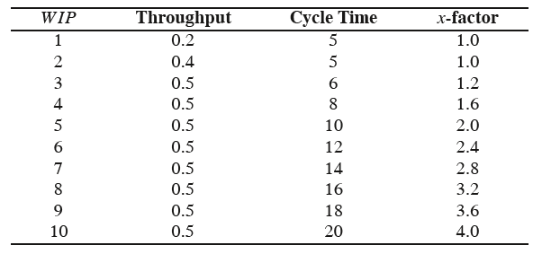

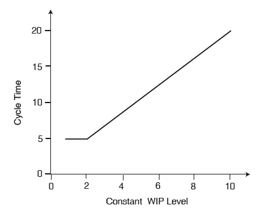

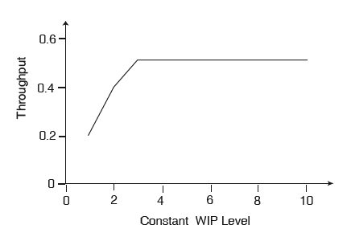

**Image description 38a:** Results table of the hand simulation with columns WIP (1-10), Throughput (job/h), Cycle Time (h), x-factor. TH stabilises at 0.5 from WIP=3 onwards, while CT and x-factor grow linearly.

**Image description 38b:** Chart of Cycle Time (Y axis, 0-20) vs Constant WIP Level (X axis, 0-10). The curve is flat at 5h for WIP=1 and 2, then grows linearly up to 20h for WIP=10.

**Image description 38c:** Chart of Throughput (Y axis, 0-0.6) vs Constant WIP Level (X axis, 0-10). The curve grows rapidly up to WIP=3 (TH=0.5), then remains flat at 0.5 for WIP≥3.

---

## Slide n.39 → Title: Penny Fab manual simulation

- The WIP level in the factory can be reduced to 3 jobs while maintaining the factory throughput rate of ½
- The cycle time reduces to 2×WIP = 6 hours with an x-factor of 1.2
- Thus at no expense, the factory can maintain its current throughput rate and reduce its cycle time from 20 to 6 hours

**Image description 39a:** Same Cycle Time vs WIP Level chart as the previous slide. It highlights that by reducing WIP from 10 to 3 the CT drops from 20h to 6h.

**Image description 39b:** Same Throughput vs WIP Level chart as the previous slide. It highlights that TH remains unchanged at 0.5 even when reducing WIP to 3.

---

## Slide n.40 → Title: Conclusion

$$CT_{best}(w) = \begin{cases} T_0, & \text{if } w \leq W_0 \\ w/r_b, & \text{otherwise.} \end{cases}$$

$$TH_{best}(w) = \begin{cases} w/T_0, & \text{if } w \leq W_0 \\ r_b, & \text{otherwise.} \end{cases}$$

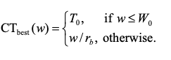

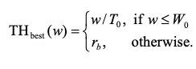

- CT remains constant at the minimum CT (T_0) as WIP increases and it increases to infinity once the maximum WIP (r_b) is reached
- TH increases as WIP level increases, until the WIP level reaches the maximum WIP (r_b); after that TH stabilizes, remaining constant
- The best case (min CT and max TH) is when with WIP = 3

**Image description 40a:** Piecewise formula for CT_best(w): equal to T_0 if w ≤ W_0, otherwise equal to w/r_b.

**Image description 40b:** Piecewise formula for TH_best(w): equal to w/T_0 if w ≤ W_0, otherwise equal to r_b.

---

## Slide n.41 → Title: Line critical parameters

1. **Bottleneck Rate (r_b)**: TH of the workstation which is the bottleneck of a line (maximum TH obtained from the line)
2. **Raw process time (T_0)**: sum of the long-term average process times of each station in the line (minimum possible CT)
3. **Critical WIP (W_0 = r_b · T_0)**: WIP level which allows a line to achieve the maximum TH (r_b) with the minimum cycle time (T_0)

> No image/graph present in this slide.

---

## Slide n.42 → Title: Example: balanced production line

- Line composed of 4 machines in series
- Each machine has a 2 hours per piece process time
- Capacity of each machine (inverse of process time) = 1 pcs/2h
- Once an operation on a machine is completed, the product goes immediately to the next machine
- Machines work continuously, with no stops
- No discarded pieces

**Image description:** Four identical machine icons (represented as rectangles with a circle, symbol of a machine tool) arranged in a horizontal row, representing the balanced line with 4 machines in series all with the same processing time (2h).

---

## Slide n.43 → Title: Example: balanced production line

**Critical parameters:**
- r_b = 1 pcs/2h = 0.5 pcs/h (max utilization ≡ min capacity)
- T_0 = 2h × 4 = 8h (sum of process times on machines)
- W_0 = r_b × T_0 = 0.5 × 8 = 4 pcs

W_0 is the critical value of WIP, which allows to reach r_b = 0.5 pcs/h and T_0 = 8 h

> No image/graph present in this slide.

---

## Slide n.44 → Title: Example: not balanced production line

- Line composed of work stations in series
- Each WS is composed of a different number of machines
- Each WS is composed of identical machines (with the same process time) in parallel
- WS capacity = single machine capacity * number of machines

| Work Station | Machines | Process time | Machine capacity (inverse of process time) | WS capacity (pcs/h) |
|---|---|---|---|---|
| 1 | 1 | 2 | | |
| 2 | 2 | 5 | | |
| 3 | 6 | 10 | | |
| 4 | 2 | 3 | | |

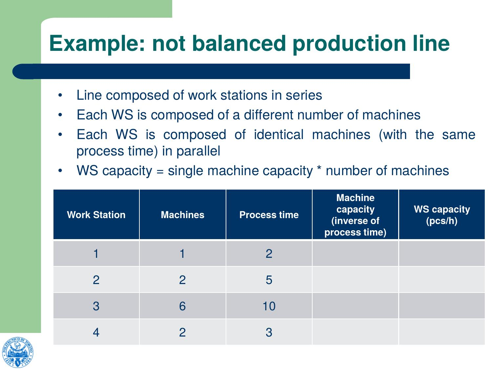

**Image description:** Table with 4 workstations, number of machines and processing times, but the "Machine capacity" and "WS capacity" columns are still empty (question slide before the answer).

---

## Slide n.45 → Title: Example: not balanced production line

- Line composed of work stations in series
- Each WS is composed of a different number of machines
- Each WS is composed of identical machines (with the same process time) in parallel
- WS capacity = single machine capacity * number of machines

| Work Station | Machines | Process time | Machine capacity (inverse of process time) | WS capacity (pcs/h) |
|---|---|---|---|---|
| 1 | 1 | 2 | ½ = 0.5 | 1*0.5 = 0.5 |
| 2 | 2 | 5 | 1/5 = 0.2 | 2*0.2 = 0.4 |
| 3 | 6 | 10 | 1/10 = 0.1 | 6*0.1 = 0.6 |
| 4 | 2 | 3 | 1/3 = 0.33 | 2*0.33 = 0.67 |

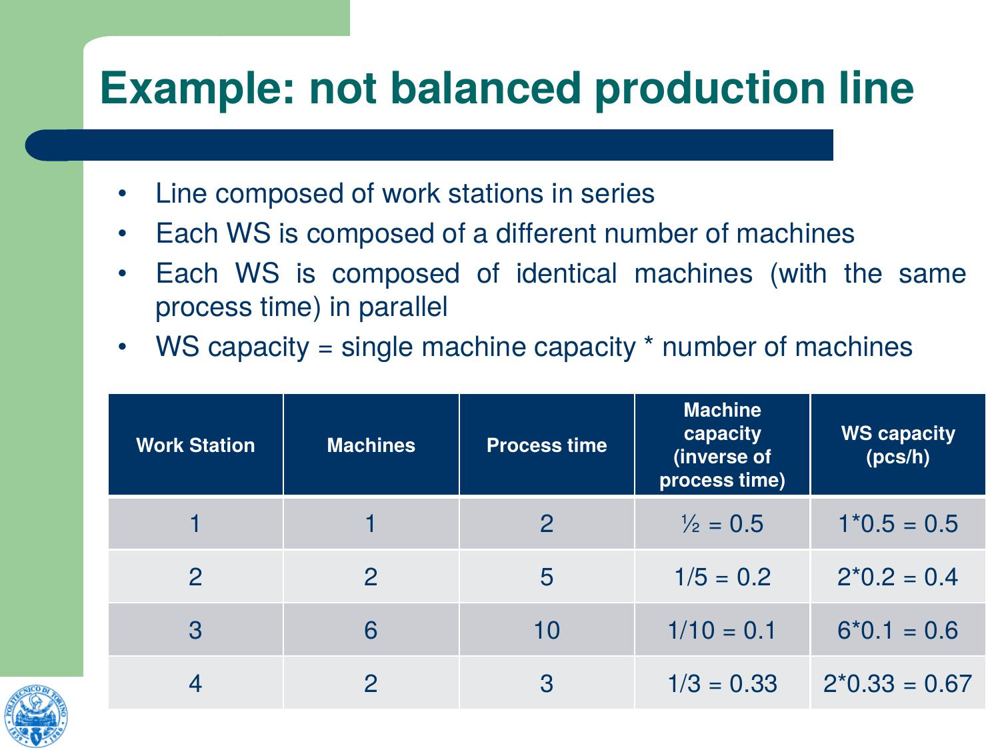

**Image description:** Same table as the previous slide, now completed with the Machine capacity values (inverse of process time) and WS capacity (machine capacity × number of machines). WS2 has the minimum capacity (0.4 pcs/h) and is therefore the bottleneck.

---

## Slide n.46 → Title: Example: not balanced production line

**Critical parameters:**
- r_b = 0.4 pcs/h (WS2 capacity: not WS3 with slower machines and not WS1 with smaller number of machines)
- T_0 = 20 h (sum of process times)
- W_0 = 0.4 × 20 = 8 pcs (it is smaller than the number of machines, because some station won't be completely used)

> No image/graph present in this slide.

---

## Slide n.47 → Title: HAL – Large Panel Line Processes

Data:
- Average process rate (number of panels/h)
- Average process time (h) at each station

| Process | Rate (p/hr) | Time (hr) |
|---|---|---|
| Lamination | 191.5 | 4.7 |
| Machining | 186.2 | 0.5 |
| Internal Circuitize | 114.0 | 3.6 |
| Optical Test/Repair - Int | 150.5 | 1.0 |
| Lamination – Composites | 158.7 | 2.0 |
| External Circuitize | 159.9 | 4.3 |
| Optical Test/Repair - Ext | 150.5 | 1.0 |
| Drilling | 185.9 | 10.2 |
| Copper Plate | 136.4 | 1.0 |
| Procoat | 117.3 | 4.1 |
| Sizing | 126.5 | 1.1 |
| EOL Test | 169.5 | 0.5 |
| **r_b, T_0** | **114.0** | **33.9** |

Batches and parallel machines are present, so rate is different from 1/time

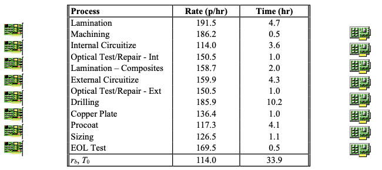

**Image description:** Table of the 12 processes of the HAL Large Panel Line with columns Process, Rate (p/hr) and Time (hr). The last row shows r_b = 114.0 p/hr (bottleneck: Internal Circuitize) and T_0 = 33.9 h (sum of all process times). Circuit board icons on the sides of the table represent the panels being produced.

---

## Slide n.48 → Title: HAL – Large Panel Line Processes

- Large Panel Line: produces printed circuit boards
- Line runs 24 hr/day (only 19.5 hrs of productive time)
- Recent Performance (last 7 months):
  - TH = 1,400 panels per day (71.8 panels/hr)
  - WIP = 47,600 panels
  - CT = 34 days (663 hr at 19.5 hr/day)
  - Customer service = 75% on-time delivery

How HAL is performing?
Which data we need to evaluate?

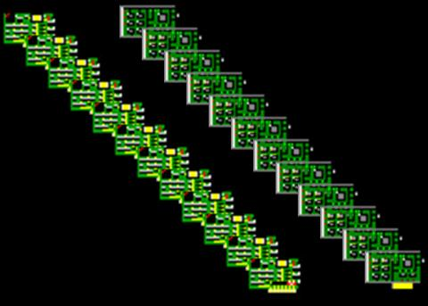

**Image description:** Photograph of numerous panels (circuit boards) arranged diagonally on a black background, visually illustrating the product of the HAL Large Panel Line. The panels show green printed circuits with electronic components.

---

## Slide n.49 → Title: HAL – Large Panel Line Processes

- Critical WIP: r_b × T_0 = 114 × 33.9 = 3,869
- Actual Values:
  - CT = 34 days = 663 hours (at 19.5 hr/day)
  - WIP = 47,600 panels
  - TH = 71.8 panels/hour
- Conclusions:
  - TH is 63% of capacity
  - WIP is 12.3 times critical WIP
  - CT is 24.1 times raw process time

**The factory is not performing well!**

> No image/graph present in this slide.

---

## Slide n.50 → Title: Exercise

Consider a production line composed of four workstations, each consisting of a single machine, except the second station which consists of two identical machines in parallel.

Each machine has mean process time equal to two hours per job.

a) Determine the bottleneck rate r_b, the raw process time T_0 and the critical WIP of the line
b) Compute CT and TH for values of WIP going from 1 to 10

> No image/graph present in this slide.

---

## Slide n.51 → Title: Exercise – Solution

Line layout: WS1 (1 machine) → WS2 (2 machines in parallel) → WS3 (1 machine) → WS4 (1 machine)

**Data:**

| Workstation | m | Process time [hours] | Station capacity [jobs/h] |
|---|---|---|---|
| 1 | 1 | 2 | 0.5 |
| 2 | 2 | 2 | 1 |
| 3 | 1 | 2 | 0.5 |
| 4 | 1 | 2 | 0.5 |

**Parameters:**
- r_b = 0.5 [jobs/h]
- T_0 = 8 [h]
- W_0 = 4 [jobs]

| WIP | CT_a | TH_a |
|---|---|---|
| 1 | 8 | 0.13 |
| 2 | 8 | 0.25 |
| 3 | 8 | 0.38 |
| 4 | 8 | 0.50 |
| 5 | 10 | 0.50 |
| 6 | 12 | 0.50 |
| 7 | 14 | 0.50 |
| 8 | 16 | 0.50 |
| 9 | 18 | 0.50 |
| 10 | 20 | 0.50 |

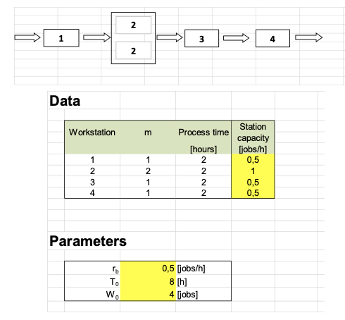

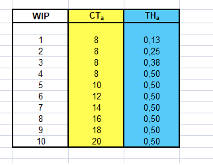

**Image description 51a:** Line layout with WS1, WS2 (with 2 parallel machines, numbered 2 and 2 in the box), WS3, WS4. Data table with workstation, number of machines m, process time and station capacity. Parameters table with r_b=0.5, T_0=8, W_0=4 (highlighted in yellow).

**Image description 51b:** Table with columns WIP (1-10), CT_a (h) and TH_a (jobs/h). CT remains at 8h for WIP≤4 (highlighted in yellow), then grows linearly. TH grows up to 0.50 at WIP=4 and remains constant (highlighted in yellow).

---

## Slide n.52 → Title: Exercise 2

Consider a production line composed by three workstations in series. The characteristics of the workstations are reported in the table.

Compute the bottleneck rate r_b, the raw process time T_0 and the critical WIP W_0 of the system.

What happen to the TH and CT values when the WIP exceeds W_0?

| Workstation i | E[Tsi] (min) | Machines |
|---|---|---|
| 1 | E[Ts1] = 3 | 2 |
| 2 | E[Ts2] = 2 | 1 |
| 3 | E[Ts3] = 4 | 3 |

> No image/graph present in this slide.

---

## Slide n.53 → Title: Solution

| Workstation i | E[Tsi] (min) | Machines | Production rate (min^-1) |
|---|---|---|---|
| 1 | E[Ts1] = 3 | 2 | 0.666666667 |
| 2 | E[Ts2] = 2 | 1 | 0.5 |
| 3 | E[Ts3] = 4 | 3 | 0.75 |

- T0 = 9 min
- r_b = 0.5 j/min
- W0 = 4.5 j

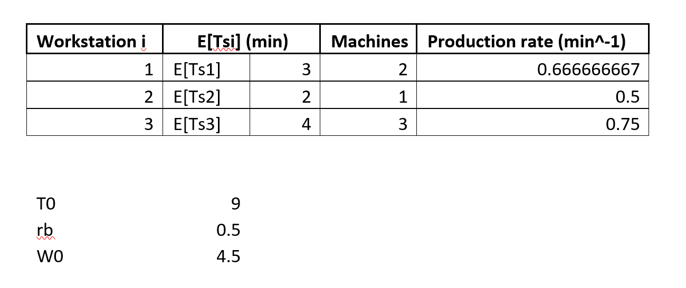

**Image description:** Table with 3 workstations, E[Tsi] in minutes, number of machines and production rate (min^-1) calculated as (number of machines / E[Tsi]). Below the table: summary of the critical parameters T0=9 min, r_b=0.5 j/min (WS2 is the bottleneck, minimum rate), W0=4.5 j.

---

## Slide n.54 → Title: Solution

$$CT_{best}(w) = \begin{cases} T_0, & \text{if } w \leq W_0 \\ w/r_b, & \text{otherwise.} \end{cases} \qquad TH_{best}(w) = \begin{cases} w/T_0, & \text{if } w \leq W_0 \\ r_b, & \text{otherwise.} \end{cases}$$

If the WIP exceeds W0, the TH remains constant at value of 0.5 j/min and the CT increases at a rate of WIP/0.5

**Image description 54a:** Piecewise formula for CT_best(w): equal to T_0 if w ≤ W_0, otherwise equal to w/r_b.

**Image description 54b:** Piecewise formula for TH_best(w): equal to w/T_0 if w ≤ W_0, otherwise equal to r_b.
