# Analysis and Management of Production System

# Lesson 3: Single Workstation Analysis

Prof. Giulia Bruno

Department of Management and Production Engineering

giulia.bruno@polito.it

# Deterministic vs Stochastic Models

V The simple throughput analysis of a serial factory with deterministic processing times was used to illustrate several system performance measures and their inter-relationships   
V The modeling approach was developed specifically for deterministic processing times

>This approach does not yield accurate results when processing times are random   
The next models will include probabilistic behavior for the arrival process and processing times,and the early models will restrict these two probability laws to the exponential distribution

# Variability

Definition: not uniformity of a class of entities   
>It causes a departure from regularity and predictability of the system behaviour   
Examples of variability sources:   
>Machine failures   
>Material shortages   
Operator unavailability   
>Different skill levels   
>Material handling   
>Product variety

# Variability

> Random variable: consequence of events out of our immediate control   
A random variable is characterized by:

Type of distribution: Exponential, Normal,Poisson.,..   
V Parameters:

V Mean value μ   
Variance g2   
V Skewness   
V Kurtosis   
V

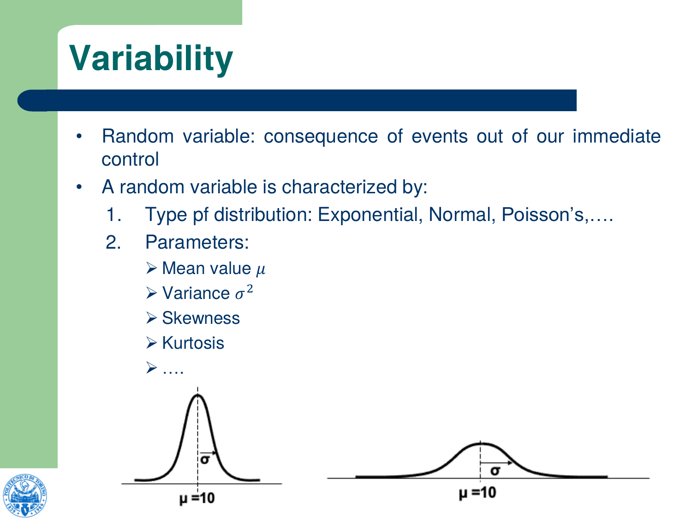

> **[Figura]** Curva di distribuzione normale con bassa varianza (campana stretta), con media μ=10 e deviazione standard σ indicata. Rappresenta una variabile casuale con bassa variabilità.

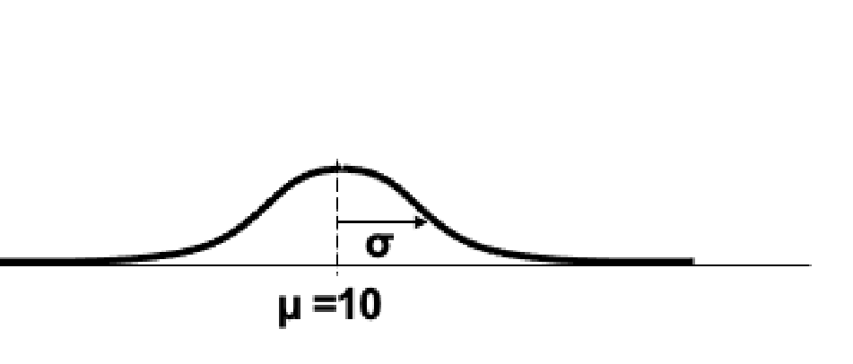

> **[Figura]** Curva di distribuzione normale con alta varianza (campana piatta e larga), con media μ=10 e deviazione standard σ indicata. A parità di media, la variabilità è molto maggiore rispetto alla curva precedente.

# Variability

> To classify and to quantify the variability of a random variables, dimensionless coefficients are used:

Coefficient of Variation (CV):

$$
c = \frac {\sigma}{\mu}
$$

Squared coefficient of variation (SCV):

$$
c ^ {2} = \frac {\sigma^ {2}}{\mu^ {2}}
$$

# Variability

> To allow the comparison，systems are classified according to the level of variability expressed through the coefficient of variation:

>Low variability (LV): c < 0,75   
>Moderate variability (MV): 0,75 < C < 1,33   
>High variability (HV): c ≥ 1,33

> **[Figura]** Scala orizzontale che classifica i sistemi in tre livelli di variabilità in base al coefficiente di variazione c: Bassa variabilità (LV) per c < 0.75, Variabilità moderata (MV) per 0.75 < c < 1.33, Alta variabilità (HV) per c ≥ 1.33.

> **[Figura]** Stessa scala di classificazione della variabilità (LV/MV/HV) con i valori soglia 0.75 e 1.33 evidenziati sull'asse del coefficiente di variazione c.

Mean Value = 25 min

StDev = 5.65 min

CV = 0.226

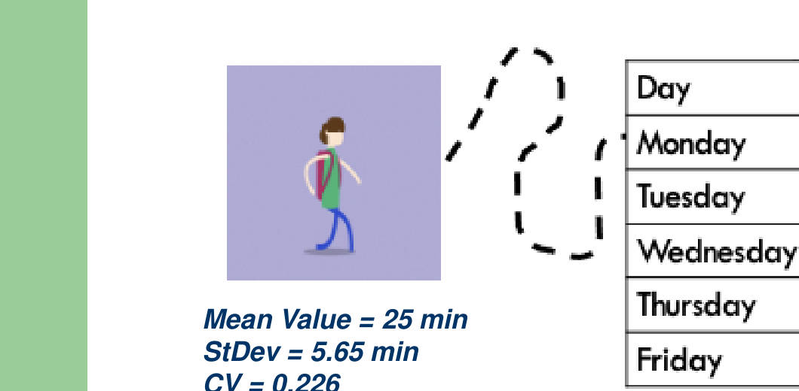

> **[Figura]** Esempio di variabilità: uno studente percorre ogni giorno il tragitto verso la scuola. I tempi misurati sono: Lunedì 26 min, Martedì 18 min, Mercoledì 19 min, Giovedì 30 min, Venerdì 32 min. Media = 25 min, Deviazione standard = 5.65 min, CV = 0.226 (bassa variabilità).

> **[Figura]** Illustrazione dell'edificio scolastico relativo all'esempio di variabilità del tragitto studente-scuola (CV = 0.226).

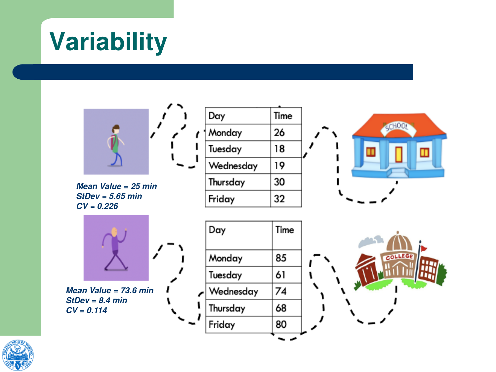

> **[Figura]** Confronto di due esempi di variabilità: tragitto verso la scuola (media 25 min, CV=0.226) e tragitto verso l'università (media 73.6 min, CV=0.114). Nonostante l'università sia più lontana, ha un CV inferiore, cioè è più regolare.

Mean Value = 73.6 min

StDev = 8.4 min

CV = 0.114

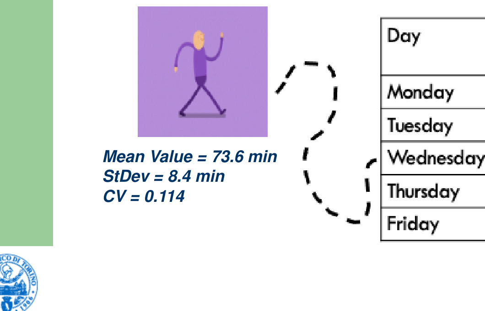

> **[Figura]** Esempio di variabilità: uno studente percorre ogni giorno il tragitto verso l'università. I tempi misurati sono: Lunedì 85 min, Martedì 61 min, Mercoledì 74 min, Giovedì 68 min, Venerdì 80 min. Media = 73.6 min, Deviazione standard = 8.4 min, CV = 0.114 (bassa variabilità).

> **[Figura]** Illustrazione dell'edificio universitario relativo all'esempio di variabilità del tragitto studente-università (CV = 0.114).

# Effect of variability

# Example

Constant processing time:

$$
t _ {0} = 1 0 \mathrm {m i n}
$$

Constant arrival rate:

$$
A = 1 / 3 0 \quad p c s / m i n
$$

$$
\mathrm {B} = 1 / 2 0 \quad \mathrm {p c s} / \mathrm {m i n}
$$

$$
C = 1 / 1 0 \quad p c s / m i n
$$

$$
D <   1 / 1 0 \quad p c s / m i n
$$

Item arrival

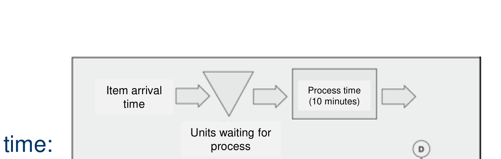

> **[Figura]** Schema del sistema di accodamento: il flusso degli item va da 'Item arrival time' → coda (triangolo) → macchina/server (cerchio) → uscita. Il tempo di processo è costante a 10 minuti.

Process time (10 minutes)

Units waiting for process

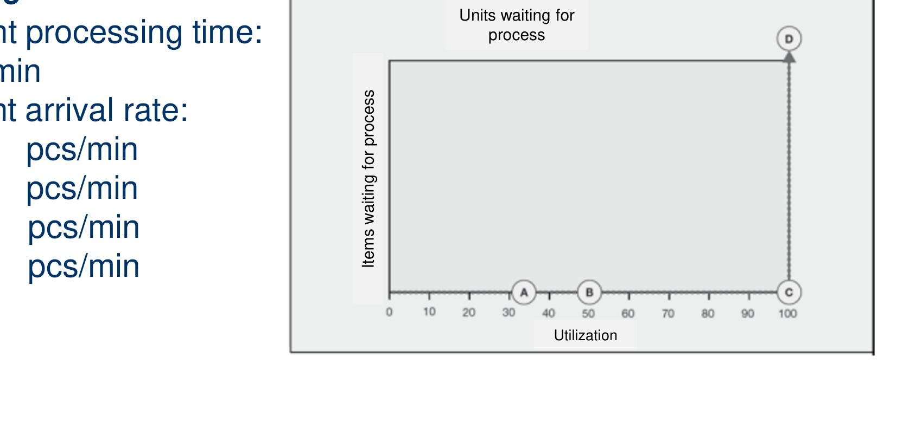

> **[Figura]** Grafico (caso deterministico): numero di item in attesa vs tasso di utilizzo (%). Con tempi di arrivo e di processo costanti, la coda è zero fino al 100% di utilizzo (punti A=33%, B=50%, C=100%), dopodiché esplode a infinito (punto D). La variabilità zero significa nessuna attesa finché il sistema non è saturo.

# Effect of variability

# Example

Constant processing time = 10 min

Variable arrival rate

Waiting time in queue = 3 min

6 units processing time = 65 min

Mean waiting time = 3/65 = 0.046 min

Inactivity time = 5 min = 7.7% of 65

Utilization = 92.3%

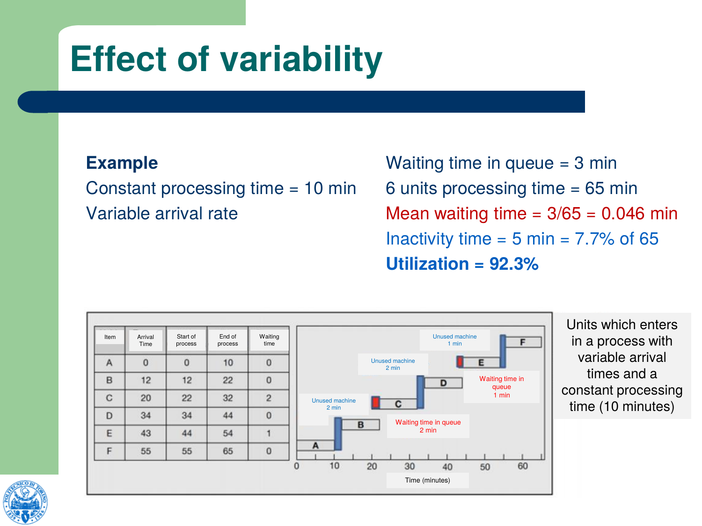

> **[Figura]** Tabella con i dati di 6 job (A-F) con tempi di arrivo variabili (0, 12, 20, 34, 43, 55 min), inizio e fine processo, e tempo di attesa in coda per ciascuno. Il tempo di processo è costante a 10 min. Attese: A=0, B=0, C=2, D=0, E=1, F=0 min. Attesa totale = 3 min su 65 min totali.

> **[Figura]** Diagramma di Gantt per 6 job (A-F) con tempi di arrivo variabili e processo costante di 10 min. Sono visibili i periodi di inattività della macchina (2+2+1 = 5 min) e i tempi di attesa in coda (2+1 = 3 min). Utilizzo = 92.3%, tempo medio di attesa = 3/65 = 0.046 min.

Units which enters in a process with variable arrival times and a constant processing time (10 minutes)

# Effect of variability

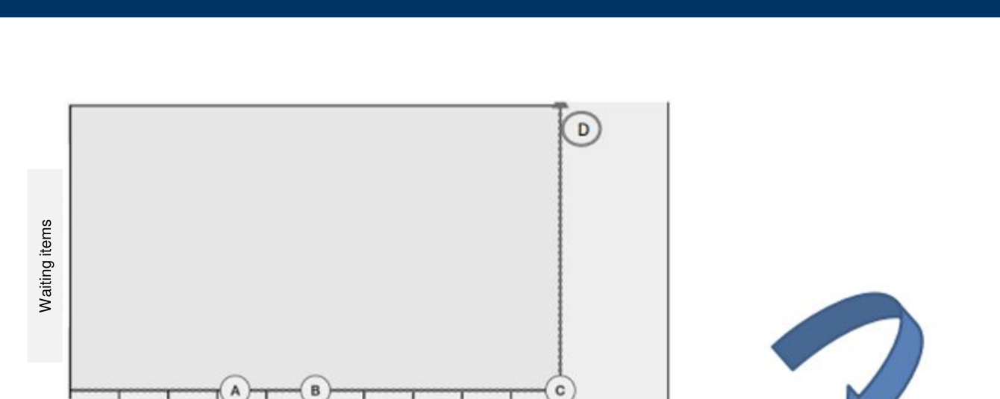

> **[Figura]** Grafico (caso deterministico): item in attesa vs utilizzo. La linea è piatta a zero fino al 100% di utilizzo, poi sale verticalmente. Questo è il comportamento ideale senza variabilità.

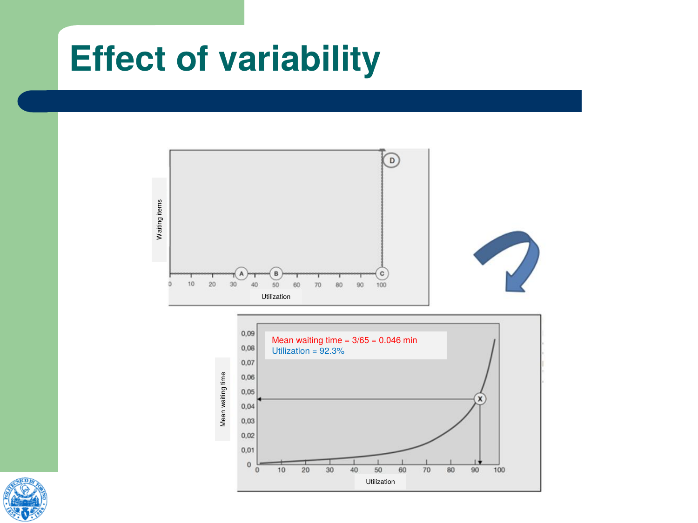

> **[Figura]** Grafico del tempo medio di attesa vs utilizzo per il caso con arrivi variabili e processo costante. La curva cresce in modo esponenziale avvicinandosi al 100% di utilizzo. Il punto X indica il caso dell'esempio: utilizzo = 92.3%, tempo medio di attesa = 0.046 min.

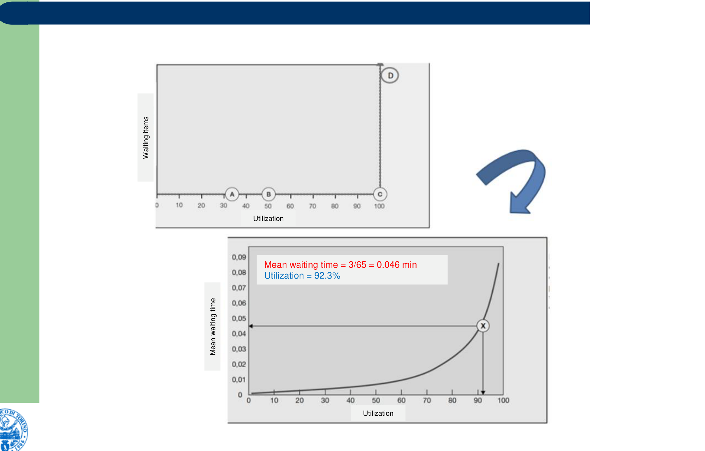

> **[Figura]** Confronto tra i due grafici: il grafico superiore (deterministico) mostra attesa zero fino alla saturazione; il grafico inferiore (con variabilità) mostra crescita esponenziale del tempo di attesa. La variabilità provoca attese anche a utilizzi moderati.

# Effect of variability

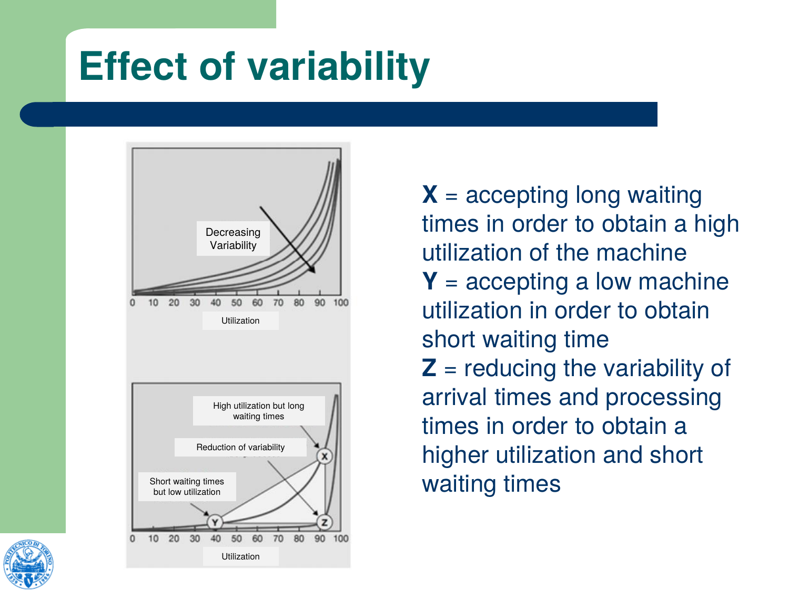

> **[Figura]** Famiglia di curve del tempo di attesa vs utilizzo per diversi livelli di variabilità. Al diminuire della variabilità (freccia verso il basso), le curve si abbassano: per lo stesso utilizzo si ottengono tempi di attesa minori. L'obiettivo è ridurre la variabilità per migliorare le prestazioni.

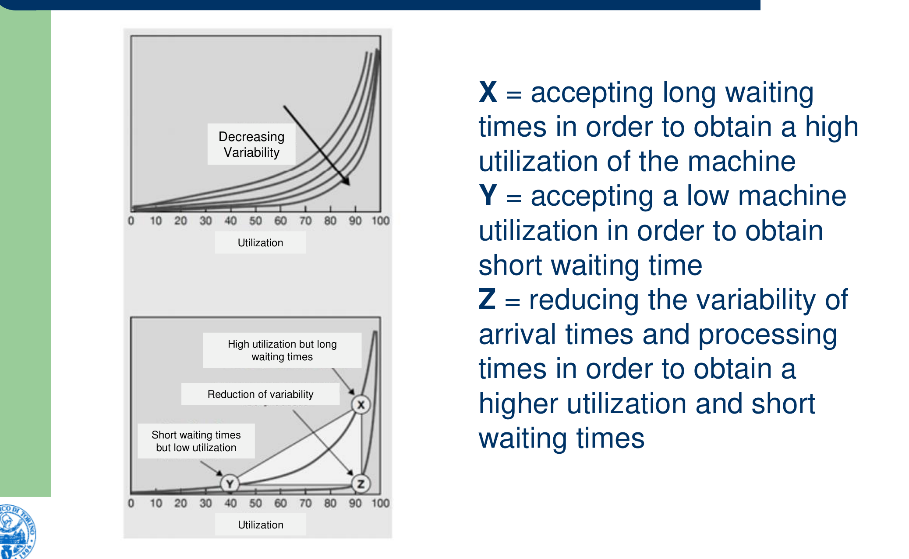

> **[Figura]** Grafico con tre strategie operative: X = accettare lunghi tempi di attesa per ottenere alta utilizzazione; Y = accettare bassa utilizzazione per avere tempi di attesa brevi; Z = ridurre la variabilità per ottenere contemporaneamente alta utilizzazione e tempi di attesa brevi (zona ottimale).

X = accepting long waiting times to obtain a high utilization of the machine

Y = accepting a low machine utilization to obtain short waiting time

Z = reducing the variability of arrival times and processing times to obtain a higher utilization and short waiting times

# Example: limited system

Consider a facility with a single machine that is used to service only one type of job.

The company policy is to limit the number of orders accepted at each time to 3.

The mean arrival rate of orders,λ, is 5 jobs per day,and the mean processing time for a job is 1/4 day (thus, the processing rate is μ = 4/day).

Both the processing and inter-arrival times are assumed to be exponentially distributed.

# Diagram model

> Straightforward method for developing the balance equations for ay system in steady-state whose inter-arrival and service times are exponentially distributed   
> The approach is to start by listing all the states as nodes in a network   
Each state represents the number of items in the system   
The node listing is

> **[Figura]** Nodi del diagramma di stato per il sistema M/M/1/3: quattro cerchi etichettati 0, 1, 2, 3 che rappresentano il numero di job presenti nel sistema (inclusi quello in lavorazione e quelli in coda). Stato 0 = sistema vuoto, stato 3 = sistema pieno.

> **[Figura]** Stessi nodi di stato 0, 1, 2, 3 del sistema M/M/1/3, mostrati nella fase iniziale prima di aggiungere gli archi di transizione.

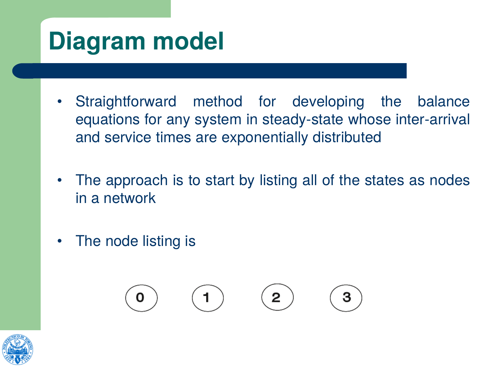

> **[Figura]** Nodi di stato del sistema M/M/1/3 (capacità massima 3 job). La presenza di un limite superiore significa che i job che arrivano quando il sistema è in stato 3 vengono persi (rifiutati).

> **[Figura]** Quattro nodi di stato (0, 1, 2, 3) per il sistema M/M/1/3, pronti per essere collegati dagli archi di transizione λ (arrivi) e μ (completamenti di servizio).

# Diagram model

> Directional arcs are added to the network to represent possible flows between nodes.

>Node 0 is connected to node 1 to represent the flow from state 0 to 1 when an arrival occurs, and the system is in state 0   
>Node 1 is connected to node O to represent the flow when a service occurs with the system in state 1 (a service results in an empty system or state 0)

> Note that an arrival into the system cannot occur when the system is in state 3 (i.e., when the system is full)

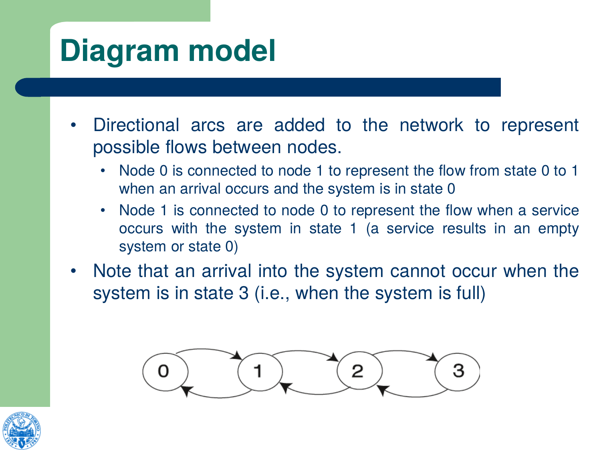

> **[Figura]** Diagramma di stato completo del sistema M/M/1/3 con archi direzionali: le frecce verso destra rappresentano gli arrivi (tasso λ) e collegano 0→1→2→3; le frecce verso sinistra rappresentano i completamenti di servizio (tasso μ) e collegano 3→2→1→0. Non c'è freccia di arrivo dallo stato 3 perché il sistema è pieno.

# Diagram model

> Upward movements among the states all occur at a rate λ times the probability of being in that state,Pn

>The conditional arrival rate given that the system is in state n is ^ and the net upward rate from state n is λ Pn

Downward movements all occur when a service has been completed and these have rates that are μ times the probability of being in the particular state, Pn

>The conditional service rate given that there is a job in the system to be serviced is μ and the resulting downward rates from state n is μ Pn

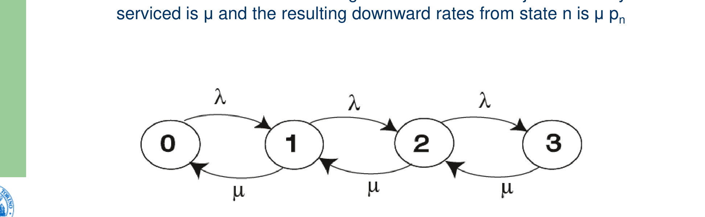

> **[Figura]** Diagramma di transizione di stato del sistema M/M/1/3 con i tassi esplicitati: arrivi a tasso λ (frecce superiori verso destra), completamenti di servizio a tasso μ (frecce inferiori verso sinistra). Le transizioni upward hanno tasso λ·pₙ, quelle downward tasso μ·pₙ.

# Diagram model

The completed directed network can now be used to derive the steadystate balance equations   
> Assuming that a steady-state exists, then the flow into and out of each state must balance   
Partition the nodes into two subsets of nodes, then establish values for the appropriate steady-state probabilities to balance the flow between the two subsets   
> Partitions are redrawn at n-1 different locations to obtain n-1 equations; these equations are combined with the norming equation   
First equation

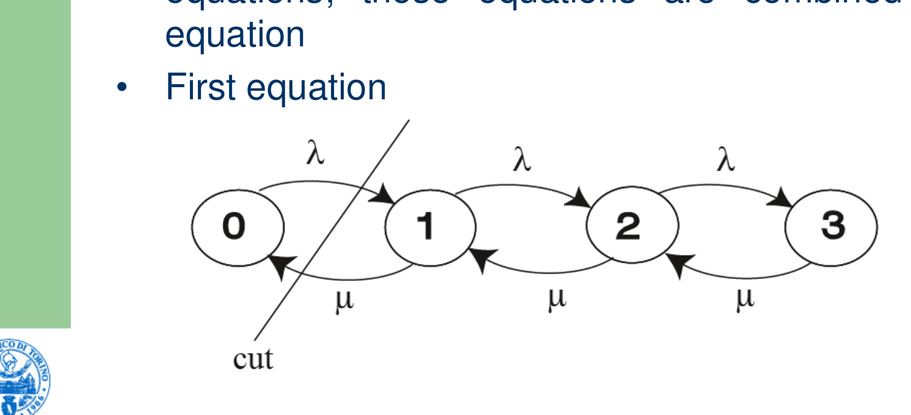

> **[Figura]** Diagramma di stato M/M/1/3 con il primo taglio (cut) tra lo stato {0} e gli stati {1,2,3}. Il bilanciamento dei flussi attraverso il taglio dà la prima equazione di equilibrio: λp₀ = μp₁ (il flusso di arrivi dallo stato 0 eguaglia il flusso di servizio verso lo stato 0).

$$
\lambda p _ {0} = \mu p _ {1}
$$

# Diagram model

Second equation

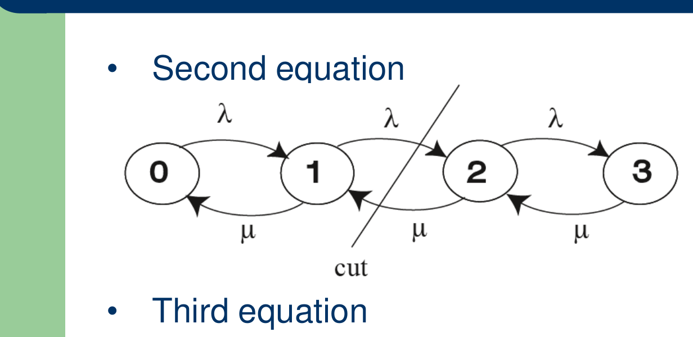

> **[Figura]** Diagramma di stato M/M/1/3 con il secondo taglio tra gli stati {0,1} e {2,3}. Il bilanciamento dà la seconda equazione di equilibrio: λp₁ = μp₂.

$$
\lambda p _ {1} = \mu p _ {2}
$$

Third equation

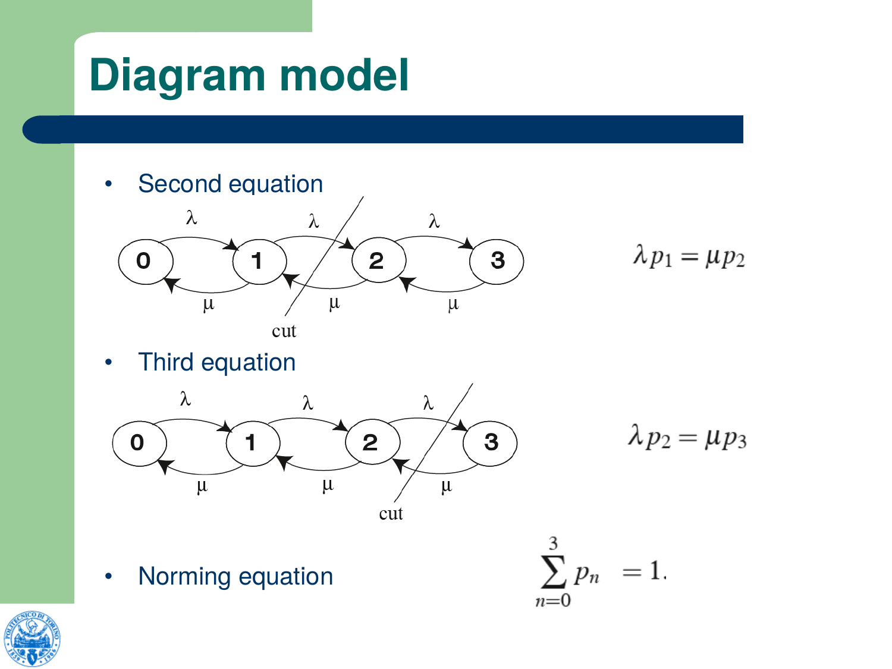

> **[Figura]** Diagramma di stato M/M/1/3 con il terzo taglio tra gli stati {0,1,2} e {3}. Il bilanciamento dà la terza equazione di equilibrio: λp₂ = μp₃.

$$
\lambda p _ {2} = \mu p _ {3}
$$

Norming equation

$$
\sum_ {n = 0} ^ {3} p _ {n} = 1.
$$

# Solution

$$
p _ {1} = \left(\frac {\lambda}{\mu}\right) p _ {0}, \quad p _ {2} = \left(\frac {\lambda}{\mu}\right) ^ {2} p _ {0}, \quad p _ {3} = \left(\frac {\lambda}{\mu}\right) ^ {3} p _ {0}
$$

$$
p _ {0} = \left[ 1 + \frac {\lambda}{\mu} + \left(\frac {\lambda}{\mu}\right) ^ {2} + \left(\frac {\lambda}{\mu}\right) \right] ^ {- 1}
$$

$$
(p _ {0}, p _ {1}, p _ {2}, p _ {3}) = (0. 1 7 3, 0. 2 1 7, 0. 2 7 1, 0. 3 3 9)
$$

# Comments

> The server is idle when the system is empty, so the percentage of server idle time is 17.3%.   
The probability of having 1 item in the system is p1: 21.7%   
The probability of having 2 items in the system is pz: 27.1%   
The probability of having 3 items in the system is p3: 33.9%

$$
W I P = E [ N ] = \sum n p _ {n} = 1 \times 0. 2 1 7 + 2 \times 0. 2 7 1 + 3 \times 0. 3 3 9 = 1. 7 7 6 \text {j o b s}
$$

# Comments

> The number of lost jobs per hour (i.e., those arriving to a full system) is given by λxp= 5x0.339 = 1.695.   
Throughput is equal to the number of jobs that enter the system per unit time (those jobs that actually get into the system,called the effective arrival rate).   
Thus, throughput rate equals the arrival rate minus the loss rate; namely,5 - 1.695= 3.305 jobs/day.

$$
C T = W I P / t h = W I P / \left(\lambda \left(1 - p _ {3}\right)\right) = 1. 7 7 6 / 3. 3 0 5 = 0. 5 3 7 \text {d a y s}
$$

# Effective arrival rate

> Whenever the system is finite, there is the possibility that the system will be full and arriving jobs will be lost; hence, the actual rate of jobs that enter the system, ∧e may not be the same as the arrival rate, λ.   
V The effective arrival rate for a system is te rate at which jobs enter the system. For a workstation with constant arrival rate, ^,and with a maximum number of jobs at the workstation limited to nmax, the effective arrival rate is given by

$$
\lambda_ {e} = \lambda (1 - p _ {n _ {\max}})
$$

where Pnmax is the probability that the workstation is full.

V A system at steady-state willhave its system throughput rate equal to the effective arrival rate; that is, th =λe, and the use of Little's Law must always use λe and not λ for the throughput.

# Queuing Systems

> Queues Theory: development of models to study the waiting phenomena which appears in presence of a service demand   
Applications

Customers waiting at the bank or at the post office   
Patients waiting for the doctor   
People waiting for a taxi   
Parts waiting to be processed by a machine

Defined in 1917 by Erlang and applied in telephonic sector

# A queuing systems includes:

# 1. An arrival process

Single jobs or batches   
Deterministic or stochastic arrival times

# 2. A production/service process

Single or parallel machines   
Deterministic or stochastic process times

# 3. A queue

FCFS (First Come First Served),LCFS (Last Come First Served), SIRIO (Service In Random Order),....   
Limited or illimited length

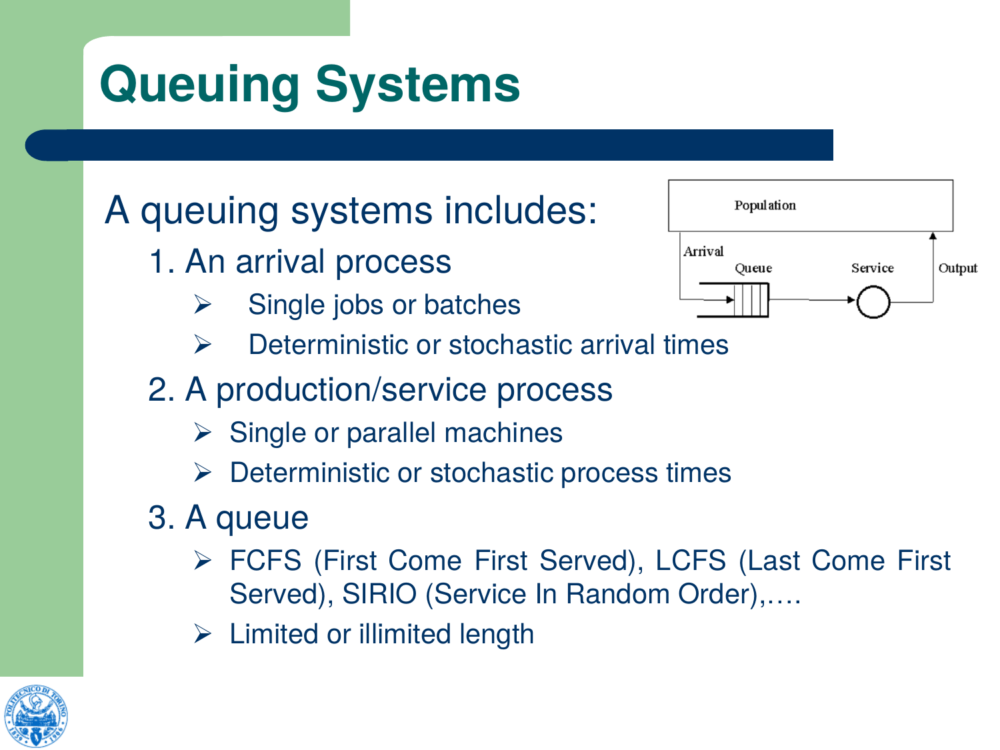

> **[Figura]** Schema generale di un sistema di accodamento: flusso Popolazione → Arrivi → Coda (lista di attesa) → Servizio (server/macchina) → Output. Mostra i tre componenti fondamentali: processo di arrivo, coda, e processo di servizio.

# Kendall Notation

List of characters separated by a “/"   
First element: inter-arrival time distribution   
Second element: service time distribution   
V Third element: number of servers   
V Fourth element: maximum number of jobs allowed in the system at one time   
Optional fifth element: queueing discipline

/ maximum arrival service number queue (process/process of servers possible discipline in system

Example: M/M/1/3

# Commonly used abbreviations

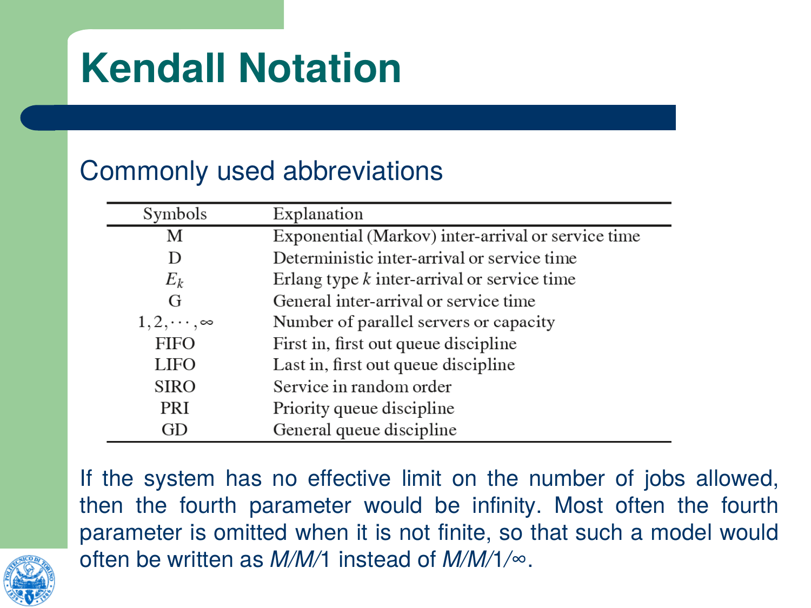

> **[Figura]** Tabella delle abbreviazioni usate nella notazione di Kendall: M = distribuzione esponenziale (Markoviana), D = deterministica, E_k = Erlang di tipo k, G = generale; numeri 1,2,...,∞ = numero di server; discipline di coda FIFO (first-in first-out), LIFO (last-in first-out), SIRO (servizio in ordine casuale), PRI (priorità), GD (disciplina generale).

V If the system has no effective limit on the number of jobs allowed, then the fourth parameter would be infinity. Most often the fourth parameter is omitted when it is not finite, so that such a model would often be written as M/M/1 instead of M/M/1/.

# Infinite Capacity Model (M/M/1)

Exponential distribution of arrival times   
Exponential distribution of processing times   
One machine in the server   
Queue of unlimited dimension (it can be omitted)

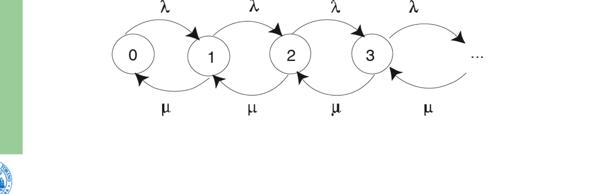

> **[Figura]** Diagramma di transizione di stato del modello M/M/1 a capacità infinita: stati 0, 1, 2, 3, ... estesi all'infinito. Ogni stato n è connesso a n+1 (arrivo a tasso λ) e a n-1 (completamento a tasso μ). La coda non ha limite superiore.

# Infinite Capacity Model (M/M/1)

> An infinite system of equations exists

$$
\lambda p _ {0} = \mu p _ {1}
$$

$$
\lambda p _ {1} = \mu p _ {2}
$$

$$
\lambda p _ {2} = \mu p _ {3}
$$

$$
\lambda p _ {n} = \mu p _ {n + 1}
$$

$$
\sum_ {n = 0} ^ {\infty} p _ {n} = 1.
$$

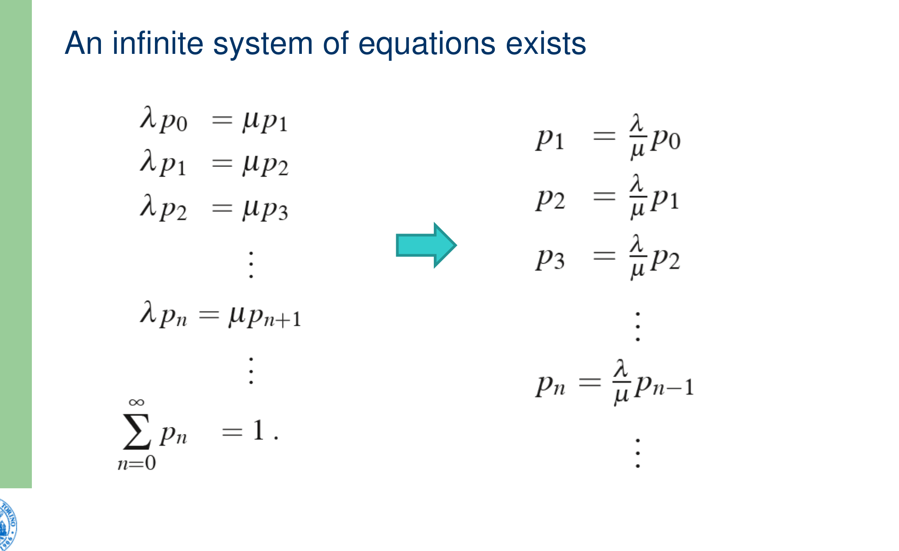

> **[Figura]** Sistema infinito di equazioni di bilancio per M/M/1: λp₀=μp₁, λp₁=μp₂, ..., λpₙ=μpₙ₊₁, con l'equazione di normalizzazione Σpₙ=1. Dalla sostituzione successiva si ottiene pₙ = (λ/μ)·pₙ₋₁.

$$
{p _ {1}} {= \frac {\lambda}{\mu} p _ {0}}
$$

$$
p _ {2} = \frac {\lambda}{\mu} p _ {1}
$$

$$
p _ {3} = \frac {\lambda}{\mu} p _ {2}
$$

$$
p _ {n} = \frac {\lambda}{\mu} p _ {n - 1}
$$

# Infinite Capacity Model (M/M/1)

Using a successive substitution procedure,each pn term can be written as a function of Po

$$
p _ {n} = \left(\frac {\lambda}{\mu}\right) ^ {n} p _ {0} \text {f o r} n = 0, 1, \dots
$$

By substituting in the norming equation:

$$
p _ {0} + \left(\frac {\lambda}{\mu}\right) p _ {0} + \left(\frac {\lambda}{\mu}\right) ^ {2} p _ {0} + \dots + \left(\frac {\lambda}{\mu}\right) ^ {n} p _ {0} + \dots = 1
$$

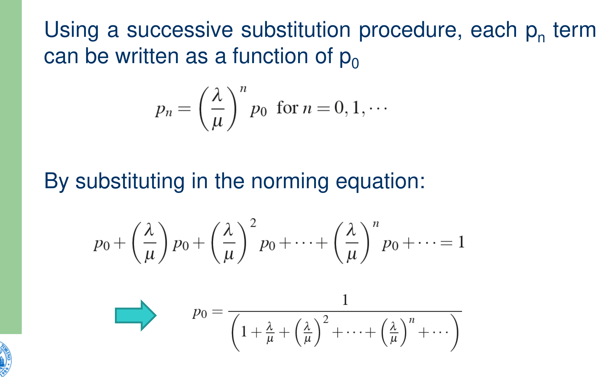

> **[Figura]** Derivazione di p₀ per M/M/1: sostituendo nell'equazione di normalizzazione si ottiene p₀·(1 + λ/μ + (λ/μ)² + ...) = 1. La serie geometrica converge se λ/μ < 1, quindi p₀ = 1/(1/(1-λ/μ)) = 1 - λ/μ.

$$
p _ {0} = \frac {1}{\left(1 + \frac {\lambda}{\mu} + \left(\frac {\lambda}{\mu}\right) ^ {2} + \cdots + \left(\frac {\lambda}{\mu}\right) ^ {n} + \cdots\right)}
$$

# Infinite Capacity Model (M/M/1)

Remembering the property of a geometric series:

$$
\sum_ {n = 0} ^ {\infty} r ^ {n} = 1 / (1 - r) \text {f o r} | r | <   1
$$

V The denominator is a geometric series that has a finite value if Vu<1, thus

$$
p _ {0} = 1 - \frac {\lambda}{\mu}
$$

The general solution to the steady-state probabilities is

$$
p _ {n} = \left(1 - \frac {\lambda}{\mu}\right) \left(\frac {\lambda}{\mu}\right) ^ {n} \text {f o r} n = 0, 1, \dots
$$

# Infinite Capacity Model (M/M/1)

V Computation of the expected number of jobs in the system (WIP)

$$
\begin{array}{l} W I P _ {s} = E [ N ] = \sum_ {n = 0} ^ {\infty} n p _ {n} = \sum_ {n = 0} ^ {\infty} n \left(1 - \frac {\lambda}{\mu}\right) \left(\frac {\lambda}{\mu}\right) ^ {n} \\ = \left(1 - \frac {\lambda}{\mu}\right) \left(\frac {\lambda}{\mu}\right) \sum_ {n = 1} ^ {\infty} n \left(\frac {\lambda}{\mu}\right) ^ {n - 1} \\ = \left(1 - \frac {\lambda}{\mu}\right) \left(\frac {\lambda}{\mu}\right) \overbrace {\left(\frac {1}{1 - \frac {\lambda}{\mu}}\right) ^ {2}} \\ = \frac {\left(1 - \frac {\lambda}{\mu}\right) \left(\frac {\lambda}{\mu}\right)}{\left(1 - \frac {\lambda}{\mu}\right) ^ {2}} = \frac {\left(\frac {\lambda}{\mu}\right)}{\left(1 - \frac {\lambda}{\mu}\right)} = \frac {u}{1 - u} \\ \end{array}
$$

Utilization factor (u)

$$
\boxed {\sum_ {n = 1} ^ {\infty} n r ^ {n - 1} = 1 / (1 - r) ^ {2} \text {f o r} | r | <   1}
$$

# Infinite Capacity Model (M/M/1)

> Using Little's Law, the expected time in system (the cycle time) CTs is given by:

$$
C T _ {s} = \frac {W I P _ {s}}{\lambda} = \frac {1}{\lambda} \frac {\frac {\lambda}{\mu}}{(1 - \frac {\lambda}{\mu})} = \frac {1}{\mu - \lambda}
$$

# Example

Consider a single server system with exponentially-distributed interarrival times and exponentially-distributed service times.

4 jobs per hour arrive for service and the mean service time is 1/5 hour.

Compute the WS performance measures

# Data

λ = 4 jobs/hr (=TH)   
μ = 5 jobs/hr → E[Ts]= 1/5 hr = 0.2 hr

# Solution

u = =4/5 =0.8 μ   
WIPs = u 0.8 = 4 jobs 1-u 1-0.8   
CTs = WIPs = 4/4 = 1 hr TH   
CTq = CTs-E[Ts] = 1 - 0.2= 0.8 hr

# Solution

Probability that the server is idle: po= 1-u = 0.2   
> Probability of having 1 item in the system: p,= u*(1-u)= 0.8*0.2 = 0.16   
> Probability of having 2 item in the system: P2= u2*(1-u) = 0.82*0.2 = 0,128   
> Probability of having 3item in the system: p3 = u3*(1-u)= 0.83*0.2 = 0.1024   
  
> Probability of having n item in the system: Pn = un*(1-u) = 0.8n*0.2

# Exercise

V Consider a M/M/1 system with the following parameters:

>λ = 2,875 jobs/hr   
>μ = 3 jobs/hr -> E[Ts] = 1/3 = 0.333 hr

> What is the utilization factor of the WS?   
What is the probability that there are no jobs at the WS?   
> What is the average number of jobs lost per hour?   
> What is the average throughput rate per hour?   
What is the average WIP?   
What is the average CT in hours?   
What are the average CTq (in hours) and WIPq?

# Solution

u = =2.875/3=0.958   
> Probability that there are no jobs in the WS: po= 1-u = 1-0.958 = 0.042   
Number of jobs lost = O,because the queue is unlimited   
TH=λ =2.875 jobs/hr   
WIP =1= 22.81 jobs   
CT = WP = 23/2.875 = 7.934 hrs   
? CTq = CT - E[Ts] = 7.934 -0.333 = 7.6 hrs   
WIPq = TH · CTq = 21.85 jobs

# M/M/1 - Summary of Performance Measures

Work In Process:

$$
W I P _ {s} = \frac {u}{1 - u}
$$

Cycle Time:

$$
C T _ {\mathrm {s}} = \frac {W I P _ {\mathrm {s}}}{\lambda} = \frac {1}{\lambda} \frac {\frac {\lambda}{\mu}}{(1 - \frac {\lambda}{\mu})} = \frac {1}{\mu - \lambda}
$$

Queue Cycle Time:

$$
C T _ {q} = \frac {u}{1 - u} E [ T _ {s} ]
$$

Moreover:

$$
\mathrm {T H} = \lambda
$$

V Queue Work In Process:

$$
W I P _ {q} = \frac {u ^ {2}}{1 - u}
$$

$$
u = \lambda / \mu <   1
$$

> Performance measures increase as u and E[Ts] increase, and tend to infinity as u → 1

# Infinite Capacity Model (M/M/c)

> In most models,it is usually assumed that allthe machines are identical and jobs are not split,but processed completely on one machine.   
> If one machine operates at a rate of μ, then c machines operate at a rate of cu ，and the state diagram must be adjusted accordingly.   
For example, suppose a workstation has three machines, then the service rate when two machines are busy is 2μ and whenever all machines are busy the service rate is 3μ; thus, the rate diagram is as below. 入 2 入

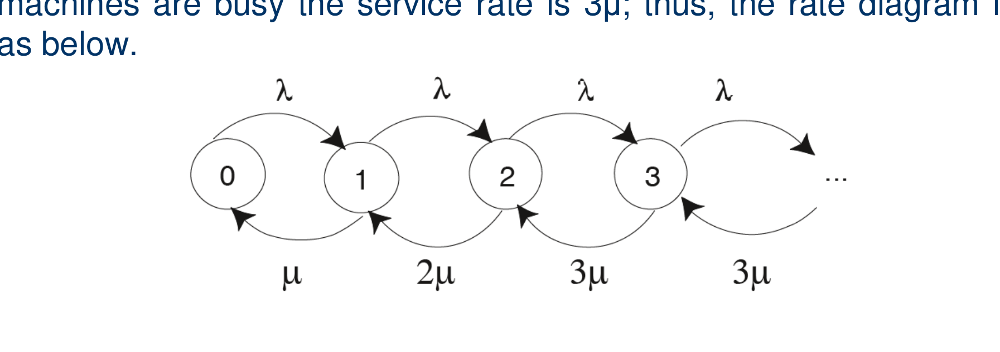

> **[Figura]** Diagramma di transizione di stato per il modello M/M/c con 3 macchine identiche: il tasso di servizio è μ quando 1 macchina è occupata, 2μ quando 2 macchine sono occupate, 3μ quando tutte e 3 sono occupate. Il tasso di arrivo è sempre λ. Gli stati si estendono all'infinito.

# Infinite Capacity Model (M/M/c)

$$
C T _ {q} (M / M / c) = \left(\frac {u ^ {\sqrt {2 c + 2} - 2}}{c}\right) C T _ {q} (M / M / 1)
$$

$$
C T _ {q} (M / M / c) = \frac {u ^ {\sqrt {2 (c + 1)} - 1}}{c (1 - u)} E [ T s ]
$$

> When c=1, the formula is equal to the M/M/1 case

# Non-identical service rates

> Workstation with two machines with non-identical service rate   
> If a job arrives to the system and finds that only one machine is busy, the job is assigned to the idle machine regardless of the speed of the machine   
V Once a job is assigned to a machine for processing, it remains on that machine until its processing is complete   
> Inter-arrival times exponentially distributed with a mean arrival rate of λ   
> Mean service rates of μ and γ for the two distinct machines

Y<μ, the μ machine is faster

Limit of four jobs in the system at one time

# Example M/M/2/4

Nmax = 4   
> Possible number of states are nmax + 2 → {0, 1f, 1s,2,3,4}   
> n=1f: one job in the system in the faster machine   
V n=1s: one job in the system in the slower machine

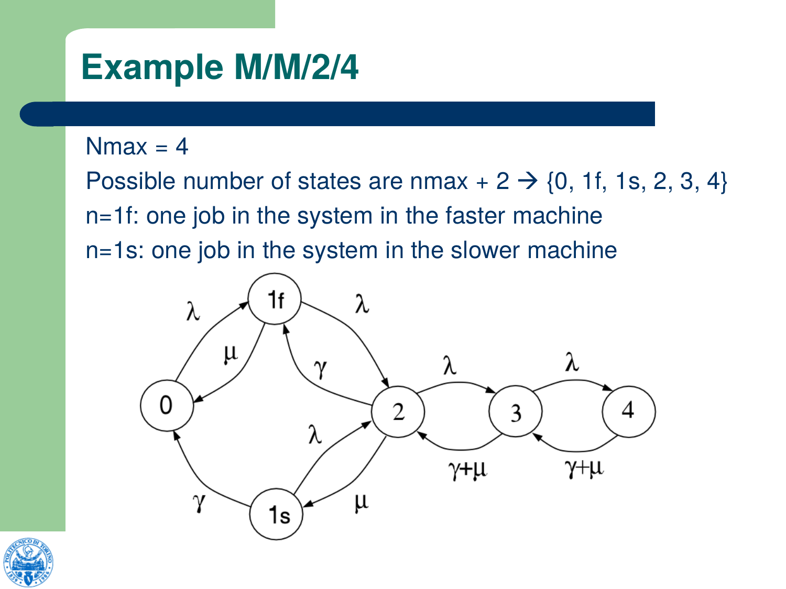

> **[Figura]** Diagramma di transizione di stato del sistema M/M/2/4 con due macchine non identiche (μ = tasso macchina veloce, γ = tasso macchina lenta, γ<μ). Gli stati sono: 0 (vuoto), 1f (1 job sulla macchina veloce), 1s (1 job sulla macchina lenta), 2 (entrambe le macchine occupate), 3 e 4 (job in coda). Capacità massima = 4 job.

Cutting the graph

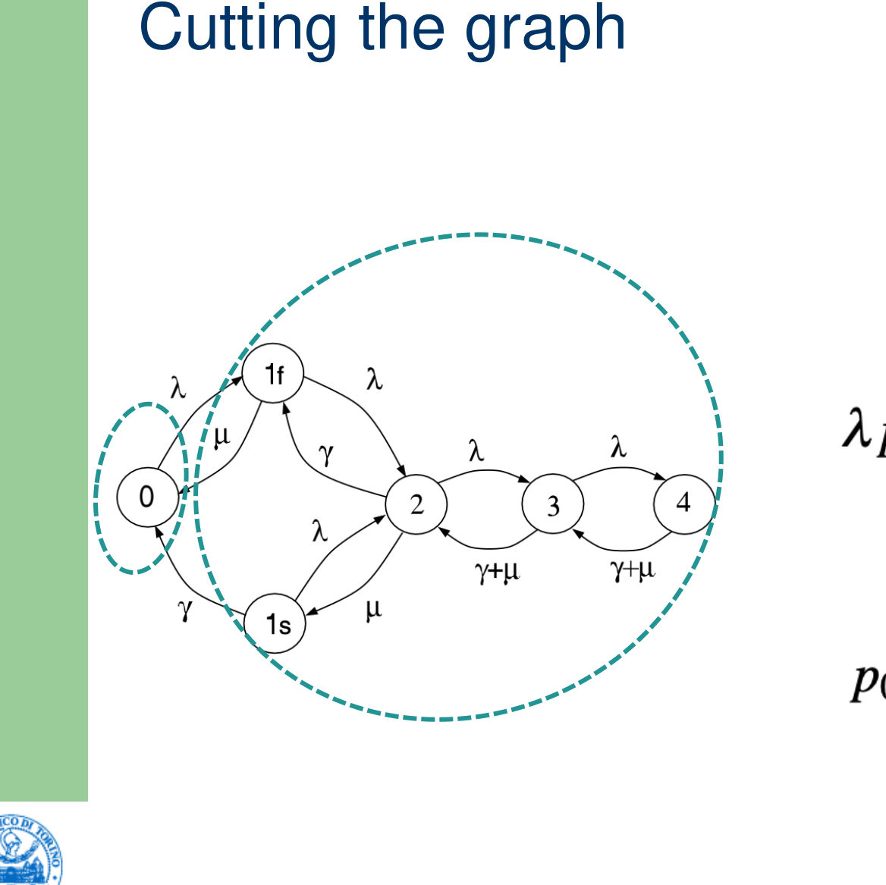

> **[Figura]** Diagramma M/M/2/4 con il primo taglio che isola lo stato 0 dagli altri. Il bilanciamento dei flussi dà la prima equazione: λp₀ = μp₁f + γp₁s (gli arrivi nello stato 0 bilanciano i completamenti dagli stati 1f e 1s che tornano a 0).

$$
\lambda p _ {0} = \mu p _ {1 \mathrm {f}} + \gamma p _ {1 \mathrm {s}}
$$

$$
\lambda p _ {1 \mathrm {f}} = \gamma p _ {2} + \gamma p _ {1 \mathrm {S}}
$$

$$
\lambda p _ {1 \mathrm {f}} + \lambda p _ {1 \mathrm {S}} = (\gamma + \mu) p _ {2}
$$

$$
\lambda p _ {2} = (\gamma + \mu) p _ {3}
$$

$$
\lambda p _ {3} = (\gamma + \mu) p _ {4}
$$

$$
p _ {0} + p _ {1 \mathrm {f}} + p _ {1 \mathrm {S}} + p _ {2} + p _ {3} + p _ {4} = 1
$$

# Example M/M/2/4

Cutting the graph

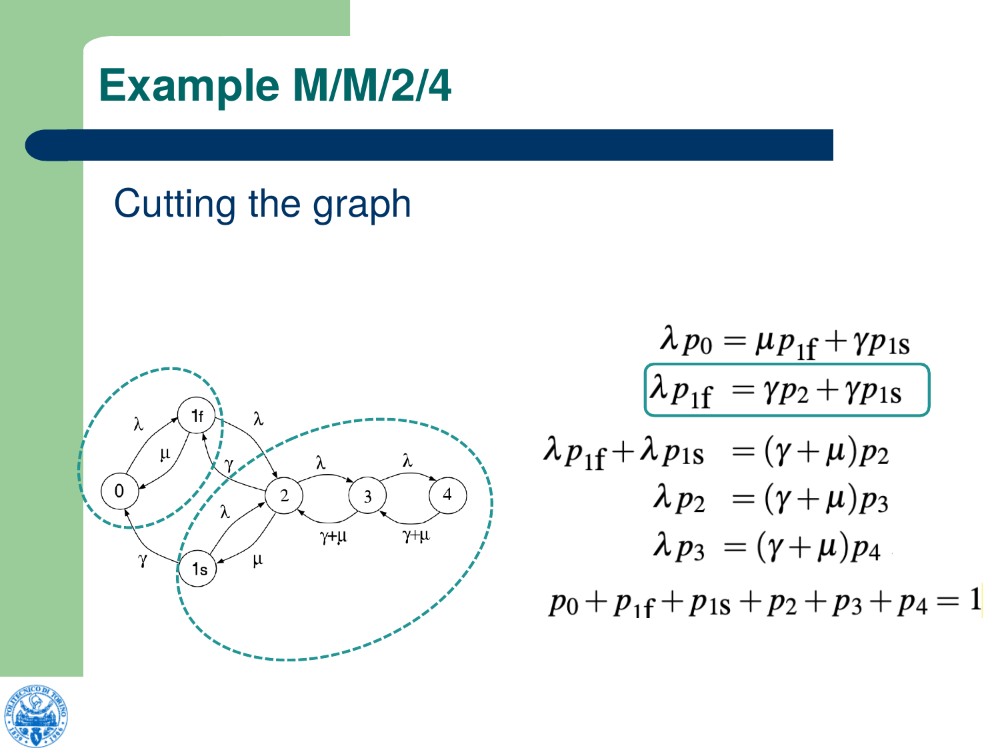

> **[Figura]** Diagramma M/M/2/4 con il secondo taglio che isola lo stato 1f. La seconda equazione di equilibrio è: λp₁f = γp₂ + γp₁s.

$$
\lambda p _ {0} = \mu p _ {1 \mathrm {f}} + \gamma p _ {1 \mathrm {S}}
$$

$$
\lambda p _ {1 \mathrm {f}} = \gamma p _ {2} + \gamma p _ {1 \mathrm {S}}
$$

$$
\lambda p _ {1 \mathrm {f}} + \lambda p _ {1 \mathrm {S}} = (\gamma + \mu) p _ {2}
$$

$$
\lambda p _ {2} = (\gamma + \mu) p _ {3}
$$

$$
\lambda p _ {3} = (\gamma + \mu) p _ {4}
$$

$$
p _ {0} + p _ {1 \mathrm {f}} + p _ {1 \mathrm {S}} + p _ {2} + p _ {3} + p _ {4} = 1
$$

# Example M/M/2/4

Cutting the graph

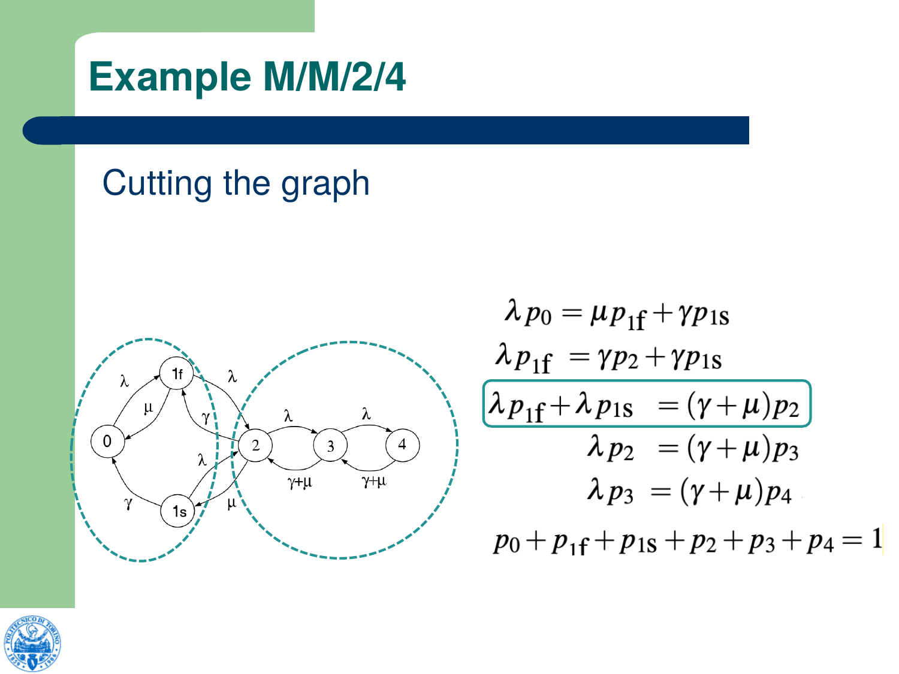

> **[Figura]** Diagramma M/M/2/4 con il terzo taglio tra gli stati {0,1f,1s} e {2,3,4}. La terza equazione di equilibrio è: λp₁f + λp₁s = (γ+μ)p₂.

$$
\lambda p _ {0} = \mu p _ {1 \mathrm {f}} + \gamma p _ {1 \mathrm {s}}
$$

$$
\lambda p _ {1 \mathrm {f}} = \gamma p _ {2} + \gamma p _ {1 \mathrm {S}}
$$

$$
\lambda p _ {1 \mathrm {f}} + \lambda p _ {1 \mathrm {S}} = (\gamma + \mu) p _ {2}
$$

$$
\lambda p _ {2} = (\gamma + \mu) p _ {3}
$$

$$
\lambda p _ {3} = (\gamma + \mu) p _ {4}
$$

$$
p _ {0} + p _ {1 \mathrm {f}} + p _ {1 \mathrm {S}} + p _ {2} + p _ {3} + p _ {4} = 1
$$

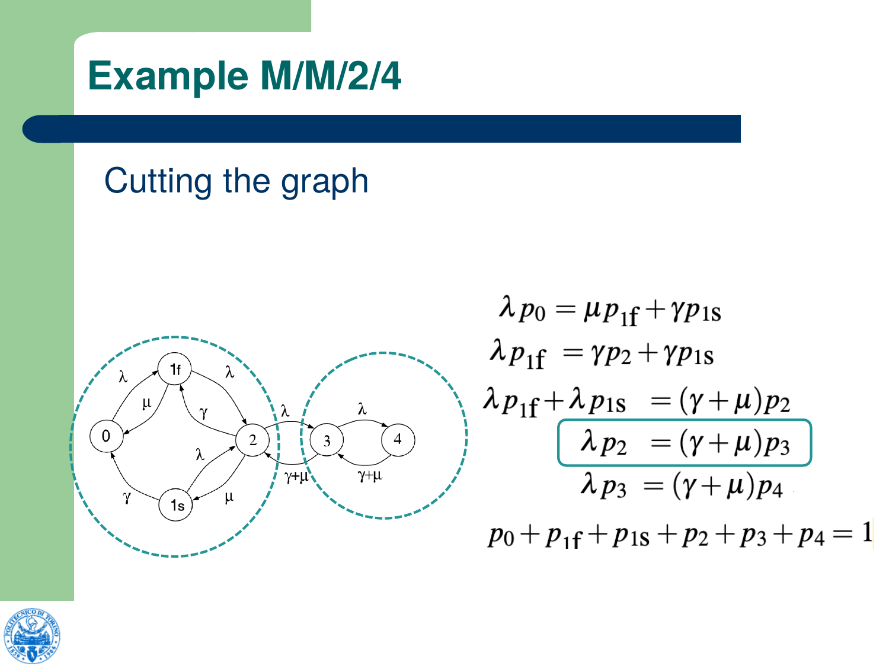

> **[Figura]** Diagramma M/M/2/4 con il quarto taglio tra gli stati {0,1f,1s,2} e {3,4}. La quarta equazione di equilibrio è: λp₂ = (γ+μ)p₃.

Cutting the graph

> **[Figura]** Diagramma M/M/2/4 che continua a mostrare il quarto taglio con l'equazione λp₂ = (γ+μ)p₃ evidenziata.

$$
\lambda p _ {0} = \mu p _ {1 \mathrm {f}} + \gamma p _ {1 \mathrm {S}}
$$

$$
\lambda p _ {1 \mathrm {f}} = \gamma p _ {2} + \gamma p _ {1 \mathrm {s}}
$$

$$
\lambda p _ {1 \mathrm {f}} + \lambda p _ {1 \mathrm {S}} = (\gamma + \mu) p _ {2}
$$

$$
\lambda p _ {2} = (\gamma + \mu) p _ {3}
$$

$$
\lambda p _ {3} = (\gamma + \mu) p _ {4}
$$

$$
p _ {0} + p _ {1 \mathrm {f}} + p _ {1 \mathrm {S}} + p _ {2} + p _ {3} + p _ {4} = 1
$$

# Example M/M/2/4

Cutting the graph

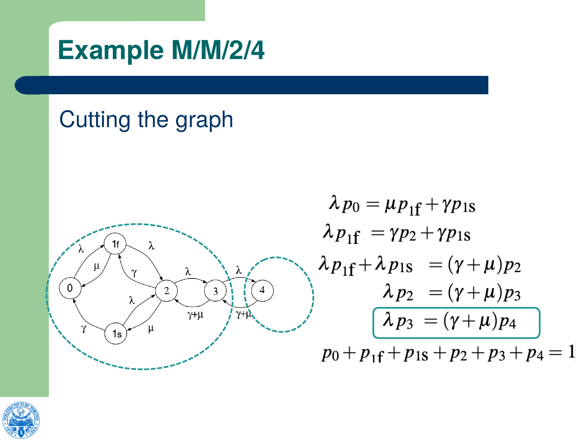

> **[Figura]** Diagramma M/M/2/4 con il quinto taglio tra gli stati {0,1f,1s,2,3} e {4}. La quinta equazione di equilibrio è: λp₃ = (γ+μ)p₄.

$$
\lambda p _ {0} = \mu p _ {1 \mathrm {f}} + \gamma p _ {1 \mathrm {S}}
$$

$$
\lambda p _ {1 \mathrm {f}} = \gamma p _ {2} + \gamma p _ {1 \mathrm {s}}
$$

$$
\begin{array}{l} \lambda p _ {1 \mathrm {f}} + \lambda p _ {1 \mathrm {S}} = (\gamma + \mu) p _ {2} \\ \lambda p _ {2} = (\gamma + \mu) p _ {3} \\ \lambda p _ {3} = (\gamma + \mu) p _ {4} \\ \end{array}
$$

$$
p _ {0} + p _ {1 \mathrm {f}} + p _ {1 \mathrm {S}} + p _ {2} + p _ {3} + p _ {4} = 1
$$

# Example M/M/2/4

Norming equation

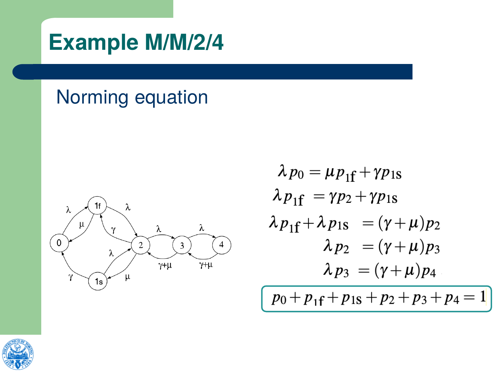

> **[Figura]** Diagramma M/M/2/4 completo con l'equazione di normalizzazione evidenziata: p₀ + p₁f + p₁s + p₂ + p₃ + p₄ = 1. Il sistema completo ha 5 equazioni di bilancio più l'equazione di normalizzazione, per un totale di 6 equazioni in 6 incognite.

$$
\lambda p _ {0} = \mu p _ {1 \mathrm {f}} + \gamma p _ {1 \mathrm {S}}
$$

$$
\lambda p _ {1 \mathrm {f}} = \gamma p _ {2} + \gamma p _ {1 \mathrm {S}}
$$

$$
\begin{array}{l} \lambda p _ {1 \mathrm {f}} + \lambda p _ {1 \mathrm {S}} = (\gamma + \mu) p _ {2} \\ \lambda p _ {2} = (\gamma + \mu) p _ {3} \\ \lambda p _ {3} = (\gamma + \mu) p _ {4} \\ \end{array}
$$

$$
p _ {0} + p _ {1 \mathrm {f}} + p _ {1 \mathrm {S}} + p _ {2} + p _ {3} + p _ {4} = 1
$$

# Numerical example

An overhaul facility for helicopters is open 24 hours a day, seven days a week and helicopters arrive to the facility at an average rate of 3 per day according to a Poisson process (i.e., exponential inter-arrival times).

One of the areas within the facility is for degreasing one of the major components.There is only room in the facility for 4 jobs at any one time and there are two machines that do the degreasing.

The newer of the two degreasing machines takes an average of 8 hours to complete the degreasing and the older machine takes 12 hours for the degreasing operation. Because of the large variability in helicopter conditions,al times are exponentially distributed.

Thus, we have λ = 3 per day, μ = 3 per day,and γ = 2 per day.

# Solution

$$
3 p _ {0} - 3 p _ {1 \mathrm {f}} - 2 p _ {1 \mathrm {S}} = 0
$$

$$
3 p _ {1 \mathrm {f}} - 2 p _ {2} - 2 p _ {1 \mathrm {s}} = 0
$$

$$
3 p _ {1 \mathrm {f}} + 3 p _ {1 \mathrm {s}} - 5 p _ {2} = 0
$$

$$
3 p _ {2} - 5 p _ {3} = 0
$$

$$
3 p _ {3} - 5 p _ {4} = 0
$$

$$
p _ {0} + p _ {\mathrm {l f}} + p _ {\mathrm {1 S}} + p _ {2} + p _ {3} + p _ {4} = 1.
$$

V The solution of this system equation is:

$$
p _ {0} = 0. 2 8 8, p _ {1 \mathrm {f}} = 0. 2 0 9, p _ {1 \mathrm {S}} = 0. 1 1 8, p _ {2} = 0. 1 9 6, p _ {3} = 0. 1 1 8, p _ {4} = 0. 0 7 1
$$

# Solution

Average number of jobs in the system:

$$
W I P s = p _ {1 f} + p _ {1 s} + 2 p _ {2} + 3 p _ {3} + 4 p _ {4} = 1. 3 5 6
$$

> Average number of jobs in the queue:

$$
\mathsf {W I P q} = \mathsf {p} _ {3} + 2 \mathsf {p} _ {4} = 0. 2 5 9
$$

The average cycle times are:

$$
\mathrm {C T s} = \frac {W I P S}{\lambda e} = \left(\frac {1 . 3 5 6}{3 * (1 - 0 . 0 7 1)}\right) = 0. 4 8 6 \mathrm {d a y}
$$

$$
\mathrm {C T q} = \frac {W I P q}{\lambda e} = \left(\frac {0 . 2 5 9}{3 * (1 - 0 . 0 7 1)}\right) = 0. 0 9 3 \mathrm {d a y}
$$

# Solution

Because of the preference given to using the faster machine, we would expect the average time of processing of the workstation to be closer to 8 hours than to 12 hours   
> To get an exact value, we take advantage of the fact that the time in the system equals the time in the queue plus service time

$$
E [ T ] = C T _ {s} - C T _ {q} = 0. 4 8 6 - 0. 0 9 3 = 0. 3 9 3 \mathrm {d a y s} = 9. 4 \mathrm {h r}
$$

# Solution

V Other measures that are sometimes desired by the management   
Expected number of busy servers E[BS]

$$
E [ B S ] = 1 p _ {1 \mathrm {f}} + 1 p _ {1 \mathrm {S}} + 2 p _ {2} + 2 P _ {3} + 2 p _ {4} = 1. 0 9 7
$$

>System utilization factor (u),i.e., the expected number of busy servers divided by the number of machines available

$$
u = \frac{E[BS]}{2} = 0.5485 = 54.85\%
$$

# Exercise

> By analyzing the reported simulation model (two servers with non identical service rate and max wip of 4),find the following parameters:

>Arrival rate (^), processing rate of faster (μ) and slower (Y) machine   
>Probability that a job is rejected   
>Utilization of the workstation

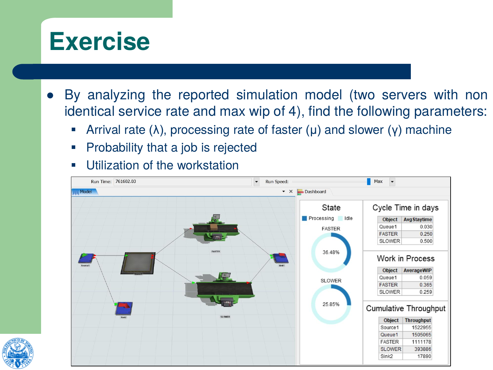

> **[Figura]** Screenshot del modello di simulazione (Plant Simulation) per il sistema con due macchine non identiche e WIP massimo 4. Dashboard: utilizzazione FASTER=36.48%, SLOWER=25.85%; tempi di ciclo Queue=0.030 giorni, FASTER=0.250 giorni, SLOWER=0.500 giorni; WIP medio Queue=0.059, FASTER=0.365, SLOWER=0.259; throughput cumulativo Source=1.522.955, FASTER=1.111.178, SLOWER=393.886, Sink2=17.890.

# Solution

V CT of faster machine = 0.25 days

$$
\rightarrow \mu = 1 / 0. 2 5 = 4 \mathrm {j} / \mathrm {d}
$$

V CT of slower machine = 0.5 days

$$
\rightarrow \mathrm {y} = 1 / 0. 5 = 2 \mathrm {j} / \mathrm {d}
$$

V Cumulative TH of Source = 1522955, Run time = 761602

$$
\rightarrow \lambda = 1 5 2 2 9 5 5 / 7 6 1 6 0 2 = 2 \mathrm {j} / \mathrm {d}
$$

V Cumulative TH of Sink = 17890, Cumulative TH of Source = 1522955

$$
\rightarrow \% \text {lost items} = 17890 / 1522955 = 0.0117 = 1.17 \%
$$

V Utilization of faster machine = 36.48, Utilization of slower machine = 28.85

→ Utilization of the workstation = (36.48+28.85)/2=32.67

# Combination of exponentials

> To model more general systems,one approach is to approximate the general times by combinations of exponentials   
The Erlang-k distribution is the sum of k independent and identical exponential distributions   
Since the Erlang-k has a squared coeficient of variation given by C² = 1/k, it also allows modeling of processes that have less variation than the exponential distribution

# Erlang distribution

> If times are not exponentially distributed   
>Approximation of times by combinations of exponentials   
> Erlang random variable with parameters k and β is the sum of k (independent) exponential random variables each with mean β /k Two Eriangprobawthy Two Erlang probability density functions with

$$
f (s) = \frac {k (k s) ^ {k - 1} e ^ {- (k / \beta) s}}{\beta^ {k} (k - 1) !} \text {f o r} s \geq 0
$$

$$
E [ X ] = \beta ; V [ X ] = \frac {\beta^ {2}}{k}; C ^ {2} [ X ] = \frac {1}{k}
$$

mean 1 and shape parameters k = 2 (solid line) and k = 10 (dashed line)

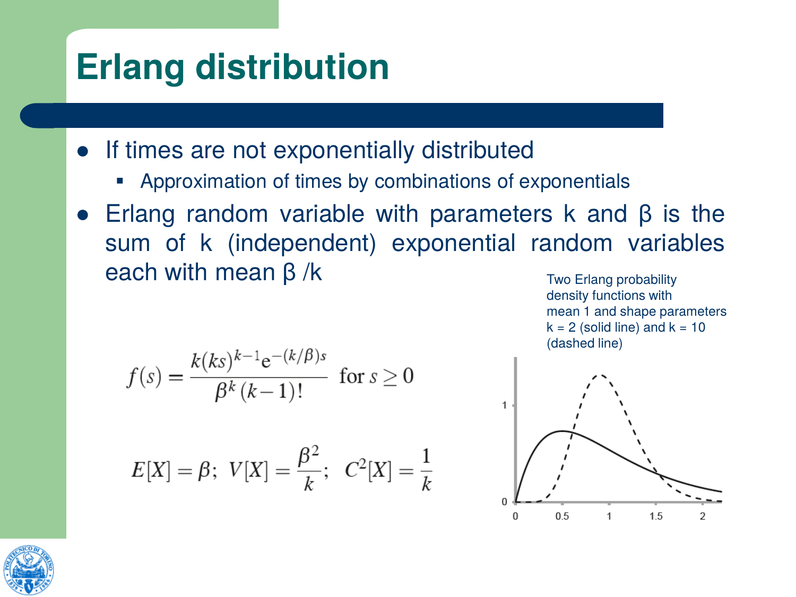

> **[Figura]** Grafico delle funzioni di densità di probabilità di due distribuzioni di Erlang con media=1: k=2 (linea continua, picco moderato) e k=10 (linea tratteggiata, picco più acuto vicino alla media). All'aumentare di k, la distribuzione si concentra intorno alla media e la variabilità diminuisce (C²=1/k).

# M/E2/1/3- Erlang processing time

Y Maximum number of jobs allowed in the system equal to 3   
> Inter-arrival times exponentially distributed with a mean arrival rate of 入   
> Processing time described by an Erlang-2 with mean rate μ   
Erlang-2 is modeled using two exponential nodes

Each node has a mean rate of 2u   
>The mean time spent in each node is 1/(2μ)→ the total time spent in the two nodes as 1/u

# M/E2/1/3- Erlang processing time

When a job begins its processing,it enters the node representing phase 1 and stays in phase 1 for an exponential length of time   
> When the job has been completed its phase 1 service, the job moves to the node representing phase 2   
> As long as the job is in either phase,it is considered to be continuing its processing and a new job is not allowed into service

Pair (n.i)

>n: number of jobs in the system   
>i: service phase occupied by the job being processed

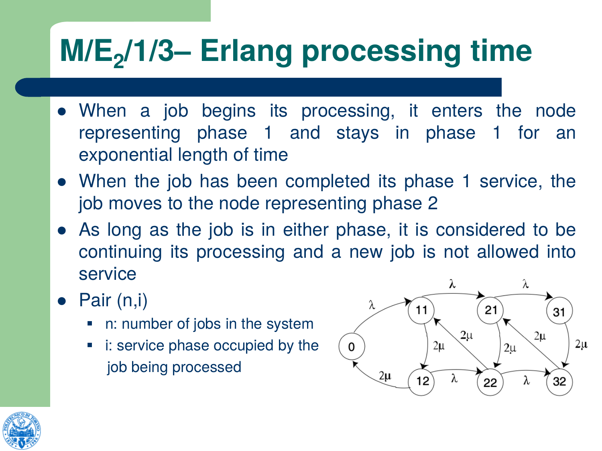

> **[Figura]** Diagramma di transizione di stato per il sistema M/E₂/1/3 (arrivi M, processo Erlang-2, 1 server, capacità 3). Gli stati sono coppie (n, i) dove n = numero di job nel sistema e i = fase Erlang in corso (1 o 2). Stati: 0, (1,1), (1,2), (2,1), (2,2), (3,1), (3,2). Tasso di arrivo λ; tasso di transizione tra le fasi 2μ; quando si completa la fase 2 con n>1 job, il job successivo entra in fase 1.

# M/E2/1/3- Erlang processing time

Node partitioning and corresponding equations

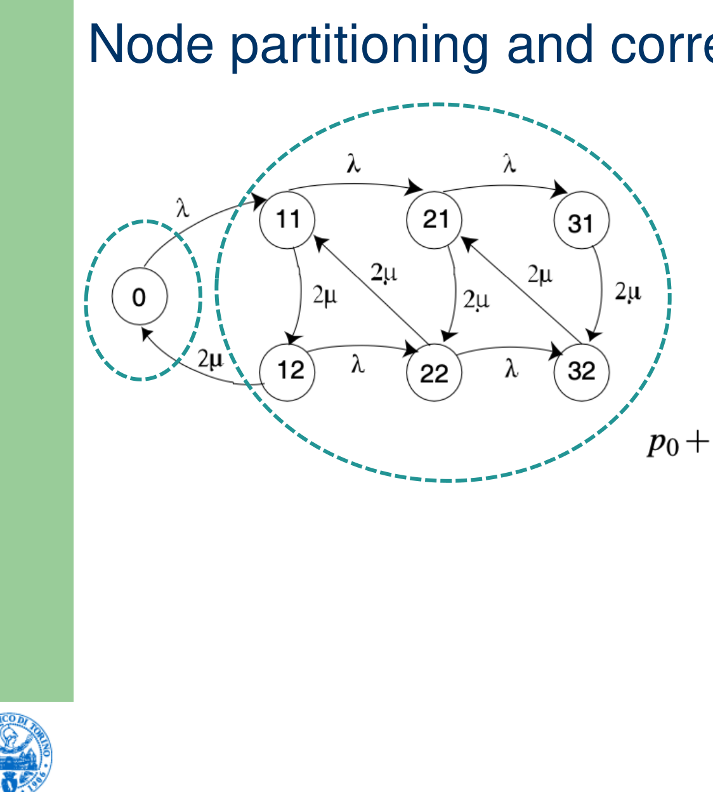

> **[Figura]** Diagramma M/E₂/1/3 con il primo taglio che isola lo stato 0. La prima equazione di equilibrio è: λp₀ - 2μp₁₂ = 0, cioè λp₀ = 2μp₁₂ (gli arrivi nello stato 0 bilanciano i completamenti della fase 2 dello stato 1 che riportano il sistema vuoto).

$$
\lambda p _ {0} - 2 \mu p _ {1 2} = 0
$$

$$
\lambda p _ {0} + \lambda p _ {1 2} - 2 \mu p _ {1 1} = 0
$$

$$
(\lambda + 2 \mu) p _ {1 1} - 2 \mu p _ {1 2} - 2 \mu p _ {2 2} = 0
$$

$$
\lambda p _ {1 1} + \lambda p _ {1 2} - 2 \mu p _ {2 2} = 0
$$

$$
\lambda p _ {2 1} + \lambda p _ {2 2} - 2 \mu p _ {3 2} = 0
$$

$$
\lambda p _ {2 2} + 2 \mu p _ {3 1} - 2 \mu p _ {3 2} = 0
$$

$$
p _ {0} + p _ {1 1} + p _ {1 2} + p _ {2 1} + p _ {2 2} + p _ {3 1} + p _ {3 2} = 1.
$$

# M/E2/1/3- Erlang processing time

Node partitioning and corresponding equations

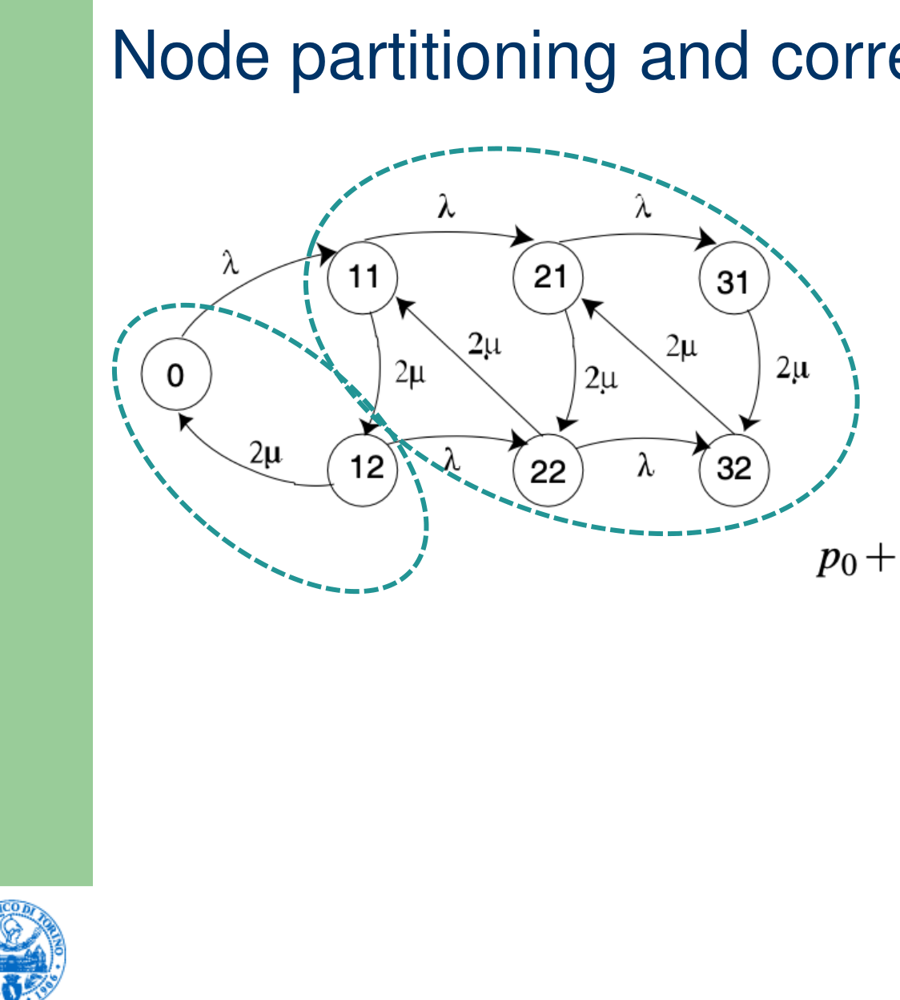

> **[Figura]** Diagramma M/E₂/1/3 con il secondo taglio che isola lo stato (1,1). La seconda equazione è: λp₀ + λp₁₂ - 2μp₁₁ = 0.

$$
\lambda p _ {0} - 2 \mu p _ {1 2} = 0
$$

$$
\lambda p _ {0} + \lambda p _ {1 2} - 2 \mu p _ {1 1} = 0
$$

$$
(\lambda + 2 \mu) p _ {1 1} - 2 \mu p _ {1 2} - 2 \mu p _ {2 2} = 0
$$

$$
\lambda p _ {1 1} + \lambda p _ {1 2} - 2 \mu p _ {2 2} = 0
$$

$$
\lambda p _ {2 1} + \lambda p _ {2 2} - 2 \mu p _ {3 2} = 0
$$

$$
\lambda p _ {2 2} + 2 \mu p _ {3 1} - 2 \mu p _ {3 2} = 0
$$

$$
p _ {0} + p _ {1 1} + p _ {1 2} + p _ {2 1} + p _ {2 2} + p _ {3 1} + p _ {3 2} = 1.
$$

# M/E2/1/3- Erlang processing time

Node partitioning and corresponding equations

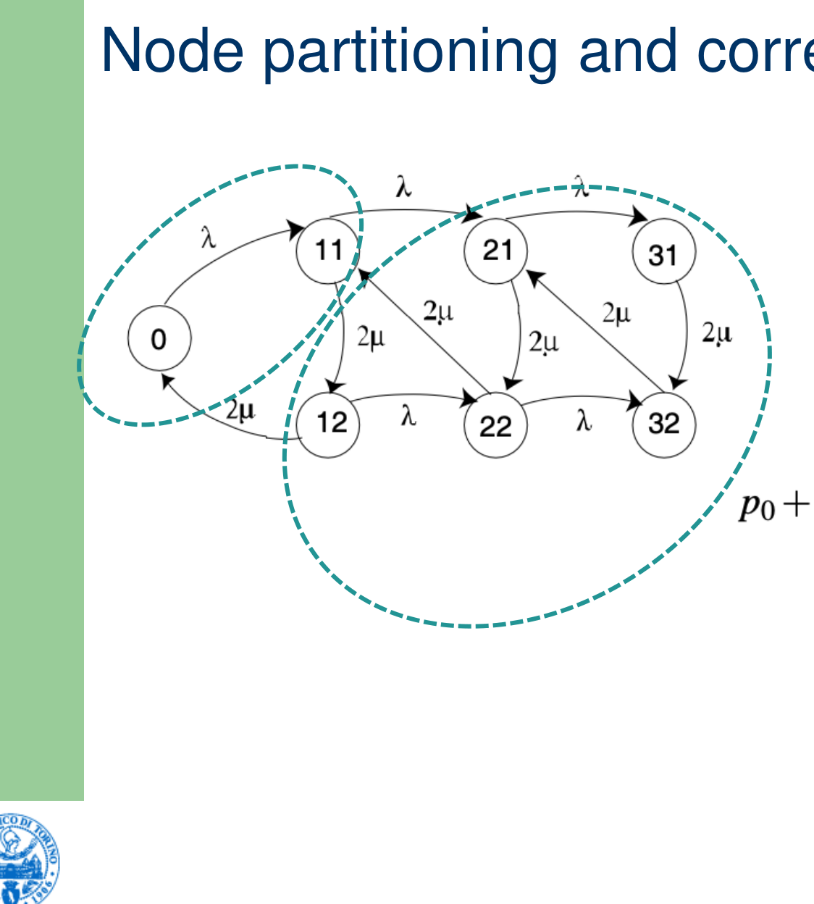

> **[Figura]** Diagramma M/E₂/1/3 con il terzo taglio che isola gli stati {0,(1,1),(1,2)}. La terza equazione è: (λ+2μ)p₁₁ - 2μp₁₂ - 2μp₂₂ = 0.

$$
\lambda p _ {0} - 2 \mu p _ {1 2} = 0
$$

$$
\lambda p _ {0} + \lambda p _ {1 2} - 2 \mu p _ {1 1} = 0
$$

$$
(\lambda + 2 \mu) p _ {1 1} - 2 \mu p _ {1 2} - 2 \mu p _ {2 2} = 0
$$

$$
\lambda p _ {1 1} + \lambda p _ {1 2} - 2 \mu p _ {2 2} = 0
$$

$$
\lambda p _ {2 1} + \lambda p _ {2 2} - 2 \mu p _ {3 2} = 0
$$

$$
\lambda p _ {2 2} + 2 \mu p _ {3 1} - 2 \mu p _ {3 2} = 0
$$

$$
p _ {0} + p _ {1 1} + p _ {1 2} + p _ {2 1} + p _ {2 2} + p _ {3 1} + p _ {3 2} = 1.
$$

# M/E2/1/3- Erlang processing time

Node partitioning and corresponding equations

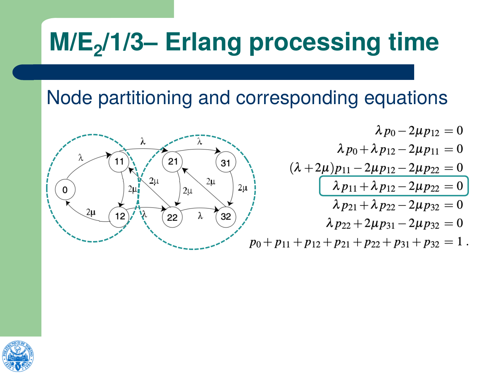

> **[Figura]** Diagramma M/E₂/1/3 con il quarto taglio. La quarta equazione è: λp₁₁ + λp₁₂ - 2μp₂₂ = 0.

$$
\lambda p _ {0} - 2 \mu p _ {1 2} = 0
$$

$$
\lambda p _ {0} + \lambda p _ {1 2} - 2 \mu p _ {1 1} = 0
$$

$$
(\lambda + 2 \mu) p _ {1 1} - 2 \mu p _ {1 2} - 2 \mu p _ {2 2} = 0
$$

$$
\lambda p _ {1 1} + \lambda p _ {1 2} - 2 \mu p _ {2 2} = 0
$$

$$
\lambda p _ {2 1} + \lambda p _ {2 2} - 2 \mu p _ {3 2} = 0
$$

$$
\lambda p _ {2 2} + 2 \mu p _ {3 1} - 2 \mu p _ {3 2} = 0
$$

$$
p _ {0} + p _ {1 1} + p _ {1 2} + p _ {2 1} + p _ {2 2} + p _ {3 1} + p _ {3 2} = 1.
$$

# M/E2/1/3- Erlang processing time

Node partitioning and corresponding equations

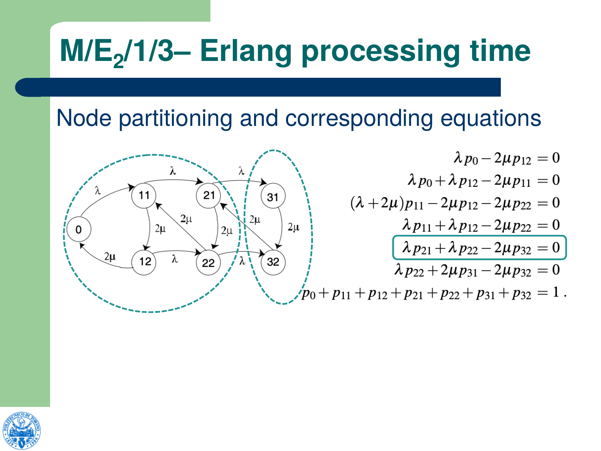

> **[Figura]** Diagramma M/E₂/1/3 con il quinto taglio. La quinta equazione è: λp₂₁ + λp₂₂ - 2μp₃₂ = 0.

$$
\lambda p _ {0} - 2 \mu p _ {1 2} = 0
$$

$$
\lambda p _ {0} + \lambda p _ {1 2} - 2 \mu p _ {1 1} = 0
$$

$$
(\lambda + 2 \mu) p _ {1 1} - 2 \mu p _ {1 2} - 2 \mu p _ {2 2} = 0
$$

$$
\lambda p _ {1 1} + \lambda p _ {1 2} - 2 \mu p _ {2 2} = 0
$$

$$
\lambda p _ {2 1} + \lambda p _ {2 2} - 2 \mu p _ {3 2} = 0
$$

$$
\lambda p _ {2 2} + 2 \mu p _ {3 1} - 2 \mu p _ {3 2} = 0
$$

$$
p _ {0} + p _ {1 1} + p _ {1 2} + p _ {2 1} + p _ {2 2} + p _ {3 1} + p _ {3 2} = 1.
$$

# M/E2/1/3- Erlang processing time

Node partitioning and corresponding equations

> **[Figura]** Diagramma M/E₂/1/3 con il sesto taglio. La sesta equazione è: λp₂₂ + 2μp₃₁ - 2μp₃₂ = 0.

$$
\lambda p _ {0} - 2 \mu p _ {1 2} = 0
$$

$$
\lambda p _ {0} + \lambda p _ {1 2} - 2 \mu p _ {1 1} = 0
$$

$$
(\lambda + 2 \mu) p _ {1 1} - 2 \mu p _ {1 2} - 2 \mu p _ {2 2} = 0
$$

$$
\lambda p _ {1 1} + \lambda p _ {1 2} - 2 \mu p _ {2 2} = 0
$$

$$
\lambda p _ {2 1} + \lambda p _ {2 2} - 2 \mu p _ {3 2} = 0
$$

$$
\lambda p _ {2 2} + 2 \mu p _ {3 1} - 2 \mu p _ {3 2} = 0
$$

$$
p _ {0} + p _ {1 1} + p _ {1 2} + p _ {2 1} + p _ {2 2} + p _ {3 1} + p _ {3 2} = 1.
$$

# M/E2/1/3- Erlang processing time

# Norming equation

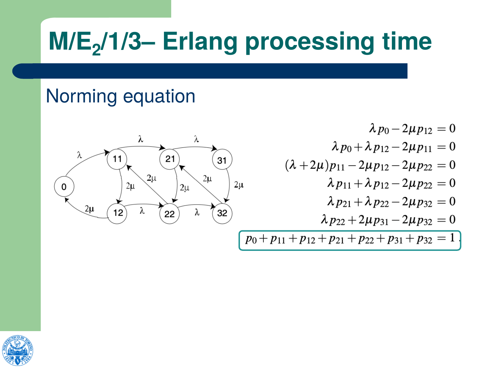

> **[Figura]** Diagramma M/E₂/1/3 completo con l'equazione di normalizzazione evidenziata: p₀ + p₁₁ + p₁₂ + p₂₁ + p₂₂ + p₃₁ + p₃₂ = 1. Il sistema ha 6 equazioni di bilancio più la normalizzazione.

$$
\lambda p _ {0} - 2 \mu p _ {1 2} = 0
$$

$$
\lambda p _ {0} + \lambda p _ {1 2} - 2 \mu p _ {1 1} = 0
$$

$$
(\lambda + 2 \mu) p _ {1 1} - 2 \mu p _ {1 2} - 2 \mu p _ {2 2} = 0
$$

$$
\lambda p _ {1 1} + \lambda p _ {1 2} - 2 \mu p _ {2 2} = 0
$$

$$
\lambda p _ {2 1} + \lambda p _ {2 2} - 2 \mu p _ {3 2} = 0
$$

$$
\lambda p _ {2 2} + 2 \mu p _ {3 1} - 2 \mu p _ {3 2} = 0
$$

$$
\left. \overline {{p _ {0} + p _ {1 1} + p _ {1 2} + p _ {2 1} + p _ {2 2} + p _ {3 1} + p _ {3 2} = 1}} \right\rbrack
$$

# M/E2/1/3- Erlang processing time

# V Alternative solution with node isolation

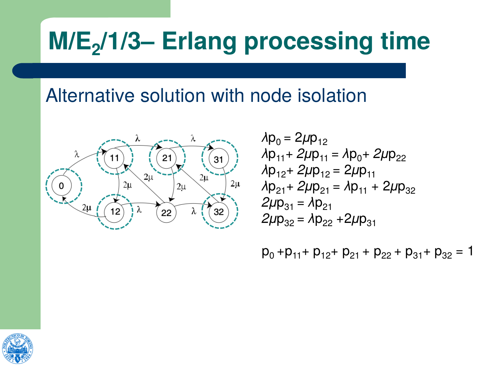

> **[Figura]** Diagramma M/E₂/1/3 risolto con il metodo dell'isolamento dei nodi (node isolation). Per ogni nodo si scrive che il flusso in entrata = flusso in uscita: λp₀=2μp₁₂; λp₁₁+2μp₁₁=λp₀+2μp₂₂; λp₁₂+2μp₁₂=2μp₁₁; λp₂₁+2μp₂₁=λp₁₁+2μp₃₂; 2μp₃₁=λp₂₁; 2μp₃₂=λp₂₂+2μp₃₁.

$$
\begin{array}{l} \lambda p _ {0} = 2 \mu p _ {1 2} \\ \lambda p _ {1 1} + 2 \mu p _ {1 1} = \lambda p _ {0} + 2 \mu p _ {2 2} \\ \lambda p _ {1 2} + 2 \mu p _ {1 2} = 2 \mu p _ {1 1} \\ \lambda p _ {2 1} + 2 \mu p _ {2 1} = \lambda p _ {1 1} + 2 \mu p _ {3 2} \\ 2 \mu p _ {3 1} = \lambda p _ {2 1} \\ 2 \mu p _ {3 2} = \lambda p _ {2 2} + 2 \mu p _ {3 1} \\ \end{array}
$$

$$
p _ {0} + p _ {1 1} + p _ {1 2} + p _ {2 1} + p _ {2 2} + p _ {3 1} + p _ {3 2} = 1
$$

# M/E2/1/3- Erlang processing time

V Performance measures

$$
W I P _ {s} = \sum_ {n = 1} ^ {3} n \left(p _ {n 1} + p _ {n 2}\right)
$$

$$
t h = \lambda_ {e} = \lambda (1 - p _ {3 1} - p _ {3 2})
$$

$$
C T _ {s} = W I P _ {s} / \lambda_ {e}.
$$

# Exercise

# Input data

>Maximum number of jobs allowed in the system equal to 2   
>Inter-arrival times exponentially distributed with a mean arrival rate of λ=3 j/h   
> Processing time described by an Erlang-3 with mean rate μ=6 j/h

# V Questions

Draw the state diagram   
Derive the balance equations   
>Compute the performances of the system (WIP, WIPq, TH, CT, CTq)

# Solution

State diagram

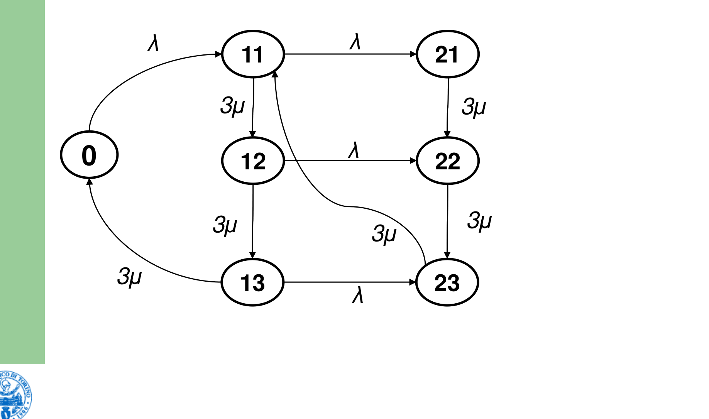

> **[Figura]** Diagramma di transizione di stato per il sistema M/E₃/1/2 (λ=3 j/h, μ=6 j/h, capacità massima 2 job). Gli stati sono coppie (n,i) con n=numero di job e i=fase Erlang (1, 2 o 3). Stati: 0, (1,1), (1,2), (1,3), (2,1), (2,2), (2,3). Tasso di arrivo λ=3, tasso di transizione tra fasi 3μ=18.

# Solution

# Equations with node isolation

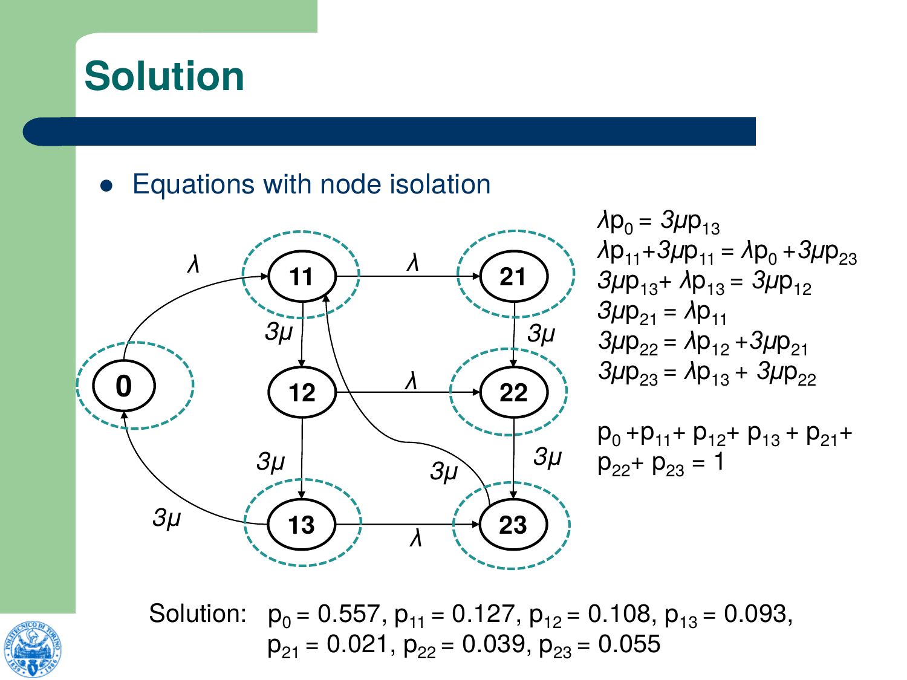

> **[Figura]** Equazioni di equilibrio per M/E₃/1/2 con metodo node isolation e soluzione numerica: p₀=0.557, p₁₁=0.127, p₁₂=0.108, p₁₃=0.093, p₂₁=0.021, p₂₂=0.039, p₂₃=0.055. Il sistema è scritto nella matrice dei coefficienti per la soluzione tramite Excel.

$$
\begin{array}{l} \lambda p _ {0} = 3 \mu p _ {1 3} \\ \lambda p _ {1 1} + 3 \mu p _ {1 1} = \lambda p _ {0} + 3 \mu p _ {2 3} \\ 3 \mu p _ {1 3} + \lambda p _ {1 3} = 3 \mu p _ {1 2} \\ 3 \mu p _ {2 1} = \lambda p _ {1 1} \\ 3 \mu p _ {2 2} = \lambda p _ {1 2} + 3 \mu p _ {2 1} \\ 3 \mu p _ {2 3} = \lambda p _ {1 3} + 3 \mu p _ {2 2} \\ \end{array}
$$

$$
\begin{array}{l} p _ {0} + p _ {1 1} + p _ {1 2} + p _ {1 3} + p _ {2 1} + p _ {2 2} + \\ \mathsf {p} _ {2 3} = 1 \\ \end{array}
$$

Solution: Po= 0.557,P11= 0.127, P12= 0.108,P13= 0.093,

$$
\mathsf {p} _ {2 1} = 0. 0 2 1, \mathsf {p} _ {2 2} = 0. 0 3 9, \mathsf {p} _ {2 3} = 0. 0 5 5
$$

# Solution

Excel to solve linear systems of N equations

>Linear systems can be written in matrix form Ax = b   
>If the matrix Ahas an nverse,the solutionisX=A-1b

Select a column of N cells and type the function:

$$
= \text {M M U L T (M I N V E R S E (F i r s t C e l l O f A : L a s t C e l l O f A) , F i r s t C e l l O f b : L a s t C e l l O f b)}
$$

> When finished typing, hold down the <ctrl> and <shift> keys and while holding these two keys down, hit <enter>

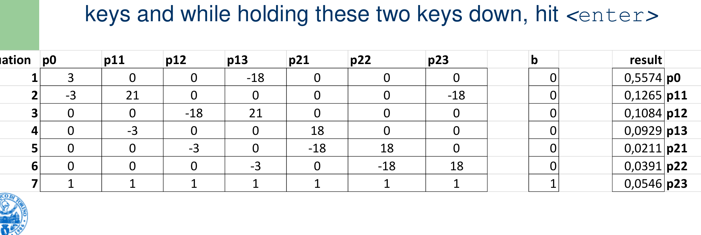

> **[Figura]** Foglio Excel con la matrice dei coefficienti A del sistema lineare per M/E₃/1/2 (7 equazioni × 7 incognite) e il vettore dei termini noti b. La soluzione si ottiene con la formula =MMULT(MINVERSE(A),b) inserita come formula array (Ctrl+Shift+Invio). Risultati: p₀=0.5574, p₁₁=0.1265, p₁₂=0.1084, p₁₃=0.0929, p₂₁=0.0211, p₂₂=0.0391, p₂₃=0.0546.

# Solution

Average number of jobs in the system:

$$
W I P s = p _ {1 1} + p _ {1 2} + p _ {1 3} + 2 p _ {2 1} + 2 p _ {2 2} + 2 p _ {2 3} = 0. 5 5 8 \mathrm {j o b s}
$$

V Average number of jobs in the queue:

$$
\mathrm {W I P q} = \mathrm {p} _ {2 1} + \mathrm {p} _ {2 2} + \mathrm {p} _ {2 3} = 0. 1 1 5 \mathrm {j o b s}
$$

Throughput

$$
\mathsf {T H} = \lambda (1 - (\mathsf {p} _ {2 1} + \mathsf {p} _ {2 2} + \mathsf {p} _ {2 3})) = 2. 6 5 5 \mathrm {j / h}
$$

Average cycle times:

$$
\mathsf {C T s} = \frac {W I P s}{T H} = \left(\frac {0 . 5 5 8}{2 . 6 5 5}\right) = 0. 2 1 \mathrm {h o u r s}
$$

$$
\mathrm {C T q} = \frac {W I P q}{T H} = \left(\frac {0 . 1 1 5}{2 . 6 5 5}\right) = 0. 0 4 3 \mathrm {h o u r s}
$$

# Exercise

Consider an M/E3/1/3 model with an arrival rate of 4 j/h and a service rate of 8 j/h. Compute the system performance measures of TH, WIP, WIPq, and CT, given the steady-state probability vector

$$
\begin{array}{l} p = \left[ p _ {0}, p _ {1, 1}, p _ {1, 2}, p _ {1, 3}, p _ {2, 1}, p _ {2, 2}, p _ {2, 3}, p _ {3, 1}, p _ {3, 2}, p _ {3, 3} \right] ^ {T} \\ = [ 0. 5 2 0 7, 0. 1 1 8 0, 0. 1 0 1 2, 0. 0 8 6 8, 0. 0 3 5 7, 0. 0 4 5 1, 0. 0 5 1 0, 0. 0 0 6 0, 0. 0 1 3 5, 0. 0 2 2 0 ] ^ {T} \\ \end{array}
$$

where p_(m,n)is the state probability,mis the numberof jobs in thefacility and n is the Erlang phase.

# Solution

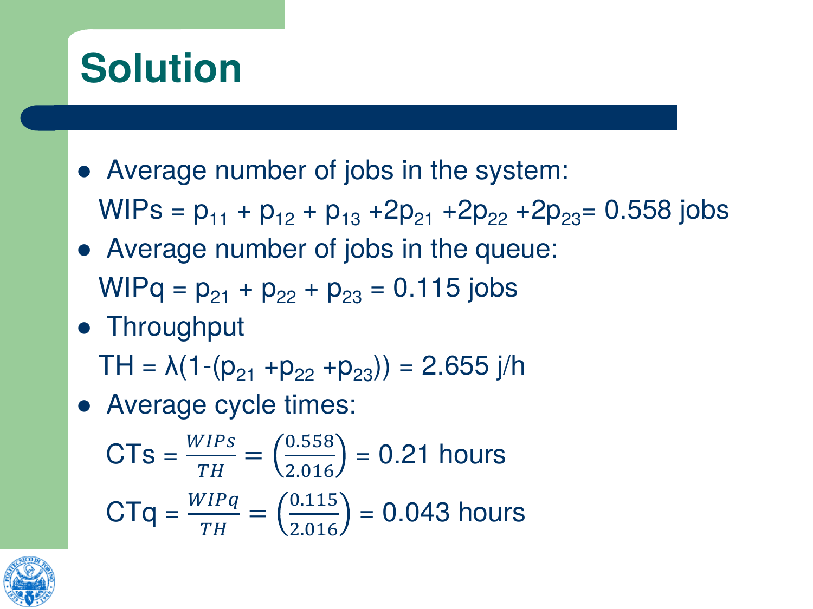

> **[Figura]** Riepilogo della soluzione per M/E₃/1/2 (λ=3 j/h, μ=6 j/h): WIPs = p₁₁+p₁₂+p₁₃+2p₂₁+2p₂₂+2p₂₃ = 0.558 job; WIPq = p₂₁+p₂₂+p₂₃ = 0.115 job; TH = λ(1-(p₂₁+p₂₂+p₂₃)) = 2.655 j/h; CTs = WIPs/TH = 0.21 ore; CTq = WIPq/TH = 0.043 ore.

# General service distribution M/G/1

> Consider a single-server system with exponential inter-arrival times,with mean rate λ,and a general service time distribution having mean time 1/μ and variance σs2   
V The state-diagram approach can no longer be used to develop equations that define the steady-state probabilities   
> The derivation of these probabilities is beyond the scope of this course

# General service distribution M/G/1

> The Pollaczek and Khintchine,or“P-K", formula for WIP in an M/G/1 queueing system is given by

$$
W I P _ {s} = E [ N ] = \frac {\lambda}{\mu} + \frac {\left(\frac {\lambda}{\mu}\right) ^ {2} + \lambda^ {2} \sigma_ {s} ^ {2}}{2 \left(1 - \frac {\lambda}{\mu}\right)}
$$

where N is the number of jobs in the system,λ is the mean arrival rate,and the service distribution has mean and variance given by 1/μ and σ²， respectively

# General service distribution M/G/1

The relationship between the average number in the system and the average number in the queue is given by WIPs-WIPq =Xe/μ. Since λe => for M/G/1 systems, the expected number of jobs waiting for the processing,E[Nq], is

$$
W I P _ {q} = E [ N _ {q} ] = \frac {\left(\frac {\lambda}{\mu}\right) ^ {2} + \lambda^ {2} \sigma_ {s} ^ {2}}{2 \left(1 - \frac {\lambda}{\mu}\right)}
$$

# General service distribution M/G/1

> The P-K formula for the queue cycle time in an M/G/1 system is given by

$$
C T _ {q} = E [ T _ {q} ] = \frac {W I P _ {q}}{\lambda} = \frac {\left(\frac {\lambda}{\mu}\right) ^ {2} + \lambda^ {2} \sigma_ {s} ^ {2}}{2 \lambda \left(1 - \frac {\lambda}{\mu}\right)}
$$

# General service distribution M/G/1

> The goal is now to rearrange this formula into a form that wil be utilized a great deal in the development of more realistic factory models.   
First recall that the squared coefficient of variation is defined by

$$
C ^ {2} [ T ] = \frac {V [ T ]}{E [ T ] ^ {2}}
$$

Recall the M/M/1 formulas

$$
W I P _ {s} (M / M / 1) = \frac {u}{1 - u}
$$

$$
C T _ {s} (M / M / 1) = \frac {1}{\mu - \lambda}
$$

$$
W I P _ {q} (M / M / 1) = \frac {u ^ {2}}{1 - u}, \mathrm {a n d}
$$

$$
C T _ {q} (M / M / 1) = \frac {u}{1 - u} E [ T _ {s} ]
$$

# General service distribution M/G/1

The P-K formula can be rewritten as

$$
\begin{array}{l} C T _ {q} = \frac {\left(\frac {\lambda}{\mu}\right) ^ {2} + \lambda^ {2} \sigma_ {s} ^ {2}}{2 \lambda \left(1 - \frac {\lambda}{\mu}\right)} \\ = \frac {\left(\frac {\lambda}{\mu}\right) ^ {2} + \lambda^ {2} \frac {C _ {s} ^ {2}}{\mu^ {2}}}{2 \lambda \left(1 - \frac {\lambda}{\mu}\right)} \\ = \left(\frac {1 + C _ {s} ^ {2}}{2}\right) \left(\frac {u}{1 - u}\right) E [ T _ {s} ] \\ \end{array}
$$

# General service distribution M/G/1

1 Relationship between M/M/1 and M/G/1

$$
C T _ {q} (M / G / 1) = \left(\frac {1 + C _ {s} ^ {2}}{2}\right) C T _ {q} (M / M / 1)
$$

# Approximation for G/G/1 systems

> The Kingman diffusion approximation for the G/G/1 queueing system is

$$
C T _ {q} (G / G / 1) \approx \left(\frac {C _ {a} ^ {2} + C _ {s} ^ {2}}{2}\right) C T _ {q} (M / M / 1)
$$

where Ca² and C² are the squared coefficients of variation for the inter-arrival distribution and the service time distribution, respectively

# Approximation for G/G/1 systems

Kingman equation also called the VUT equation

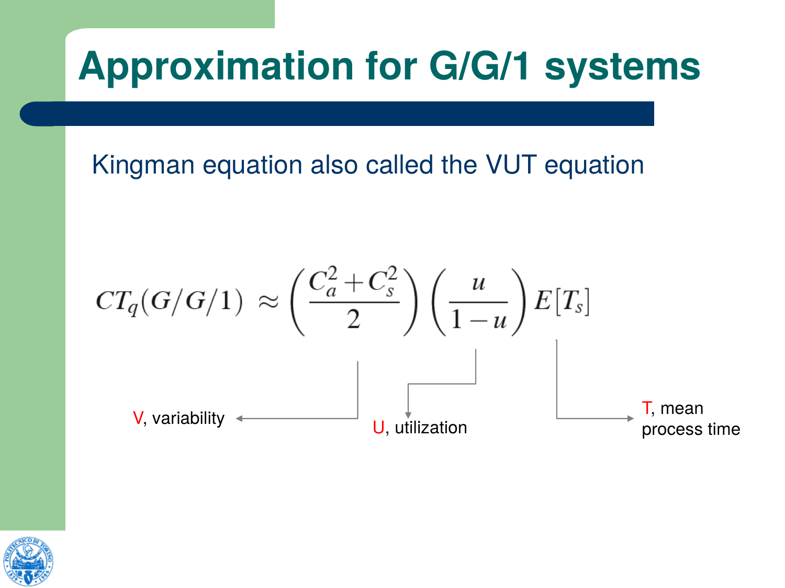

> **[Figura]** Equazione VUT di Kingman (approssimazione per G/G/1): CTq(G/G/1) ≈ ((Ca²+Cs²)/2) × (u/(1-u)) × E[Ts]. La formula è composta da tre fattori: V = fattore di variabilità ((Ca²+Cs²)/2), U = fattore di utilizzazione (u/(1-u)), T = tempo medio di processo E[Ts].

# Approximation for G/G/1 systems

> Since the time in the system equals the time in the queue plus the processing time,we also have a good approximation for the system mean cycle time as

$$
C T _ {s} (G / G / 1) \approx \left(\frac {C _ {a} ^ {2} + C _ {s} ^ {2}}{2}\right) \left(\frac {u}{1 - u}\right) E [ T _ {s} ] + E [ T _ {s} ]
$$

# Example

> Consider a system with λ= 4/hr and μ = 5/hr yielding a utilization factor u = O.8. Since this was an exponential system, we had Ca2 = C² = 1 and E[Ts]= 0.2 hr   
Thus,the G/G/1 approximation is

$$
C T _ {q} (G / G / 1) = \left(\frac {C _ {a} ^ {2} + C _ {s} ^ {2}}{2}\right) \left(\frac {u}{1 - u}\right) E [ T _ {s} ] = \left(\frac {1 + 1}{2}\right) \left(\frac {0 . 8}{0 . 2}\right) 0. 2 = 0. 8 \mathrm {h r}
$$

> Whenever the Kingman approximation is applied to an M/M/1 or M/G/1 system, it is exact and not an approximation

# Example

Consider a G/G/1 system with inter-arrival times distributed

according to a gamma distribution with mean 15 minutes and

standard deviation 30 minutes,and with service times distributed

according to an Erlang-4 distribution with mean 12 minutes.

Since the distribution of service times is Erlang, the initial temptation

may be to use the Erlang methodology; however, because the

arrival times are not exponential, the G/G/1 formula has to be used.

The given data yields the following parameters: ^= 4/hr, μ = 5/hr,

$$
\mathsf {C} _ {\mathrm {a}} ^ {2} = 4, \mathsf {a n d} \mathsf {C} _ {\mathrm {s}} ^ {2} = 0. 2 5.
$$

Compute the performances of the system.

# Solution

Utilization u = 0.8   
> Arrival process has more variability and the processing times are less variable with respect to the exponentially distributed system.

$$
C T _ {q} (G / G / 1) \approx \left(\frac {C _ {a} ^ {2} + C _ {s} ^ {2}}{2}\right) \left(\frac {u}{1 - u}\right) E [ T _ {s} ] = \left(\frac {4 + 0 . 2 5}{2}\right) \left(\frac {0 . 8}{0 . 2}\right) 0. 2 = 1. 7 \mathrm {h r}
$$

This cycle time is over twice a large as the exponentially distributed system result; thus, the variability associated with nonexponential distributions can have a significant impact on the expected cycle time

# Solution

Other performance measures

$$
W I P _ {q} = \lambda \cdot C T _ {q} = 6. 8 \mathrm {j o b s}
$$

$$
C T s = C T _ {q} + \mathsf {E} [ \mathsf {T} _ {\mathsf {s}} ] = 1. 9 \mathrm {h r s}
$$

$$
W I P s = C T s \cdot T H = 7. 6 \mathrm {j o b s}
$$

# Exercise

Consider a WS with the following parameters:

> λ= 2.875 jobs/hr = 0.0479 jobs/min   
V Ca= 1 (exponential arrival times distribution)   
E[T]= 20 min = 0.33 h   
Cs=2.5 (not exponential process times distribution)   
u = 0.9583   
Compute the WS performance measures

# Solution

$$
C T _ {q} \left(G / G / 1\right) = \left(\frac {1 + 6 . 2 5}{2}\right) \left(\frac {0 . 9 5 8 3}{1 - 0 . 9 5 8 3}\right) \cdot 2 0 = 2 7. 7 7 \mathrm {h r s}
$$

$$
W I P _ {q} = \lambda \cdot C T _ {q} = 8 0 \mathrm {j o b s}
$$

$$
C T s = C T _ {q} + \mathsf {E} [ \mathsf {T} _ {\mathsf {s}} ] = 2 8. 1 \mathrm {h r s}
$$

$$
W I P s = C T s \cdot T H = 8 1 \mathrm {j o b s}
$$

# Approximation for G/G/c systems

> There are many generalizations of the G/G/1 approximations to account for multiple server systems in the literature   
> Allen and Cunneen have one of the first commonly used approximation based on the Kingman diffusion approximation   
Their approximation was later adjusted by Hall to be a simple extension of M/M/c

$$
C T _ {q} (G / G / c) \approx \left(\frac {C _ {a} ^ {2} + C _ {s} ^ {2}}{2}\right) C T _ {q} (M / M / c)
$$

# Approximation for G/G/c systems

$$
C T _ {q} (M / M / c) = \left(\frac {u ^ {\sqrt {2 c + 2} - 2}}{c}\right) C T _ {q} (M / M / 1)
$$

Thus, the Kingman diffusion approximation extended for a multiserver system is

$$
C T _ {q} (G / G / c) \approx \left(\frac {C _ {a} ^ {2} + C _ {s} ^ {2}}{2}\right) \left(\frac {u ^ {\sqrt {2 c + 2} - 1}}{c (1 - u)}\right) E [ T _ {s} ]
$$

# Example

> Consider again the system except for a two-server system and with a mean service time of 24 minutes   
Thus,server utilization stays the same (namely, u =O.8) and the squared coefficients of variation are still given as Ca² = 4 and Cs2 = 0.25   
Then the expected system cycle time using the approximation is

$$
C T _ {q} (G / G / 2) \approx \left(\frac {4 + 0 . 2 5}{2}\right) \left(\frac {(0 . 8) ^ {\sqrt {6} - 1}}{2 (1 - 0 . 8)}\right) 0. 4 = 1. 5 4 \mathrm {h r}
$$
