# Lesson 01 – Formalisms for Manufacturing Process Modeling

**Prof. Giulia Bruno** – Department of Management and Production Engineering, Politecnico di Torino

---

## Analysis and Management

       of Production System
Lesson 01: Formalisms for manufacturing process
                   modeling

                       Prof. Giulia Bruno

                       Department of Management and
                       Production Engineering

                            giulia.bruno@polito.it

## Importance of formalism

● Problem of making
  customers/colleagues
  with different
  backgrounds to
  understand the process
  to reach the solution of a
  problem

● Everyone reasons and
  expresses concepts
  according to their own
  cultural background
    distance of languages

## Communication problem

Metaphor of the
swing

Problem of using
words to describe
processes

Importance of being
able to formalize a
process to have an
effective
communication

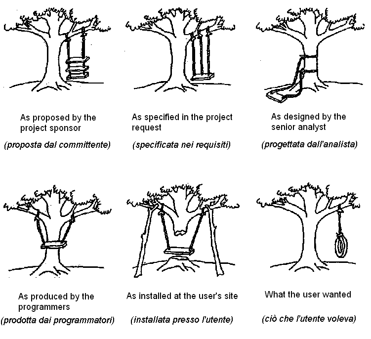

## Importance of processes in production systems

 Processes are used to manage a product during its
 whole Product Lifecycle
     Plan
     Design
     Implement
     Support
     Disposal

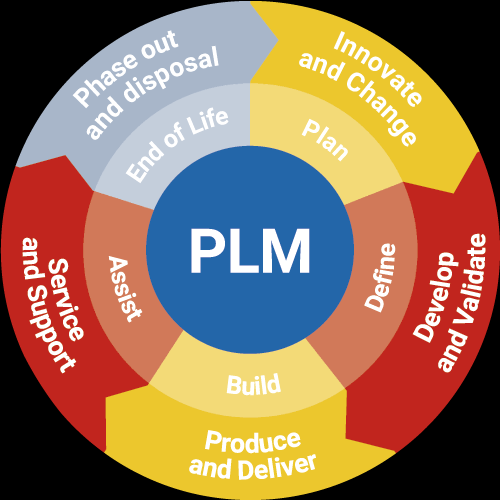

## Process definition

A process is characterized by a series of activities linked together to provide
a certain output given a certain input

            Input                                    Output
                              Process

   Representation at various levels of detail
   To represent a process, it is necessary to identify the activities of which it
    is composed and their sequence
       Activities may be difficult to be identified or separated from the other
         related activities

## Types of processes

Information processes: functions that create, manage, process and
provide information (e.g. management of a purchase order)

Physical processes: processing activities of physical objects (e.g.
material flows within a production system)

Functional processes: functions related to the overall activity of the
organization or company (e.g. production of a car, publication of a book,
management of an airline)

## Types of formalism

Depending on the process type, different representation
formalism can be used

 Information flows          Flow chart, UML Activity diagram, BPMN

 Material flows             Flow process chart, Value Stream Mapping

 Functional flows           IDEF0 diagrams

 Many variants
 The same formalism may be used to represent different process
 types

## Flow chart

         Start and End

         Activity

         Decision

         Input/output data

         Flow control

## Example: Customer support service

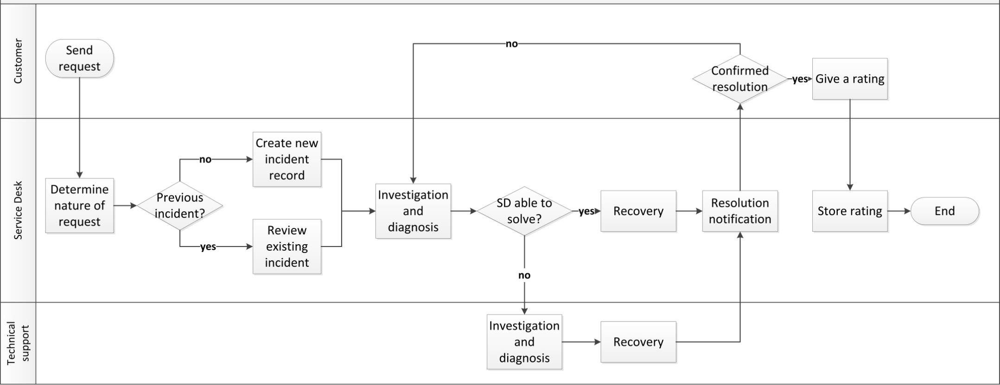

## UML Activity Diagram

          Initial state

          End state

          Activity

          Decision

          Fork and Join

          Flow control

## Example: order management

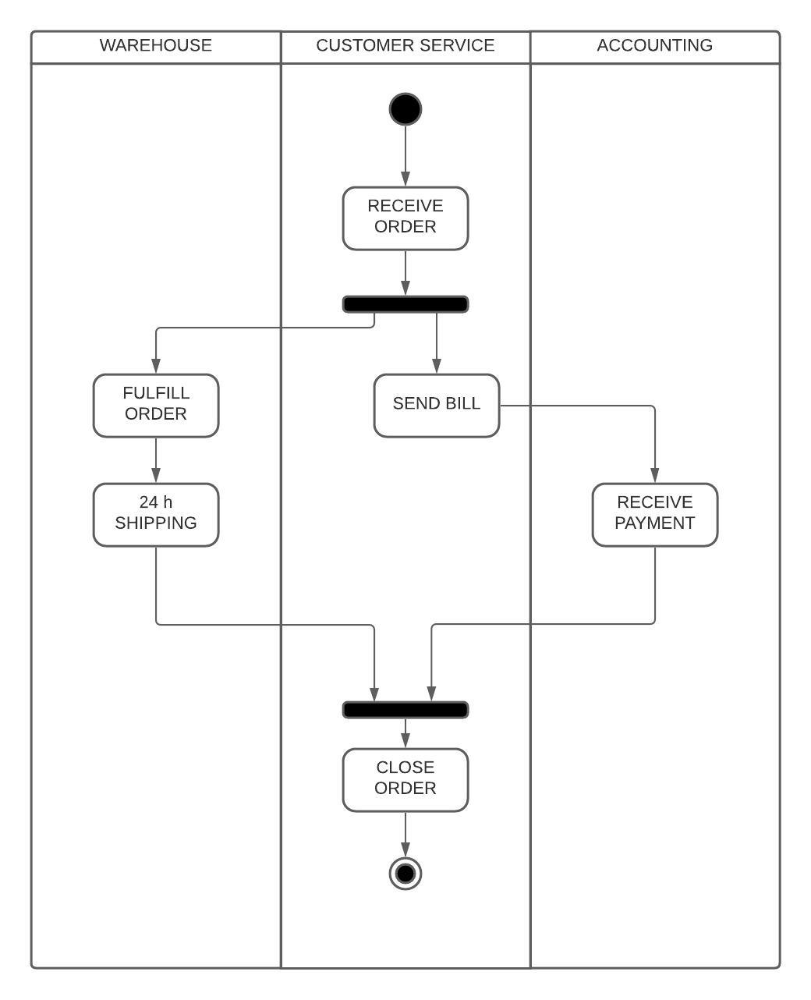

## Business process model and notation

Based on popular graphical flowcharts:
- Core set of notation elements
- Each core element has various subtypes

A BPMN process model is a graph consisting of four types of core
elements:

                       start           end

                               event                                  sequence flow
   activity                                     gateway

                   Events represent the       Gateways capture       Sequence flows
 Activities
                   process’ triggers (start   forking and joining    represent the order
 capture work
                   event) and outcomes        paths in the control   in which activities
 performed in a
                   (end event)                flow                   and events will be
 process
                                                                     performed

## Example Order-to-cash

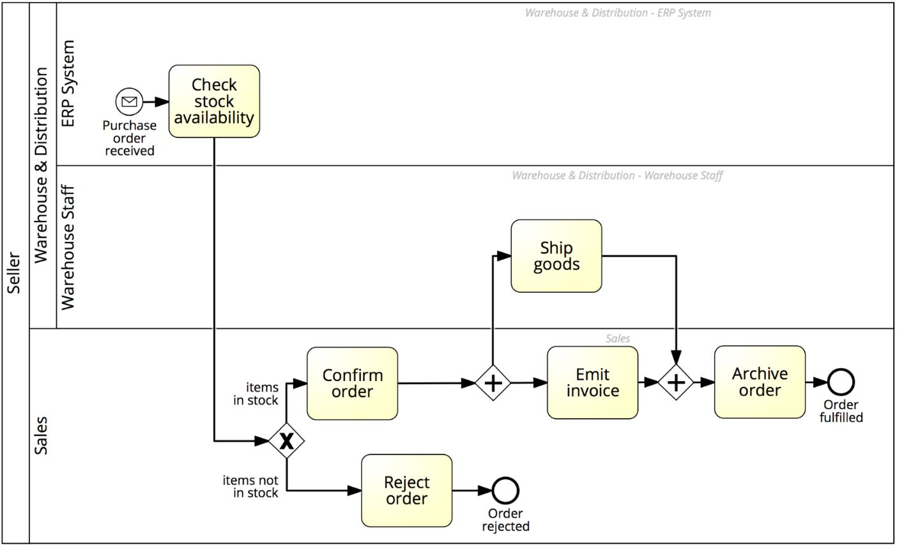

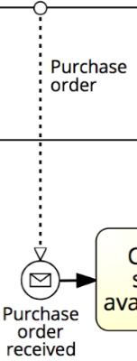

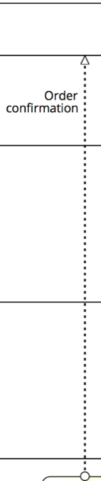

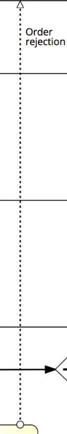

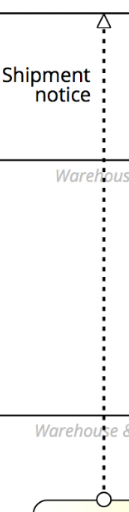

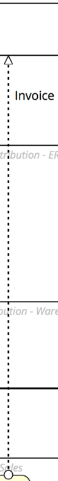

## Flow process chart

Many physical and manual processes consist of a sequence of
simple actions, such as transport, waiting or inspection

Identifying these simple activities makes it easier to find ways
to improve the process

When to use it:
    To provide a detailed description of a physical process by
     representing the individual activities in sequence
    To analyze processes to identify and eliminate waste
    To represent process with few decision blocks

Uses the American Society of Mechanical Engineers (ASME)
symbols

## ASME symbols

      Activity, changes physical or chemical material
      characteristics

      Transport, movement of people or material
      (distance measures could be included)

      Waiting, for material arrivals or machines
      availability

      Warehouse, for material storage

      Inspection, material quality and quantity control

## Example: Baking Cookies Factory

A cookie factory decides to analyze how to improve its process
In the current process the cookies are formed after introducing
the dough into the mould, then they are baked in the oven, cooled
on a cooling belt and inspected on an inspection line
8.2% of the cookies do not pass the shape control and are
discarded, the rest of them are packed for shipping

## Flow process chart

   The main flow follows a
    vertical line from the top to
    the bottom
   Alternative flows represented
    on parallel lines
   Numbers for counting the
    symbols of the same type
   Description at the right side of
    the activity

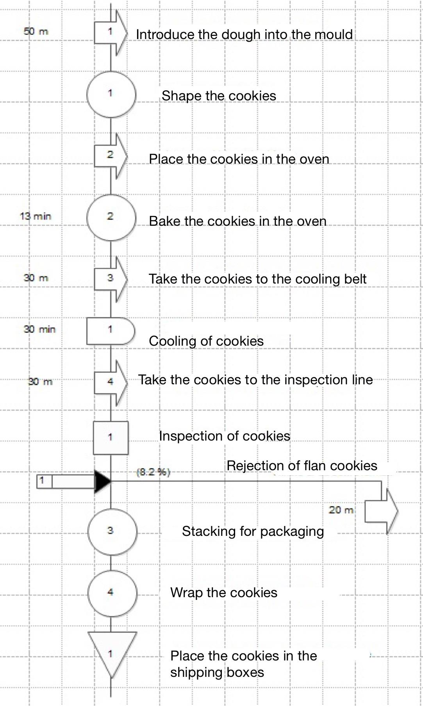

## Observations

Analyzing the material flow, you can see that the shape quality
rejection rate is very high
A simple improvement could be to introduce an inspection
immediately after the manufacture of the cookies, before baking,
since the raw dough is easier to re-mix
With a successive intervention, the mixing and molding processes
can be improved to further reduce the rejection rate

## Example: reengineering comparison

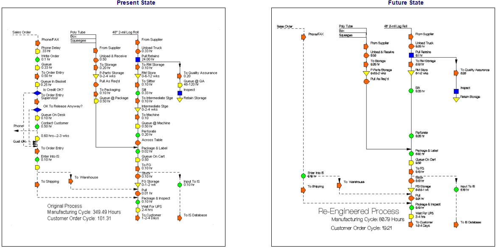

## Example: packaging process

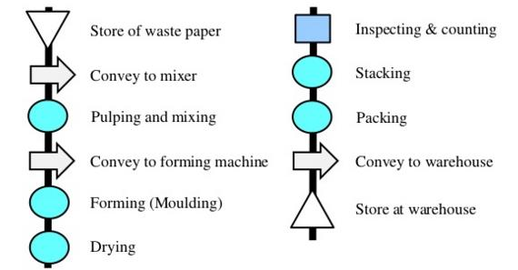

## Example: chair assembly

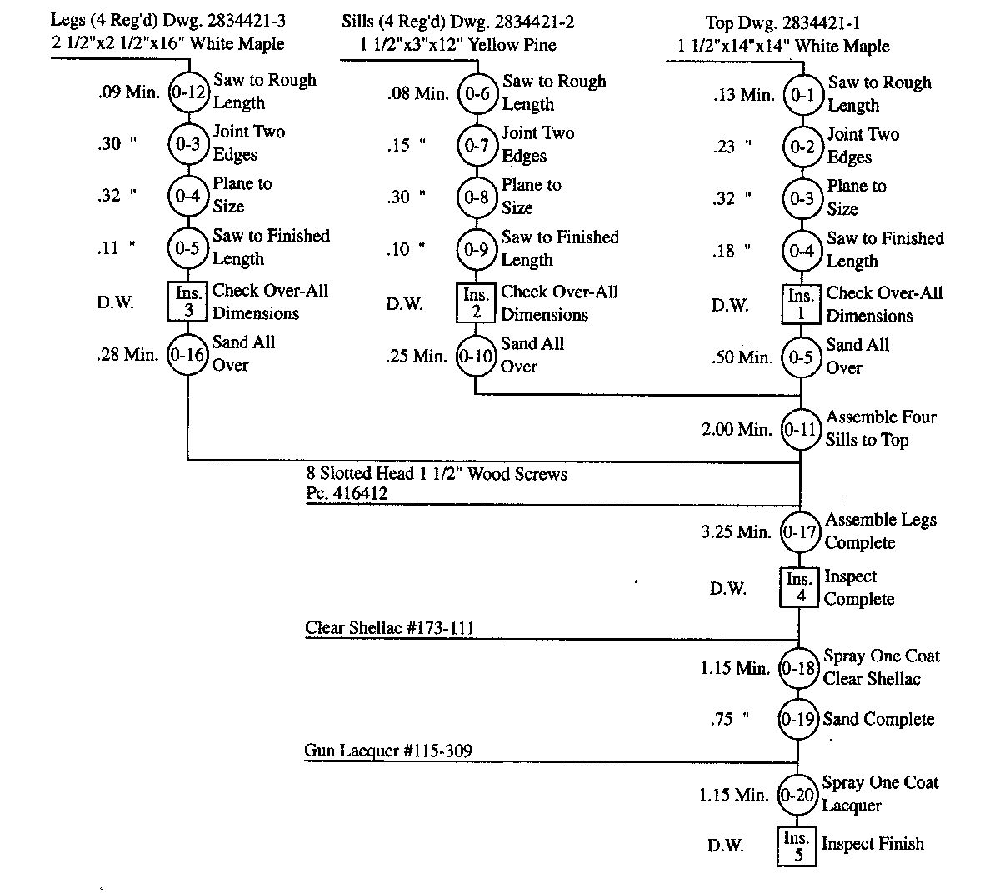

## Template

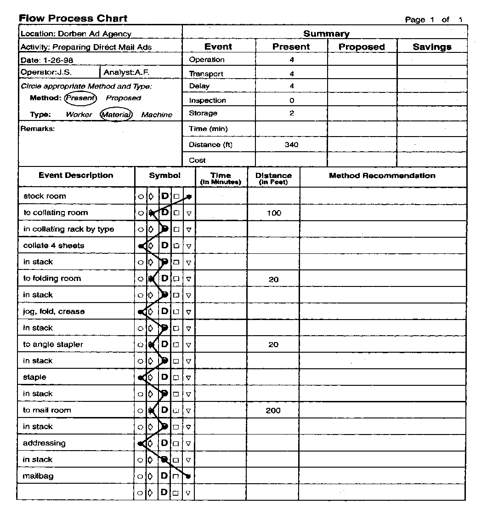

## Exercise: paper factory

The wood is partly purchased from a supplier and partly produced in the
company's own forests. The wood is conveyed through an artificial channel to
the covered storage area. From there, it is taken to be cut in the chipper, where
the dimensions are made uniform to the standard size of 1x1/4 inch. Wood
chips that are too large are returned to the previous station, and those that are
too small are removed. The chips are then stored in silos.
Lignin is removed from wood chips by boiling them in caustic soda and sodium
sulphide solution. Then the chips pass into a low-pressure discharge vat which
physically separates the fibres. The wood fibres are then centrifuged and
pressed. The pulp produced in this process is finally subjected to bleaching and
then put to rest in the warehouse.
The paper is produced starting from the pulp in a dedicated machine, in which
the pulp is deprived of part of its content in water and compressed in steam-
heated cylinders. Then it is wrapped in large reels and stored. When delivered
to the customer it is cut and rewound into smaller reels.

## Solution

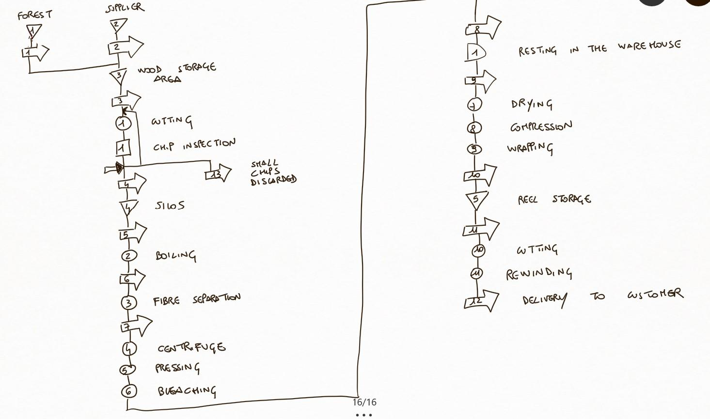

## Value Stream Mapping (VSM)

Value Stream Mapping was introduced in 1980 by Taiichi Ohno and
Shigeo Shingo, as part of the Toyota Production System, through
which the Japanese company has implemented a policy of reducing
waste in production processes

It is composed by a set of activities and processes necessary for the
realization of a product, starting from the supplier to the delivery of
the finished product

Activities are divided in two groups: value-added activity and non
value-added activity

The VSM Objective is to identify and reduce any non-value-added
activity (waste), highlighting the points of improvement of the
process

## Introduction

Value Stream Mapping is a tool that analyses the current state of a
production process

It allows to visualize in a clear and concise way the current production
situation by drawing the material and information flows in order to
decrease the inventory and the production time and to eliminate the
overproduction

It allows to identify each parts of the production flow to reengineer it

It describes the flow of materials/components of a given product inside
the manufacturing (or logistic) system, providing a descriptive visual
representation of each phase

It highlights the points of material accumulation (i.e. raw material stocks,
finished products and WIP) along the production process, as well as the
causes of this accumulation

## Introduction

Advantages of using Value Stream Mapping:
   shows the process flow as a whole, without detailing
    individual processes
   allows to identify waste and the causes that determine it
   is a common international language to talk about the
    production process
   helps to define how the production flow should look like
    and lays the foundation for a Lean implementation plan
   shows the link between material flows and information
    flows
   is a qualitative tool that describes how the plant should
    operate to produce value

## VSM Diagram

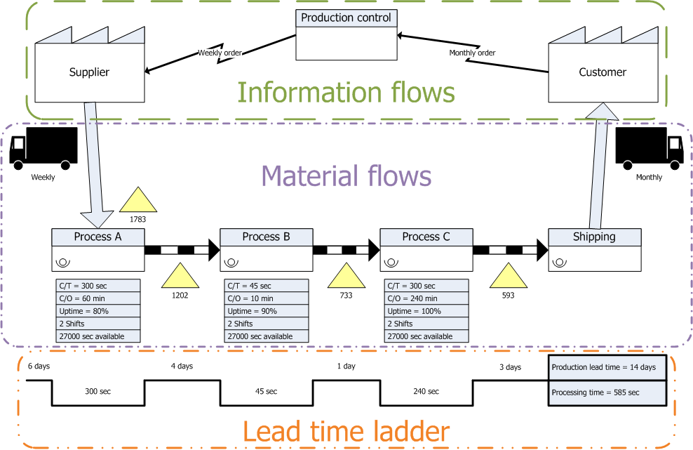

## Formalism

The       manufacturing
process mapping is
performed    using     a
series of simple unified
icons

These      icons   can
represent both physical
flows and information
flows of the production
planning system (e.g.,
an MRP system)

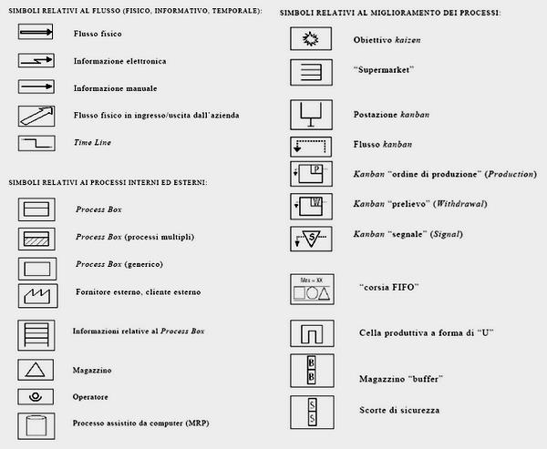

## Factory

It is the symbol used to represent external sources
    • Clients                                                                ABC
                                                                             COMPANY
    • Suppliers
    • Outsourced Process

Factory + Data Box
    • Shipping frequency per shift
    • Information about the material handled
    • Purchase lot size
    • Average demand per time bucket
    • In the case of suppliers you can enter data such as number of parts/day, tray
      (pallet capacity, product bins), On Time Delivery.
    • In case of customers: number of products ordered/day, turnover, OTD.
    • In the case of services, the concepts are similar, it remains only to identify the
      appropriate measurements

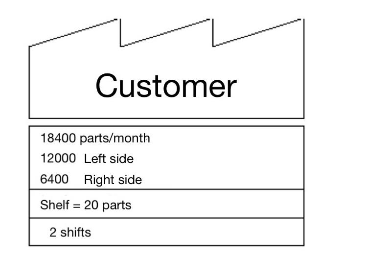

## Production process

It is the symbol used to represent the production process
    • A machine
    • A process
    • A factory

Process + Data box
    • Cycle Time (C/T)
    • Setup Time
    • Production Rate per hour/shift
    • Machine downtime, uptime and waiting time
    • Waste and Rework
    • % of Value added activities
    • etc.

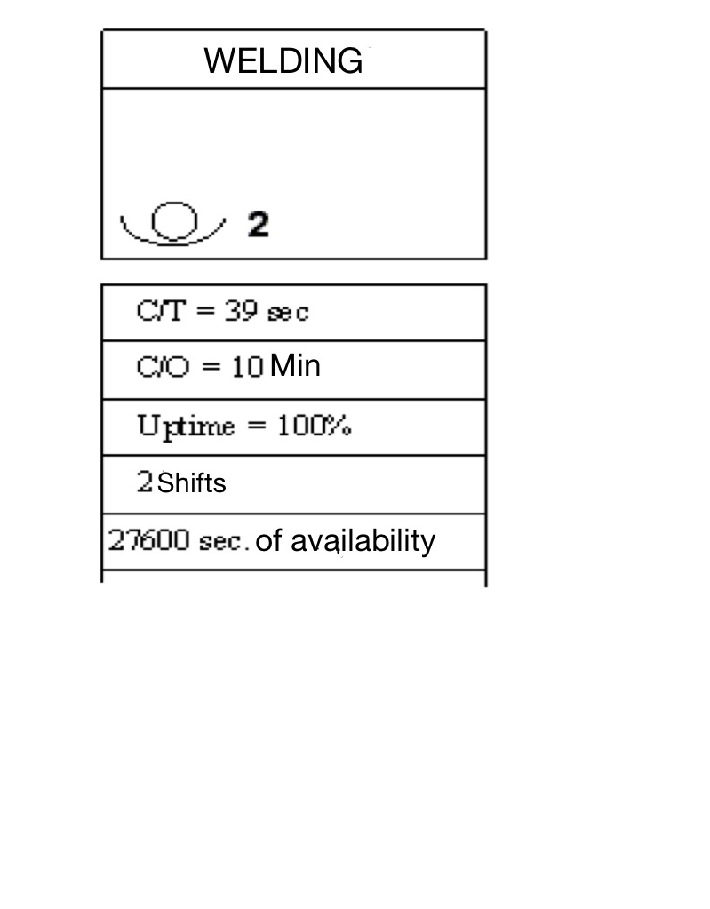

## Inventory

It shows the accumulation of products between processes

It can be expressed in terms of WIP or time, while in the
services and offices it can be understood as pending files,              I
emails to be processed, etc
                                                                       300 pezzi
                                                                       2 Giorni
Traditionally the icon is a triangle, as it represents a significant
danger in terms of waste.

## Safety Stock and Truck Shipment

Safety Stock
   • It represents the presence of voluntary stocks
   • It must always be distinguished from the
     (involuntary) accumulation of WIP generated by the
     production system.

Truck Shipment
   • It represents the transportation adopted                1 x day
   • Internally the frequency of supplying and/or delivery
     is brought

## Material Flow

Striped arrow
   • Represents the material flow between two stations
   • Indicates a "Push" type flow

White arrow
   • Represents the movement of raw materials from
     suppliers
   • Represents the movement of finished products
     towards customers

## Information Flow

Straight arrow
   • Manual information flows (fax, e-mail, telephone,
     etc.)

Lightning arrow
   • Electronic information flows

Information Label
   • Specify the type of information                        Schedulazione
   • It is shown above the arrows of the information flow    settimanale

## Operator

Indicates whether a process is automated or
needs operators

Report the number of operators required

## Timeline

The Timeline shows the overall Lead Time given by the sum
of the processing, handling and waiting times.

    The low line means that the product is within the process, and it
     will be worked for different time (it is the time in which the product
     is processed on the machine)

    In the high part of the line are indicated the waiting times

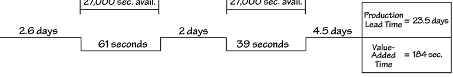

## VSM design

• 1. Process flow identification (Data box)
    Identification and mapping of the main
                     phases
                     120m                  80m                  30m                  180m                  20m                 60m
           storage
            Lager            stamping
                              Stanzen              welding
                                                  Schweißen           Schweißen
                                                                       welding              assembly1
                                                                                             Montage1            assembly2
                                                                                                                  Montage2           shipping
                                                                                                                                     Versand

              I                   1                    1                    1                    1                    1                 I

            coils                                                                                                                     2700L
            4 days                                                                                                                    1440R
                            Z/T: 1S
                            C/T:                   C/T: 39 Ss
                                                   Z/T:                Z/T:
                                                                       C/T: 46
                                                                            46 Ss            Z/T: 62 Ss
                                                                                             C/T:                 Z/T:
                                                                                                                  C/T: 40
                                                                                                                       40 Ss

                            R/T: 60
                            C/O: 60 Min.
                                    Min.         R/T:
                                                 C/O: 10
                                                      10 Min.
                                                         min.         C/O: 10
                                                                      R/T: 10 Min.
                                                                              min.          R/T: 00 Min.
                                                                                            C/O:    min.         R/T:
                                                                                                                 C/O:00Min.
                                                                                                                       min.

                            V: 85 % 80%
                            Uptime:              Uptime:
                                                   V: 10090%
                                                         %            Uptime:
                                                                        V: 80 %
                                                                              80%           Uptime:95%
                                                                                             V: 100 %             V: 100 %
                                                                                                                 Uptime:95%

                            Q:
                             FTY:
                               0,01
                                  0.9% A          FTY:
                                                  Q: 0,80.9
                                                          %A          Q: 0,20.85
                                                                      FTY:    %A            FTY:
                                                                                            Q: 1,20.95
                                                                                                    %A           Q: 0,30.95
                                                                                                                 FTY:    %A
 Information                 2 shift              2 shift               2 shift              2 shift               2 shift
Collection for
   Data Box

## VSM design

              • 2. Material flow identification
                          • Material flow from supplier to customer
                                                                                                                                                 customer
   supplier
                                                                                                                                               18400 pcs / month
   150 ft coils
                                                                                                                                               12000 L
                                                                                                                                               6400 R
                                                                                                                                               1Tray = 20 pieces
                                                                                                                                               AZ/S: 480 min
Mo + We

                                                                                                                                                       daily

                  120m                     80m                        30m                    180m                        20m                    60m
storage
  Lager                   stamping
                          Stanzen                  welding
                                                 Schweißen                   welding
                                                                            Schweißen                assembly1
                                                                                                     Montage1                   assembly2
                                                                                                                                Montage2           Versand
                                                                                                                                                   shipping
                  I                        I                      I                          II                      I
   I                            1                       1                          1                       1                          1                I
              coils                      4600L                  1100L                      1600L                   1200L
              1day
              1                          2400R                  600R                       850R                    640R
   coils                                                                                                                                              2700L
  4 days                 Z/T: 1S
                         C/T:                      Z/T: 39 Ss
                                                   C/T:                      Z/T:
                                                                             Z/T: 46
                                                                             C/T: 46 SSs             Z/T:
                                                                                                     C/T: 62 Ss                  Z/T: 40 Ss
                                                                                                                                 C/T:                 1440R

                         R/T: 60
                         C/O: 60 Min.
                                 Min.            R/T: 10
                                                 C/O: 10 Min.
                                                         min.               R/T: 10
                                                                            C/O: 10 Min.
                                                                                    min.             R/T:
                                                                                                     C/O:00Min.
                                                                                                           min.                 R/T:
                                                                                                                                C/O: 00 Min.
                                                                                                                                        min.
                         FTY.:
                         V: 85 80
                               %%                  FTY.:
                                                   V: 10090%%                 V: 8080
                                                                              s. r.: %%               V:r.:
                                                                                                      s. 100100
                                                                                                              %%                 V: 100
                                                                                                                                 s. r.:   %%
                                                                                                                                        100
                         Rejt:
                         Q: 0,01
                               0,01
                                  %A%A            Q: 0,8 % A                 Q: 0,2 % A              Q: 1,2 % A                 Q: 0,3 % A
                         AZ/S:480Min
                         WT/S:480Min             AZ/S:480Min
                                                 WT/S:480min                AZ/S:480Min
                                                                            WT/S:480min             AZ/S:480Min
                                                                                                    AZ/S:480Min
                                                                                                    WT/S:480min                AZ/S:480Min
                                                                                                                               WT/S:480min
                         S: 2                    S: 2                       S: 2                    S: 2                       S: 2

## VSM design

                • 3. Time information
                      • Timeline Design                                                                                                   XYZ AG
                                                                                                                                          customer
Krupp -Stahl
  supplier
                      • Cycle Time, Waiting Time e Lead time                                                                      18400 pcs / month
 150 ft coils                                                                                                                     12000 L
                                                                                                                                  6400 R
                                                                                                                                  1Tray = 20 pieces
                                                                                                                                  AZ/S: 480 min
                                                                                                                                  S: 2
Mo +&Mi
     We

                                                                                                                                             daily
                                                                                                                                             täglich

            120m                    80m                         30m                     180m                    20m                    60m
 storage
 Lager          I    Stanzen
                     stamping        I        Schweißen
                                               welding
                                              Schweißen          I       Schweißen
                                                                          welding         I      Montage1
                                                                                                 assembly1
                                                                                                 Montage1        II     assembly2
                                                                                                                        Montage2
                                                                                                                        Montage2             Versand
                                                                                                                                             shipping
    I                    1                         1                         1                       1                      1                   I
            Coils
            Coils                  4600L                       1100L                    1600L                   1200L
                                                                                                                1200L
            1Tag
            1Tag                   2400R                       600R                     850R
                                                                                        850R                    640R
                                                                                                                 640R
 Coils                                                                                                                                         2700L
 4Tage              C/T: 1S
                    Z/T: 1s                    C/T: 39
                                               Z/T:  39 SSs               C/T: 46 Ss
                                                                          Z/T:                    C/T: 62 Ss
                                                                                                  Z/T:                   C/T: 40
                                                                                                                         Z/T: 40 SSs           1440R
                                               Z/T:                                                                     Z/T:
                    R/T: 60
                    C/O: 60 Min.
                            min.              R/T: 10
                                              C/O:
                                              R/T: 10
                                                    10Min.
                                                       Min.
                                                       min.              R/T: 10
                                                                         C/O: 10 Min.
                                                                                 min.            R/T: 00 Min.
                                                                                                 C/O:    min.           R/T: 00 Min.
                                                                                                                        C/O:    min.
                    s. r.:
                    V:  8580
                           %%                 V: r.:
                                              s.
                                              V:  100
                                                 100 90%
                                                       %%                 s. r.:
                                                                          V:  8080
                                                                                 %%              V: r.:
                                                                                                 s.  100100
                                                                                                          %%            V: r.:
                                                                                                                        s.
                                                                                                                        V:  100
                                                                                                                           100 100
                                                                                                                                %%%
                    Q: 0,01 % A               Q: 0,8 % A                 Q: 0,2 % A              Q: 1,2 % A             Q: 0,3 % A
                    WT/S:480min
                    AZ/S:480Min               WT/S:480min
                                              AZ/S:480Min                WT/S:480min
                                                                         AZ/S:480Min             WT/S:480min
                                                                                                 AZ/S:480Min
                                                                                                 AZ/S:480Min            WT/S:480min
                                                                                                                        AZ/S:480Min
                    S: 2                      S: 2                       S: 2                    S: 2                   S: 2

                                                                                                                                                  W/T: 23,6 d
   5 days                          7,6 days                   1,8 days                2,7 days              2,0 days                   4,5 days
                       1s                         39 s                      46 s                    62 s                  40 s
                                                                                                                                                  P/T: 188 s

## VSM design

  • 4. Add Information Flows

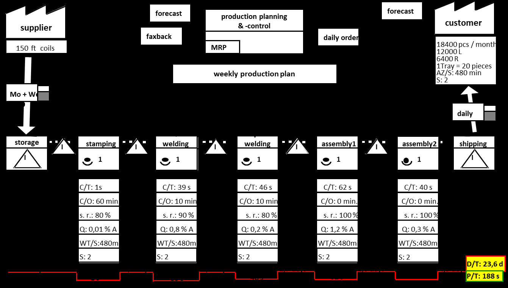

## Example

FIRM
● Acme Spa pressed steel steering arms
● The firm produces 2 types of products → L (left side)
  and R (right side)
● Each month has 20 working days, in 2 shifts of 8
  hours each and two breaks of 10 minutes for each
  shift
CLIENT
● Client demand18.400 p/month:
    L → 12.000 [p/ month]
    R → 6.400 [p/month ]
● Shipments to customers are made 1 time per day

## Example

PRODUCTION CONTROL
● The production control is carried out by MRP which
  provides forecasts at 90, 60 and 30 days
● Every day the customer provides orders with the
  desired quantities
● The production is managed through a weekly
  schedule
● The MRP forecasts with 6-month horizon sent to the
  supplier
● Acme sends orders to the supplier weekly
SUPPLIER
● The supplier supplies 500 feet long steel coils twice
  a week, transporting them by truck
● The coils supplied allow you to have material in the
  initial warehouse for 5 day

## Example

PROCESSES
● The flow between the various phases of production are of push type
● 6 processes:
   Stamping
     Process time= 1 s
     Setup time = 1 h
     Uptime = 85%
     Observed warehouse= 4600 L e 2400 R

   Welding 1
     Process time= 38 s
     Setup time = 10 m
     Uptime = 100%
     Observerd warehouse= 1100 L e 600 R

## Example

Welding 2
  Process time = 45 s
  Setup time = 10 m
  Uptime = 80%
  Observed warehouse = 1600 L e 850 R

Assembly 1
  Process time = 61 s
  Setup time = 10 m
  Uptime = 100%
  Observed warehouse = 1200 L e 640 R

## Example

 Assembly 2
   Process Time = 39 s
   Setup time = 0
   Uptime = 100%
   Observed Warehouse = 2700 L e 1440 R

 Shipment
   after assembly the product is shipped to the customer

## Example - solution

Operator Availability

Each month has 20 working days, consisting of 2 shifts of 8 hours
each, with two breaks of 10 minutes for each shift.

Time available for each process (available working time):
1 shift 8*60*60 = 28,800 [s/shift]
two breaks per shift 2*10*60 = 1,200[s/shift]

Therefore, the available time is 28,800 - 1,200 = 27,600 s/shift

## Example - solution

   Insert the Supplier and Customer icons, with the
   relative Data Boxes containing the total quantities to
   be supplied for a given period and calculate the
   necessary daily production and the load unit
   type/characteristics

                                                            48

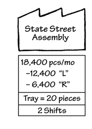

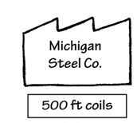

## Example - solution

  Draw, from left to right, the Process boxes and the
  corresponding Data Boxes related to the internal
  operations/stations of the component under analysis (e.g.,
  the production flow of the component)

                                                               49

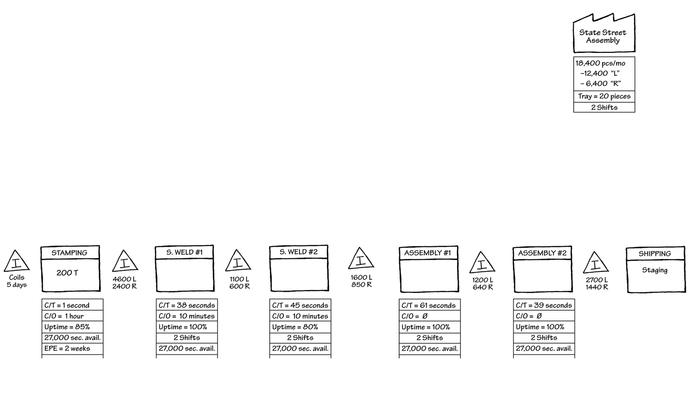

## Example - solution

Draw the icons for the external handling connections (raw material and finished products) from the
warehouse to the Customer and from the Supplier. Represent the mode of transport used (e.g., Truck    50
shipment) and indicate the frequency of shipments (daily, etc.). Draw the icons representing manual and/or
electronic information and communication flow, describing the function/content with the Information icon.

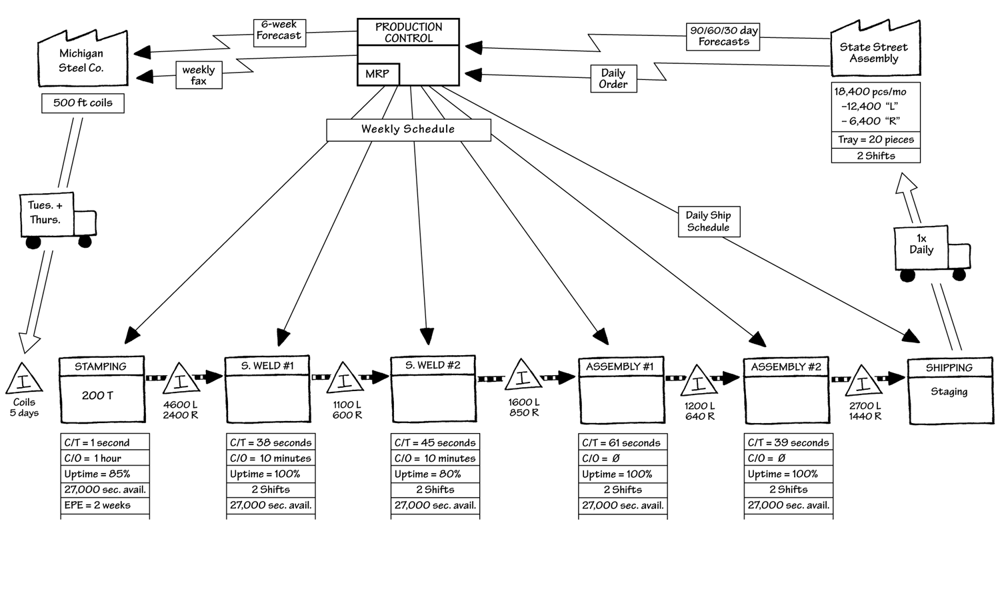

## Example - solution

Warehouse related time

Stock time = Quantity of stock pieces / daily customer demand

Customer question = 18,400 [pcs/month] /20 [working days] = 920 pcs/day

Warehouse after stamping : (4600+2400)/920 = 7.6 days
Warehouse after welding 1: (1100+600)/ 920 = 1.8 days
Warehouse after welding 2: (1600+850)/ 920 = 2.7 days
Warehouse after assembly 1: (1200+640)/920 = 2 days
Warehouse after assembly 2: (2700+1400)/920 = 4.5 days

## Example - solution

  Compute the total Value Added Time and Production Lead Time

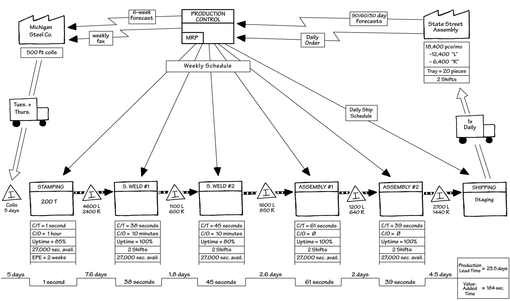

## Exercise

 FIRM
 ● TWI produces components for tractors, in
   particular steering arms
 ● Each month has 20 working days, consisting
   of 2 shifts of 8 hours each, with two breaks
   of 15 minutes for each shift.
 CUSTOMER
 ● Demand of 24,000 pcs/month
 ● Shipments to customers are made 1 time a
   day by trucks

## Exercise

 PRODUCTION CONTROL
 ● The customer provides a 60 day purchase forecast, and
   a precise order schedule two weeks before delivery
 ● The production is managed through a weekly schedule
 ● Orders received are insert into the MRP system
 ● Every day a delivery plan is generated for the shipping
   department
 SUPPLIER
 ● The company purchases steel bars and raw joints from
   two suppliers, Michigan Steel and Indiana Castings.
 ● Both suppliers make deliveries 2 times a month, and
   guarantee an initial stock for 20 days.
 ● bar cutting and the joint trim are done in parallel, then
   the two components are welded and continue the
   processing.

## Exercise

PROCESS DATA                                  ●   2° Welding
                                                      1 operator
                                                      CT = 30s, C/O = 1h
●   Bar cutting
                                                      Reliability = 80%
        1 operator
                                                      Warehouse: 3 days of welded arms
        CT = 15s, C/O = 1h
        Reliability = 100%                   ●   Deburring
        Warehouse: 5 days of cutted bars             1 operator
                                                      CT = 30s, C/O = 1h
●   Finishing
                                                      Reliability = 100%
        1 operator
                                                      Warehouse: 5 days of welded arms
        CT = 30s, C/O = 2h
        Reliability = 100%                   ●   Painting (outsourcing)
        Warehouse: 5 days of finished bars           Lead-Time = 2 days
                                                      Warehouse: 6 days of painted arms (TWI)
●   1° Welding
        1 operator                           ●   Assembly
        CT = 30s, C/O = 1h                           6 operators
        Reliability = 90%                            CT = 195s, C/O = 10 min
        Warehouse: 3 days of welded arms             Reliability = 100%
                                                      Warehouse: 4 days of finished arms
                                              ●   Shipping

## Solution

Operator availability

Each month has 20 working days, consisting of 2 shifts of 8 hours
each, with two breaks of 15 minutes for each shift

Time available for each process (available working time):
1 shift 8*60*60 = 28,800 [s/shift].
two breaks per shift 2*15*60 = 1,800[s/shift]

Therefore, the available time is 28,800 - 1,800 = 27,000 s/shift

## Solution

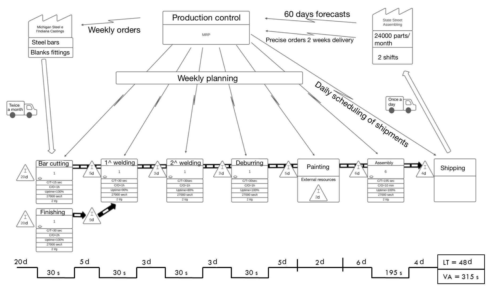

## IDEF diagram

ICAM project (Integrated Computer Aided
Manufacturing)
  IDEF0 for the generation of functional models

  IDEF1 for the generation of information models

  IDEF1X for the semantic modelling of data

  IDEF2 for the generation of dynamic models

## IDEF0 diagrams

Method designed to represent the activities of an
organization or system
   Constraints and controls between activities

Based on the organic and systematic combination of
graphic and textual components

The components are related through a multilevel
hierarchical structure

## Diagram layout

   “Box and arrow” graphics
   Function represented by a box whose sides enter or exit arrows
    with different meanings
                                         ● Node:    identification          of     the
                                           represented node
                                                A-0 overview
                                                A0 general activity
                                                A1, A2, A3, .. First level of details
                                                A11, A12,.. A21, A22,.. Second
                                                 level of detais

                                         ● Title of the diagram
                                         ● Number of the diagram
                                         ● Short description of the diagram

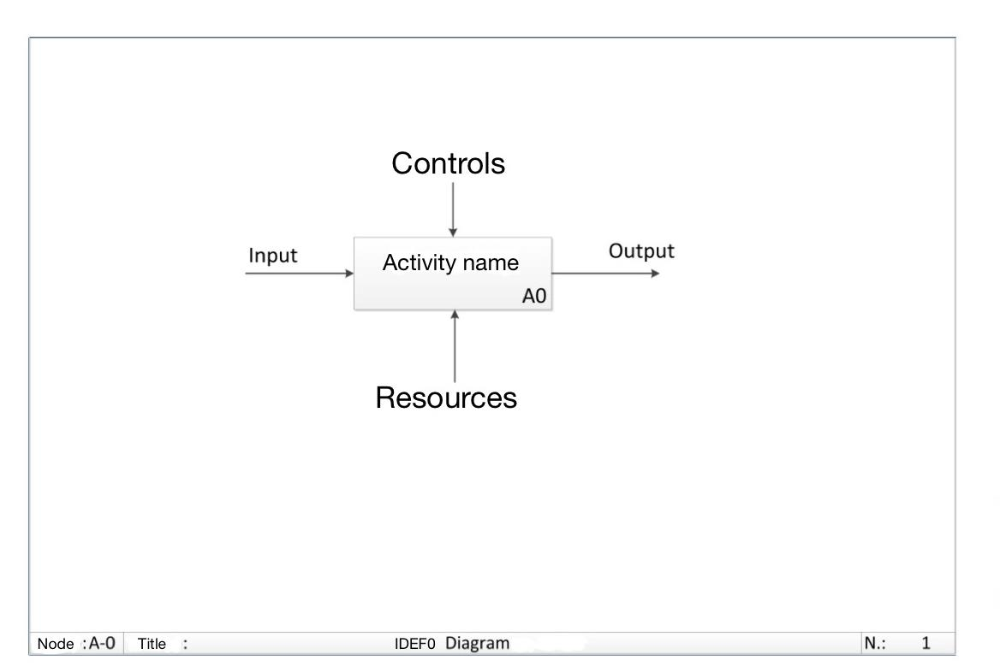

## Hierarchy of diagrams

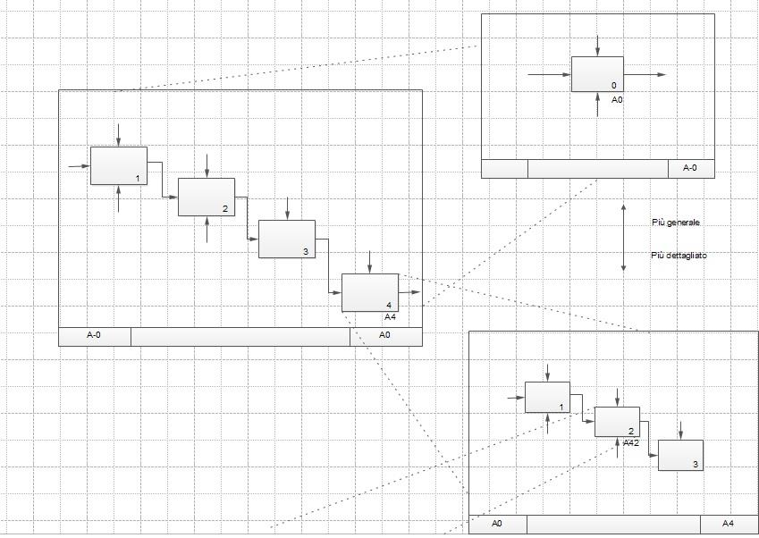

## Activity

The main component of the diagram is the
activity
   Represented by a rectangle
   Labeled with a noun or verb that describes it
   Identified by a number in the lower right corner
For reasons of readability, a maximum of 6
activities can be entered in a diagram
   If more activities are needed, an additional level
    of detail must be introduced

## Arrows

   The meaning of the arrows depends on their position with respect
    to the activity

                                    the arrows entering from the left side
                                     represent the inputs entered (the one
                                     that is processed during the activity)
                                    the arrows coming out from the right
                                     side represent the outputs produced (the
                                     results of the activity)
                                    the arrows entering from the top
                                     represent the constraints (controls) that
                                     regulate or affect the execution of the
                                     activity
                                    the arrows entering from below indicate
                                     the resources (physical tools or people)
                                     that make it possible to carry out the
                                     activity

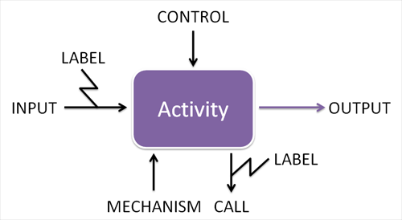

## Parallel operations

    Once the output of 1 is available,
   both the activities 2 and 3 can start

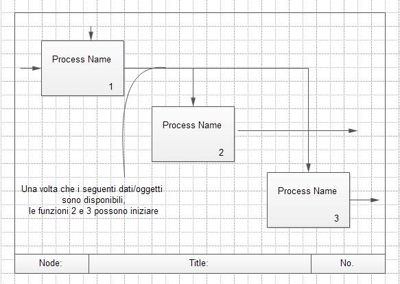

## Difference between input and control

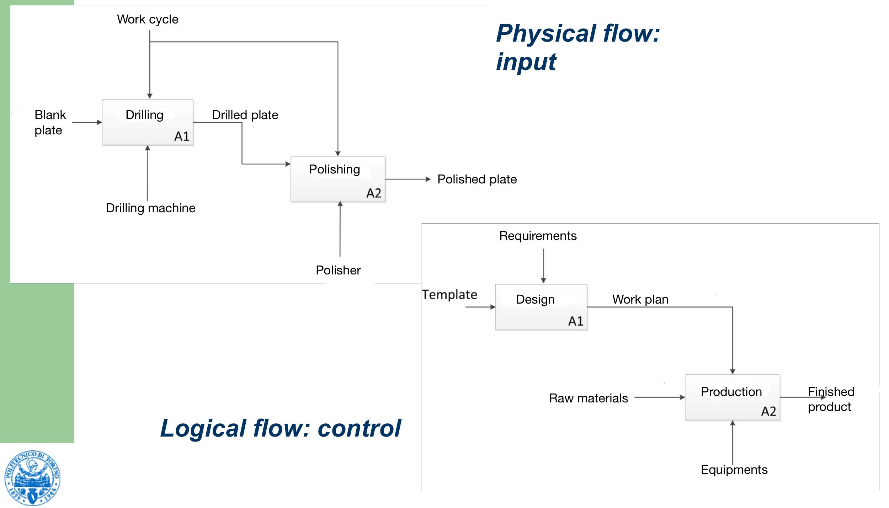

## Example: production management

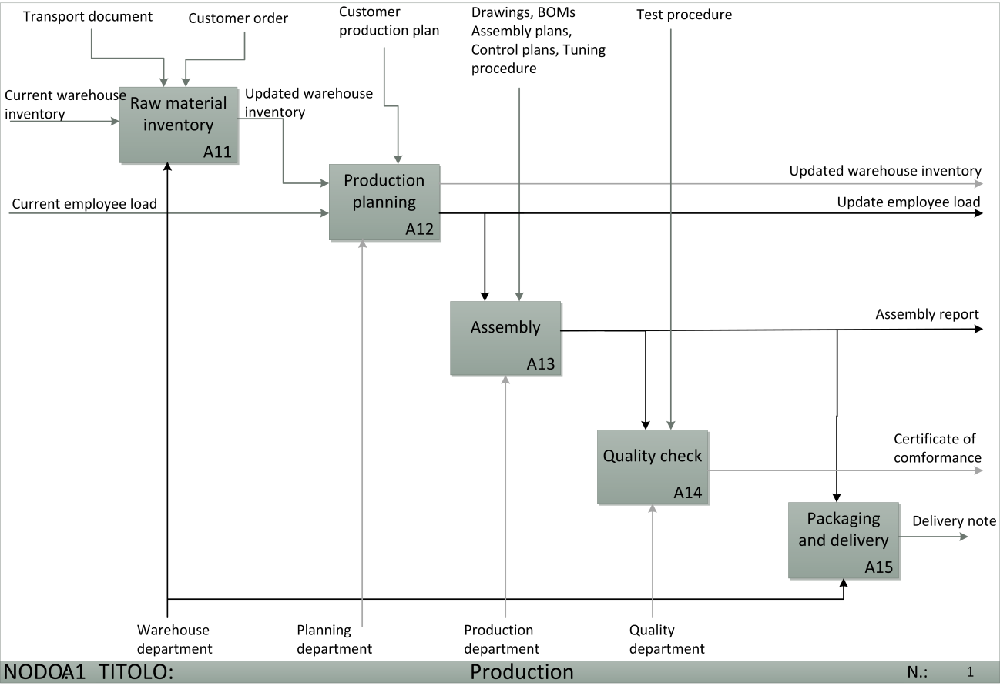

## Observation

   In IDEF0 there are no decisions, only flows

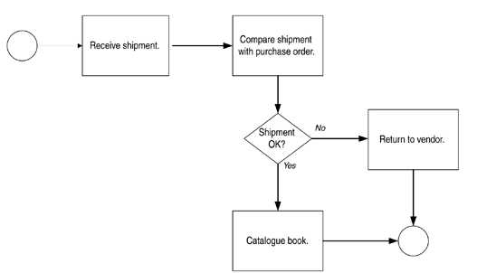

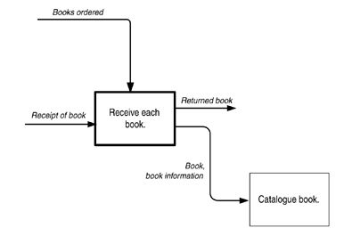

## Characteristics

 Provides a reference architecture for business
  analysis, information engineering and resource
  management
 Allows the management of large and complex
  projects
 The cost of a function can be computed based on the
  costs attributed to its component activities
 Diagrams are easy to read even by non-technical
  people
    Top-down decomposition, elimination of choices

## Example: breakfast distribution

A breakfast is served every morning in a hospital department.
Breakfast consists of liquid food (milk, tea, coffee), dry food
(cookies, croissants, etc.), jams and sugar packets.
Breakfast is brought to the patients using special wheeled
cabinets. The preparation of the cabinets takes place in two
phases: in the evening, the workers fill the cabinets with dry food,
sugar and jams; in the morning, they heat the hot food using the
tools in the kitchen and place them into the thermos on the
cabinets.
Breakfast is distributed by the distribution staff. The cabinets are
transported from the kitchen to the departments using an
elevator. The staff deliver the breakfasts to the patients and then
bring the cabinets back to the kitchen. In the kitchen the cabinets
are washed to be ready for a new use.

Represent the process using the IDEF0 diagram using no more
than two levels of detail.

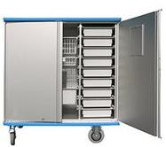

## Solution (A-0)

                 Wheeled cabinets,

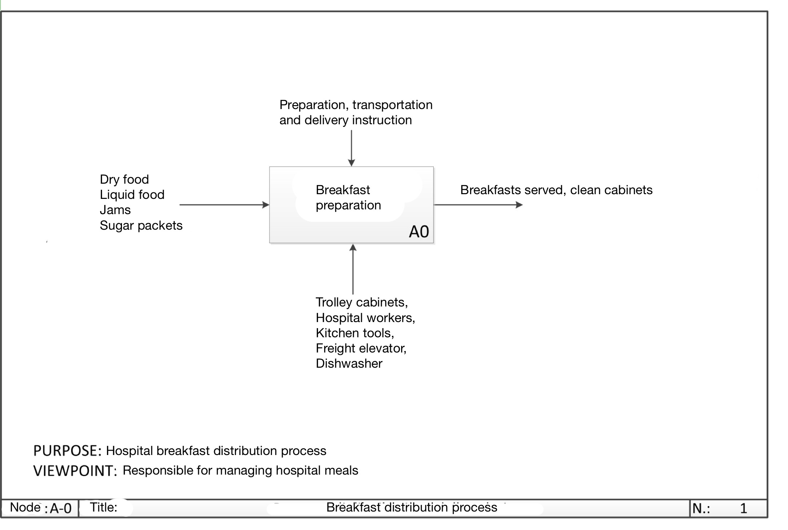

## Solution (A0)

     Wheeled
     cabinets

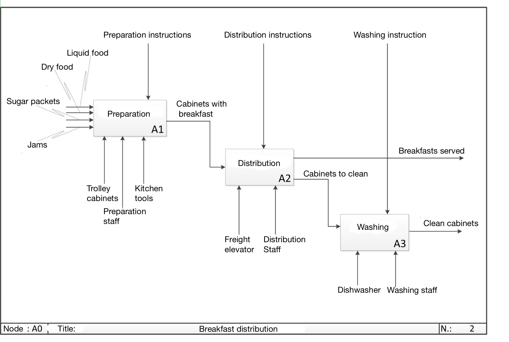

## Solution (A1)

         Wheeled
         cabinets

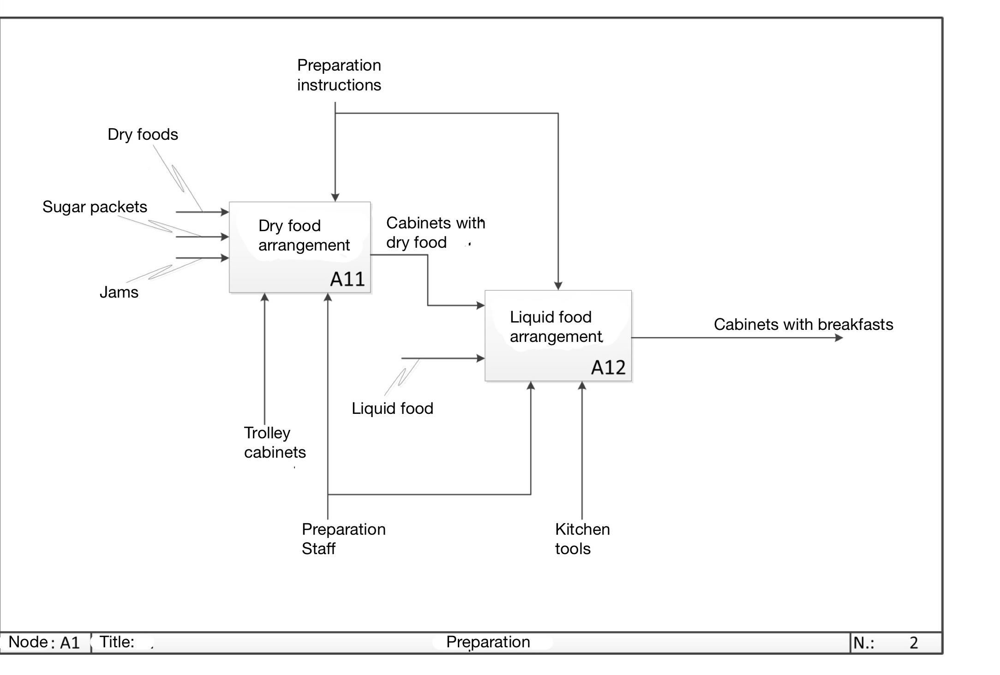

## Exercise: Car repair shop

The customer requests an offer for the production of a specific mechanical
component. The formulation of the offer involves two company functions: the
technical sector and the administrative sector. The technical sector provides a
general description of the manufacturing process, from which the
administrative sector defines the costs and define the amount of the offer. The
customer evaluates the offer received and if he considers it valid, sends an
explicit order to activates the production.
From this moment the company is formally engaged in the fulfillment of the
order and starts the appropriate administrative and technical procedures. In
particular, the technical sector define the process plan with the list of
operations that must be performed to transform the raw material into a
finished product. On the basis of the process plan, the administration
arranges to order the raw materials. Production planning is also carried out
from the information contained in the process plan, giving rise to the
production plan.
Once the raw materials have been received and the production plan is ready,
processing is carried out. At the end of the processing, a quality control of the
product is carried out with which the compliance with the project specifications
is established. The process ends with the invoice emission and the payment
of the customer.

## Solution (A-0)

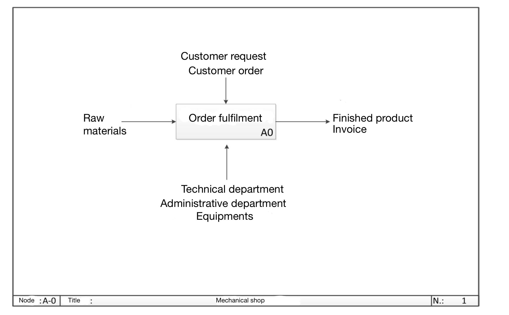

## Solution (A0)

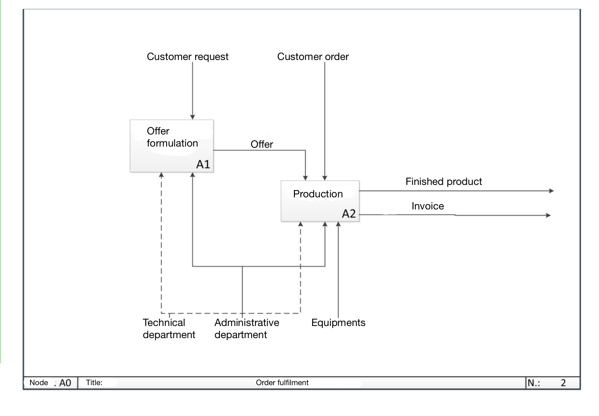

## Solution (A1)

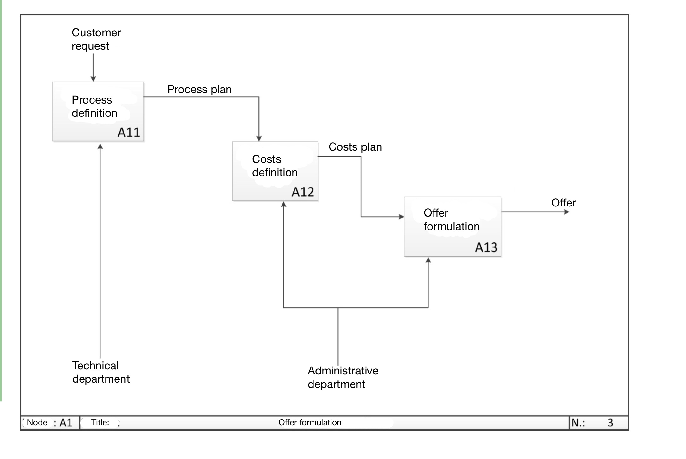

## Solution (A2)

                  Process plan
  Process
  definition

               Production
               planning

                            Production plan

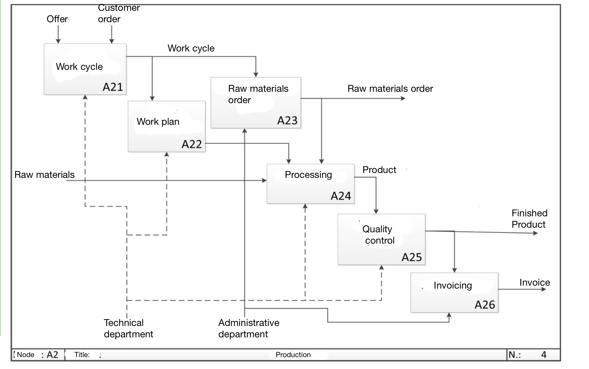
